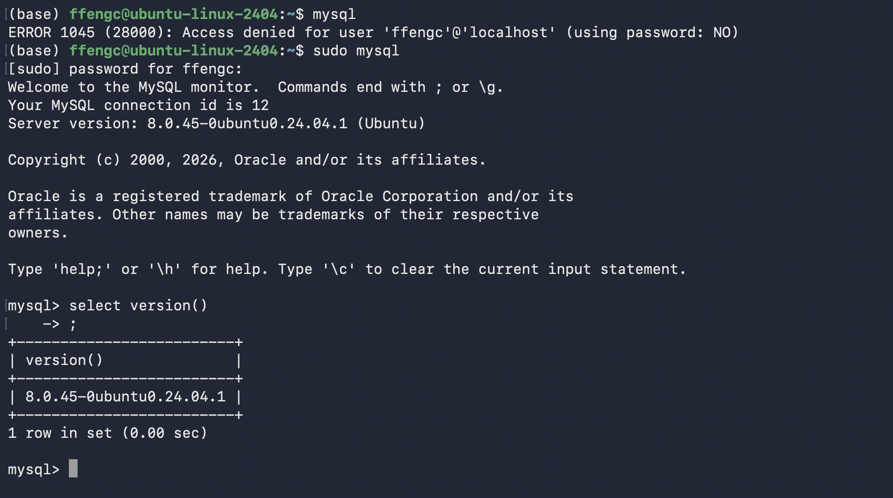
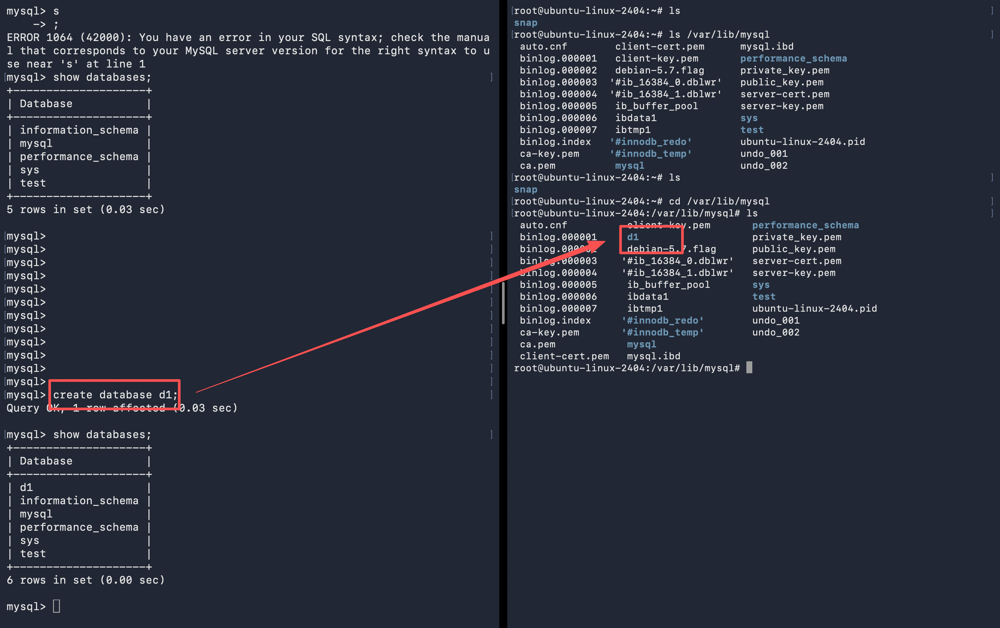
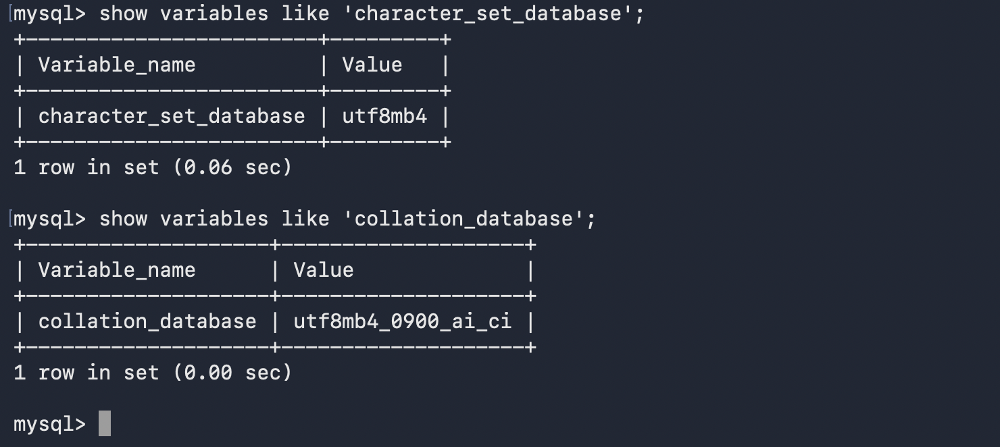
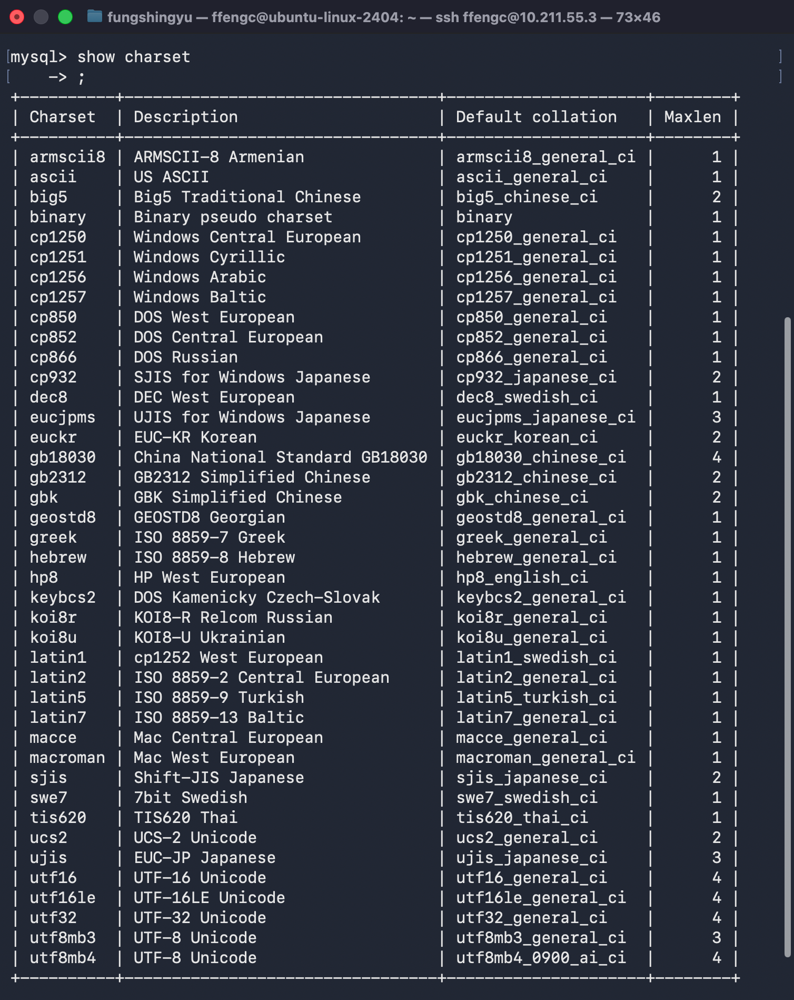
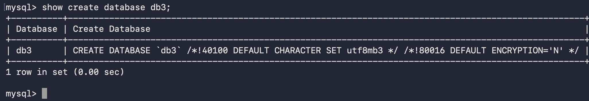
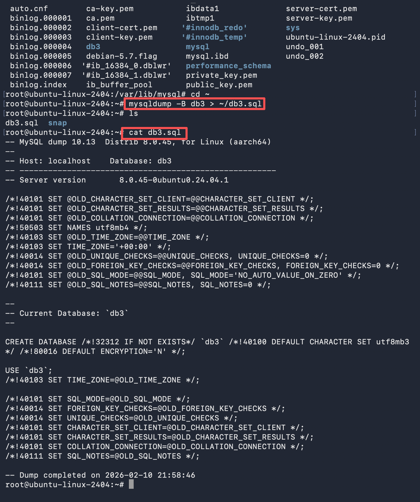

# Learn MySQL One More Time🚀

Learn how to use mysql one more time!

- [Learn MySQL One More Time🚀](#learn-mysql-one-more-time)
  - [前言](#前言)
  - [库操作](#库操作)
    - [创建和删除数据库](#创建和删除数据库)
    - [数据库编码问题](#数据库编码问题)
    - [库的删改查](#库的删改查)
    - [数据库的备份](#数据库的备份)
    - [其他](#其他)

版本：


因为这部分内容已经非常熟悉了，所以我这里只稍微补充一些内容，和一些进阶的内容。同样也是从操作开始。

## 前言

```bash
mysql -h 127.0.0.1 -P 3306 -u root -p
```

mysql是个网络服务，`-h` 表示连接哪一台主机上的 mysql, `-P` 表示端口号，`-u` 表示登陆哪个用户 `-p` 表示密码。

只是配置文件里配置之后，`mysql` 默认登陆本地的。

然后我自己用这条命令的时候登不进去，原因是这样的：

> 是 Ubuntu/Debian 默认把 MySQL 的 root 账号设成 auth_socket 认证 导致的。

> 发生了什么
> - 直接 mysql 能进去：因为你是 Linux 的 root 用户，MySQL 允许你通过 socket 方式 免密码登录 root@localhost。
> - 用 `-h 127.0.0.1 -u root -p` 进不去：一旦你指定 -h，客户端会走 TCP（即使是 127.0.0.1），这时候 auth_socket 不适用，于是报 ERROR 1698
> 所以：mysql（socket）能进，但 mysql -h 127.0.0.1（TCP）会拒绝 —— 这就是正常现象。


我这个mysql的配置文件都在这里：
- 主配置：`/etc/mysql/my.cnf`
- 服务配置：`/etc/mysql/mysql.conf.d/mysqld.cnf`
- 其他片段：`/etc/mysql/conf.d/`


然后就是 mysqld 和 mysql 的区别，前者是服务端后者是客户端。

一些主流的数据库：
- SQL Sever: 微软的产品，.Net 程序员的最爱，中大型项目。
- Oracle: 甲骨文产品，适合大型项目，复杂的业务逻辑，并发一般来说不如MySQL。
- MySQL: 世界上最受欢迎的数据库，属于甲骨文，并发性好，不适合做复杂的业务。主要用在电商，SNS，论坛。对简单的SQL处理效果好。
- PostgreSQL: 加州大学伯克利分校计算机系开发的关系型数据库，不管是私用，商用，还是学术研究使用，可以免费使用，修改和分发。
- SQLite: 是一款轻型的数据库，是遵守ACID的关系型数据库管理系统，它包含在一个相对小的C库中。它的设计目标是嵌入式的，而且目前已经在很多嵌入式产品中使用了它，它占用资源非常的低，在嵌入式设备中，可能只需要几百K的内存就够了。
- H2: 是一个用Java开发的嵌入式数据库，它本身只是一个类库，可以直接嵌入到应用项目中。

**SQL语句的分类：**
- DDL: Data Definition Language 数据定义语言，用来维护存储数据的结构，比如 `create`, `drop`, `alter`, ...
- DML: Data Manipulation Language 数据操纵语言，用来对数据进行操作，比如 `insert`, `delete`, `update`, ...
  - DML中又单独分了一个 DQL, 数据查询语言，代表指令 `select`
- DCL: Data Control Language 数据控制语言，主要负责权限管理和事务，比如 `grant`, `revoke`, `commit`, ...

**MySQL的一些存储引擎：**

存储引擎其实就是底层如何把数据存储起来的方法，这个也很好理解。`show engines;` 就可以查看MySQL配置有的一些存储引擎，最常用的就是 InnoDB, 其次就是 MySAM，然后还有一些其他的，也不用去管太多。


## 库操作

### 创建和删除数据库

```sql
CREATE DATABASE [IF NOT EXISTS] db_name [create_specification [,
      create_specification] ...]
      create_specification:
      [DEFAULT] CHARACTER SET charset_name
      [DEFAULT] COLLATE collation_name
```

[]是可选项。CHARACTER SET指定数据库采用的字符集。COLLATE指定数据库字符集的校验规则。




删除很简单:

```sql
drop database d1;
```

### 数据库编码问题


关于数据库的编码问题：
- 字符集
- 校验集

存的时候（写），一定是使用字符集，select的时候（查）的时候，一定是使用校验集。

编码很重要，这个也不用多说了。

数据库无论对数据做任何操作，都必须操作和编码必须是一致的。

查看系统默认字符集以及校验规则

```sql
show variables like 'character_set_database';
show variables like 'collation_database';
```



基本上默认都是 utf8 的。

然后我们可以看下数据库都可以支持什么集

```sql
show charset;
show collation;
```



创建一个使用utf字符集，并带校对规则的 db3数据库:
```sql
create database db3 charset=utf8 collate utf8_general_ci;
```


是否区分大小写，在查询，show的，select的时候，都会结果有不同的。这个也是很好理解的，不多说了。

### 库的删改查

删除很简单：

```sql
drop database ...;
```
当然也可以加上 if exists

然后查数据库，就是 `show databases;`, use 之后去操作数据库里的内容。

如何知道自己当前在哪个数据库里：
```sql
select database();
```

修改也很简单，关键字是 `alter database`

比如:

```sql
alter database mytest charset=gbk
```

想看看当时创建数据库的时候，数据库是怎么样的：

```sql
show create database db3;
```



`/*` 这些不是注释：表示当前mysql版本大于4.01版本，就执行这句话，有点像C++文件的一些宏判断。

### 数据库的备份

当然可以直接拷贝一个目录，当然极力不推荐。

mysql之前是支持库的重命名的，但是现在不支持了，这个非常不好，毕竟可能对方也在用这个数据库。

备份：
```sh
mysqldump -P3306 -u root -p 密码 -B 数据库名 > 数据库备份存储的文件路径
```

将mytest库备份到文件（退出连接）:
```sh
mysqldump -P3306 -u root -p123456 -B mytest > ~/mytest.sql
```



> [!tip]
> 备份本质是备份所有有效的操作，打开备份的`.sql`文件也可以看到，`source`的时候其实就是把操作全部执行一遍而已。

还原：
```sql
source ~/db3.sql;
```

如果备份的不是整个数据库，而是其中的一张表，怎么做？
```bash
mysqldump -u root -p 数据库名 表名1 表名2 > D:/mytest.sql
```
同时备份多个数据库:
```bash
mysqldump -u root -p -B 数据库名1 数据库名2 ... > 数据库存放路径
```


### 其他

查看连接情况。

```sql
show processlist;
```

可以告诉我们当前有哪些用户连接到我们的MySQL，如果查出某个用户不是正常登陆的，很有可能数据库被人入侵了。以后发现自己数据库比较慢时，可以用这个指令来查看数据库连接情况。


## 表操作

