# Week1 Data Modeling

## Learning Objects

- data modeling 是什么，为什么重要
- data-modeling 的基本积木（building blocks）
- business rules 是什么，以及如何影响数据库设计
- 主流数据模型如何演化
- 新兴替代数据模型（为什么出现、满足什么需求）
- 数据模型可按抽象层次分类

## Preparation

### Data Modeling and Data Models

- Data modeling：iterative & progressive（迭代渐进）过程，为特定问题域创建数据模型
- Data models：对复杂现实数据结构的简单表示
- useful for supporting a specific problem domain
- Model：对现实对象或事件的抽象

> 建模不是一次搞定：需求会变、理解会加深，所以是迭代。\
> 模型是“抽象”：抽象就意味着“有取舍”。你不是复刻现实世界，而是为目标系统服务（查询/交易/分析）。

常见误区: 以为建模=画ER图。其实 ER 图只是表现形式；核心是“抽象 + 规则”。

### Importance of Data Models

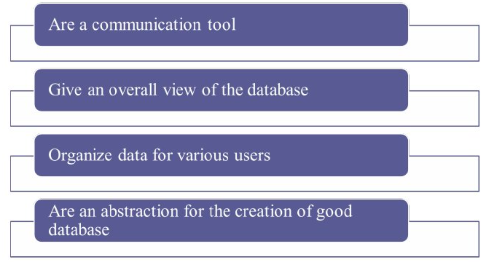

### Data Model Basic Building Blocks

建模的四大积木：

1. Entity: 唯一、可区分的对象，用于收集/存储数据
2. Attribute: 实体的特征
3. Relationship: 实体之间的关联（1:M, M:N, 1:1）
4. Constraint: 确保数据完整性的规则集合

### Business Rules

业务规则

- brief/precise/unambiguous（简短、精确、无歧义的政策/流程/原则描述）
- enable defining building blocks（帮助定义建模积木）
- describe main & distinguishing characteristics of the data（描述数据的主要/区分性特征）

### Sources of Business Rules

5个来源：
- company managers
- policy makers
- department managers
- written documentation
- direct interviews with end users

关键理解
- 文档经常过时；最终解释权通常在“用系统的人”（end users）。
- 不同角色给的规则可能冲突：这就是为什么建模是“沟通工具”。

### Why identify & document rules?

要点：
- 标准化公司对数据的看法
- 用户与设计者沟通工具
- 让设计者能：理解数据/业务流程范围；制定参与规则与约束；做准确数据模型

关键理解
- “参与规则/约束”= 例如：一个订单必须属于某个客户吗？客户可以没有订单吗？
这类“必须/可选”就是 participation（参与度）问题。

业务规则文档化 = 让模型可验证、可维护、可交接。

### Translating Business Rules → Data Model Components

这个很简单的。就是需求的话，如何翻译成规则。

1. 找名词集合 → 候选实体
2.	找动词 → 候选关系
3.	用两个方向提问 → 判断 1:1 / 1:M / M:N（两个方向的意思是：A对应多少B？和B对应多少A？这两个问题）

### Naming Conventions

要点：
- 实体名：描述业务对象、用用户熟悉的术语
- 属性名：描述所代表的数据
- 好命名：促进沟通、促进自文档化（self-documentation）

关键理解（工程落地版）
- 命名不是洁癖：是为了减少误解。
- 实体/属性命名越贴近业务语言，你的模型越容易被业务方确认（减少返工）。

常见坑
- 用开发术语代替业务术语（用户看不懂）
- 缩写乱用导致歧义（尤其跨部门）

## Hierarchical vs Network Models

这是两种之前的Model，对比如下。

| 对比维度 | Hierarchical Model（层次模型） | Network Model（网状模型） |
|---------|-----------------------------|---------------------------|
| 基本结构 | 倒置树结构（parent–child） | 图结构（owner–member） |
| 能表达的关系类型 | 只能自然表达 1:M 关系 | 可表达 1:M 和 M:N 关系 |
| 关系表示方式 | 严格的父子层次 | 节点间可有多条连接 |
| 数据访问方式 | 导航式（必须沿固定路径从根节点访问） | 导航式（沿指针/路径遍历关系） |
| 对物理结构依赖 | 强依赖，需了解存储与访问路径 | 强依赖，同样需要理解访问路径 |
| 数据独立性 | 很弱（结构变化需修改应用程序） | 很弱（结构变化需修改应用程序） |
| 完整性支持 | 父/子关系有助于维护完整性 | owner/member 关系有助于维护完整性 |
| 灵活性 | 低，结构僵硬 | 较高，能表示更复杂关系 |
| 系统复杂度 | 相对简单 | 更复杂 |
| 性能特点 | 对 1:M 访问高效 | 对复杂关系访问更高效 |
| 标准化程度 | 缺乏统一标准 | 有正式标准 |
| 语言支持 | 缺乏完整的数据定义语言 | 提供 DDL 和 DML |
| 主要缺点 | 无法表达 M:N；路径依赖强；维护困难 | 系统复杂；导航式访问导致开发和维护困难 |
| 历史地位 | 早期数据库模型 | 层次模型之后的重要改进 |
| 被替代原因 | 缺乏灵活性和数据独立性 | 复杂性高、仍缺乏声明式查询能力 |

|Hierarchical Model|Network Model|
|---|---|
|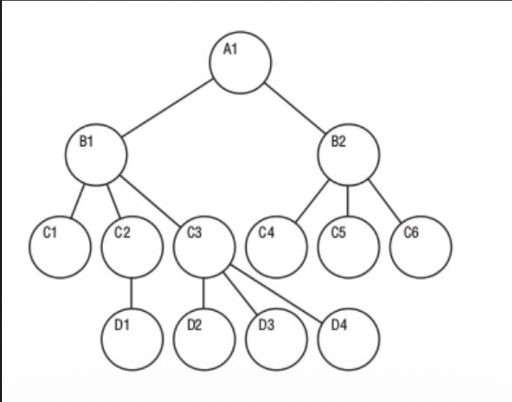|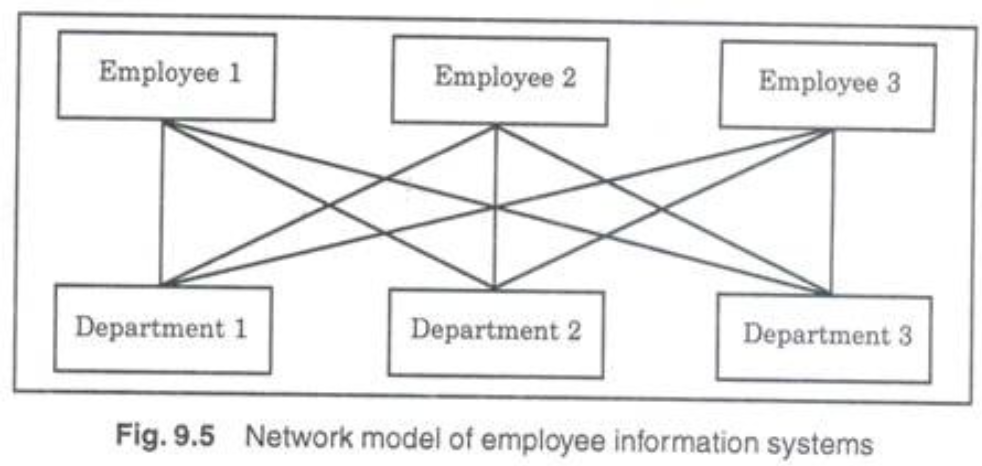|

## Standard Database Concepts（Schema v.s. Subschema）

**Schema:** DBA 视角下整个数据库的概念组织 \
**Subschema:** 应用程序看到的数据库的一部分（为了得到所需信息）

关键理解（超级重要）
- Schema = 全局蓝图（全库长什么样）
- Subschema = 视图/局部视角（某个应用/部门关心哪一部分）
- 这就是 “不同用户看到不同视图” 的正规表述，也是安全/抽象的一部分。

一句话例子
- HR 应用只需要 Employees + Salaries；销售系统只需要 Customers + Orders。它们各自的 subschema 不同，但共享同一个 schema。

### Schema data definition language (DDL)

内容：DDL 让 DBA 定义 schema components（定义模式组件）

关键理解
- DDL = “定义结构的语言”：建表、建约束、建索引、定义视图等。
- 在 SQL 世界里：`CREATE` / `ALTER` / `DROP` 主要就是 DDL。

### Data manipulation language (DML)

内容：DML 是管理数据并对数据库中的数据进行工作的环境/语言

关键理解
- DML = “操作数据的语言”：查、插、改、删。
- SQL 里：`SELECT` / `INSERT` / `UPDATE` / `DELETE` 是典型 DML。

常见误区：很多人以为 SQL 就是查询（SELECT），但课程里通常会强调：SQL 既包含 DDL 也包含 DML（还有 DCL/TCL 等扩展概念，后面可能提）。

### DDL v.s. DML

| 对比维度 | DDL（Data Definition Language） | DML（Data Manipulation Language） |
|---------|----------------------------------|-----------------------------------|
| 主要作用 | 定义和修改数据库结构 | 操作和管理数据库中的数据 |
| 操作对象 | Schema 及其组成部分（表、约束、索引、视图等） | 表中的数据（记录/元组） |
| 关注层次 | 数据的结构与组织方式 | 数据的内容本身 |
| 使用角色 | DBA / 数据库设计者 | 应用程序 / 终端用户 |
| 是否影响数据库结构 | 是 | 否 |
| 典型 SQL 语句 | CREATE, ALTER, DROP | SELECT, INSERT, UPDATE, DELETE |
| 执行频率 | 低（结构设计或调整时） | 高（日常业务操作） |
| 与事务的关系 | 通常隐式提交（依 DBMS 而异） | 通常受事务控制（可 COMMIT / ROLLBACK） |
| 在数据库生命周期中的位置 | 设计阶段 + 维护阶段 | 运行阶段 |
| 抽象层次 | 结构层（Schema level） | 数据层（Instance level） |
| 典型用途 | 建表、加约束、建索引、定义视图 | 查询、插入、修改、删除数据 |

## The Relational Model

### What is relation model

relation/table：由 tuple 与 attribute 交叉组成的矩阵
- tuple（元组） = rows
- attribute（属性） = columns

描述一组精确的数据操作构造（data manipulation constructs）

关键理解（这页是核心转折）
- 关系模型把数据统一为“表”，让查询更统一、更抽象。
- 最关键不是“表长得像 Excel”，而是：

它有严格数学基础 + 可用声明式语言表达操作（关系代数/SQL）
这会带来：更强的数据独立性、优化器空间、可移植性。

### Advantages of relational model

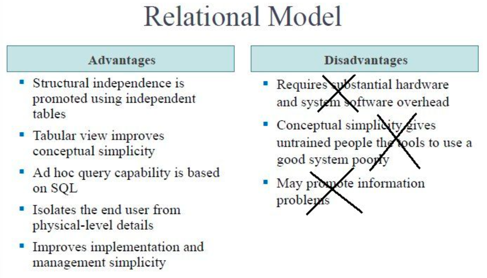

总结关系模型的优点 & 缺点（右边缺点被打叉，通常表示“历史上曾被认为是缺点，但现在弱化/不再成立或不是本课重点”）。

**Advantages（重点）**
- Structural independence：用独立表（independent tables）促进结构独立性
- 表结构/存储变更尽量不影响应用（呼应你前面学的 data/structural independence）。
- Tabular view（表格视图）让概念更简单：统一成“表/行/列”。
- Ad hoc query capability based on SQL：临时查询能力（SQL）
- 关键：不用写程序、直接问问题（what not how）。
- Isolates end user from physical-level details：用户不需要懂底层怎么存/怎么访问。
- Improves implementation & management simplicity：实现/管理更简单（标准化、工具链成熟）。

Disadvantages
- “硬件/软件开销大”“简单性导致外行乱用”“可能促成信息问题”
- 这些更多是早期观点或管理层面吐槽；现代 DBMS 生态下不作为核心反对理由（所以被打叉）。

**关系模型赢的核心：声明式查询 + 更强独立性 + 标准化生态（SQL）。**

### RDBMS

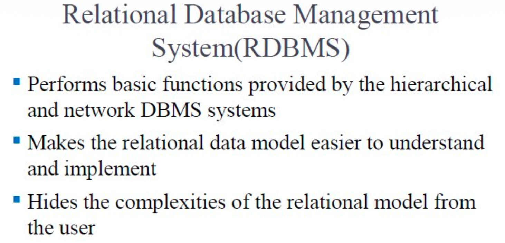

1.	提供层次/网状 DBMS 那些基础功能
2. 让关系模型更易理解和实现
3. 把复杂性隐藏在用户背后

### Example

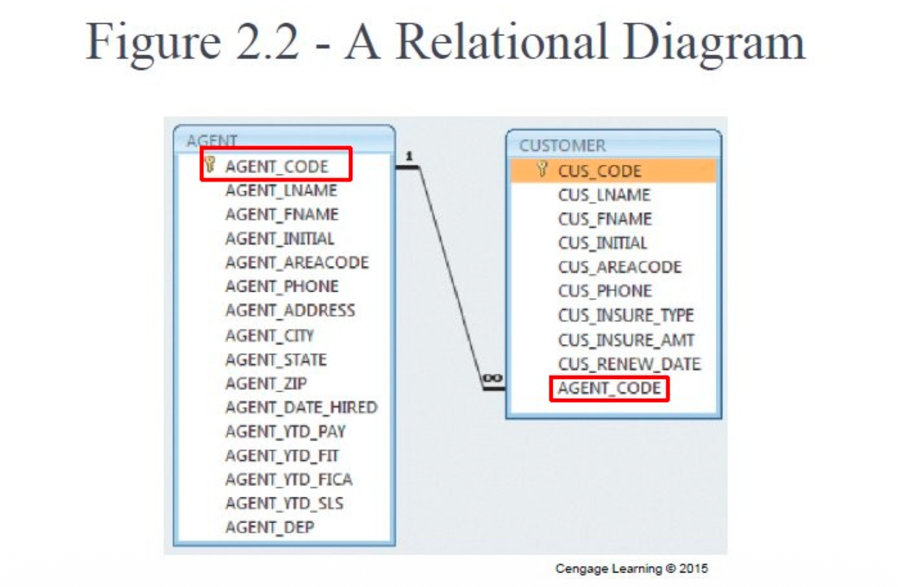

- AGENT 表里 AGENT_CODE 是主键（key 图标/红框）。
- CUSTOMER 表里 CUS_CODE 是主键；同时有 AGENT_CODE（红框）作为外键指向 AGENT。
- 连接线上 1 到 ∞：表示 一个 Agent 对应多个 Customer（1:M）。

### SQL-Based Relational Database Application

一个 SQL 关系数据库应用大概由：
1. End-user interface：用户界面（让用户交互）
2. Collection of tables：数据库中的表集合
   - 表彼此独立（结构上独立）
   - 不同表的行通过“公共属性的共同值”联系（join 的本质）
3. SQL engine：执行所有查询

关键理解
- “表是独立的”指：每张表单独存、单独定义；
- “表之间相关”靠的是 共同属性值（主键/外键）——这就是 join 发生的原因。

## The Entity Relationship Model (ER)

### What is ER

ER 模型是对实体及其关系的图形化表示：
- ERD（Entity Relationship Diagram）：用图表示数据库组件
- Entity instance / occurrence：实体实例（在关系表里对应一行 row）
- Connectivity：用于标注关系类型（1:1、1:M、M:N）

关键理解

- ER 是概念建模工具：先把业务世界表达清楚，再落地成表。
- “实体实例=表的一行”这句话很重要：
  - 实体（Entity）是类型/集合；实例（Instance）是具体一条记录。

Advantages
1. 可视化 → 概念简单
2. 是沟通工具：业务/开发/DBA 能对齐
3. 和关系模型集成：ER 常用来指导关系型设计

Disadvantages
1. 约束表示能力有限（很多业务规则没法在图里完整表达）
2. 关系表示也有限（尤其复杂约束/高阶语义）
3. 没有数据操作语言（ER 不是用来查询的）
4. 为避免图太挤会删属性 → 可能导致信息表达损失

**ER 图的定位：“画清楚业务结构”，不是最终实现细节。**

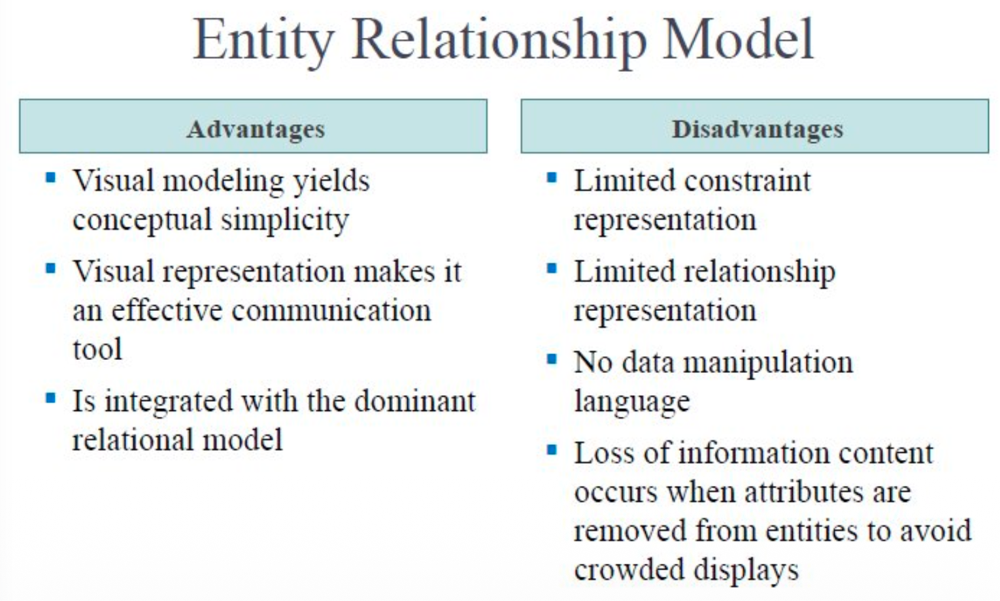

### ER Model Notations

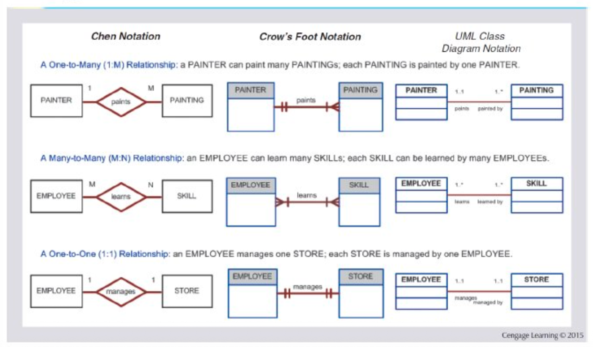

1. Chen notation（菱形关系）
2.	Crow’s Foot notation（乌鸦脚）
3.	UML class diagram（类图风格）

这三种风格怎么表示几比几，要记住！

## Evolution of Data Models

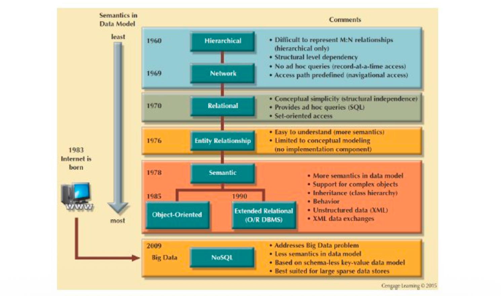

- Hierarchical / Network：访问是导航式、路径依赖，难 ad-hoc query。
- Relational（1970）：概念更简单 + SQL 支持 ad-hoc query + 集合式访问（set-oriented）。
- ER（1976）：更容易理解，但 只做概念建模，不负责实现。
- Semantic / OO / ORDBMS：为了表达更复杂对象、继承、行为，以及应对非结构化/半结构化（XML 等）。
- NoSQL（2009 Big Data）：为大数据与扩展性，往往 语义约束更少、schema 更松，适合大规模稀疏数据。

**“为什么 NoSQL 兴起”：扩展性/大数据/灵活 schema（但通常牺牲一部分强约束/一致性语义）。**

## Data Abstraction Levels

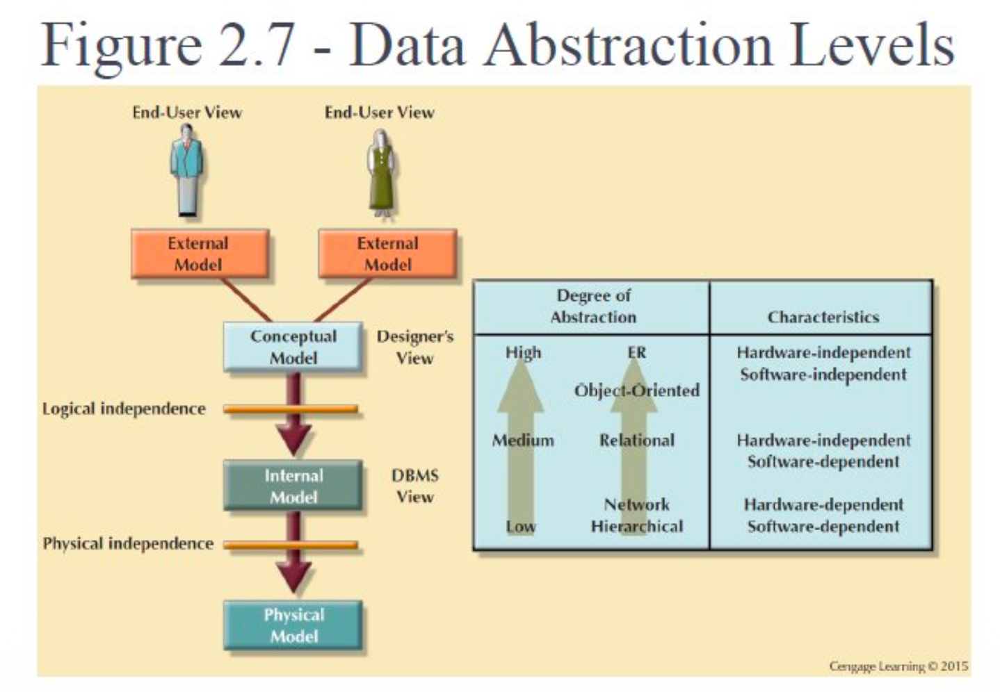

## The External Model

- 外部模型 = 终端用户对数据环境的视角
- 用 ER diagrams 表示外部视图
- External schema：某个外部视图的具体表示

关键理解
- 外部模型强调“我这个用户/部门关心什么”。
- 同一数据库可以有多个 external schema（对不同应用/角色）。

这个就是一个例子

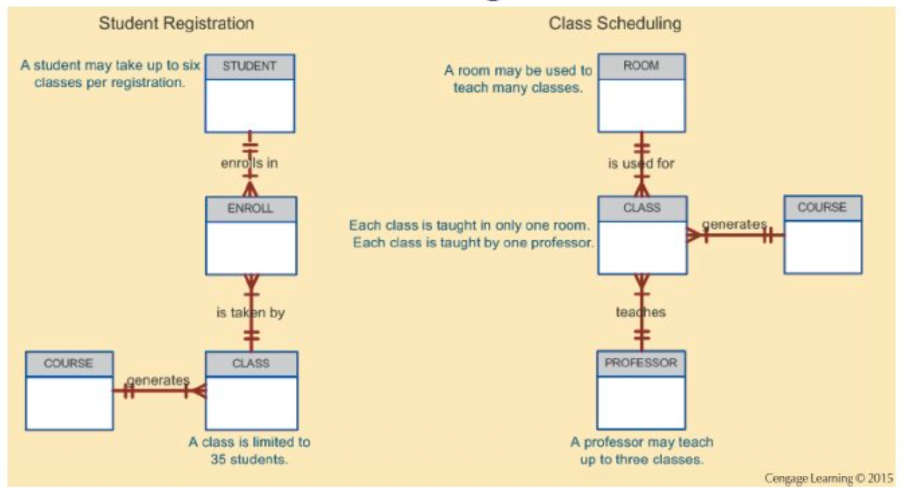

## The Conceptual Model

- Conceptual model = 整个组织的全局视图
- Conceptual schema：识别并高层描述主要数据对象的基础
- macro-level view（宏观视图）
- 软件/硬件无关
- Logical design：创建概念数据模型的任务

**这一步是“统一全公司/全系统口径”的关键：把多个 external view 合成一个完整模型。**

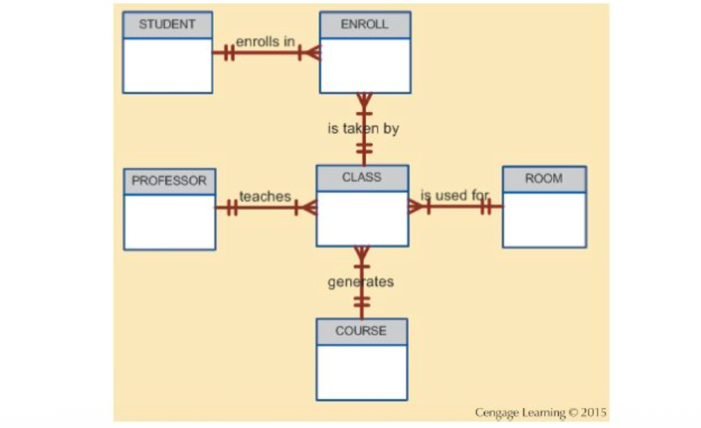

## The Internal Model

- Internal model = DBMS 看到的数据库表示（把概念模型映射到 DBMS）
- Internal schema：内部模型的具体表示
- 用所选 DBMS 支持的构造（表、类型、约束等）
- **软件相关**、硬件无关
- Logical independence：改变内部模型不影响概念模型

**Internal model 其实就是：“把 ER/概念模型落成关系模型结构（表、主键、外键、约束）”。**

意思就是落到实处，落到实现上！

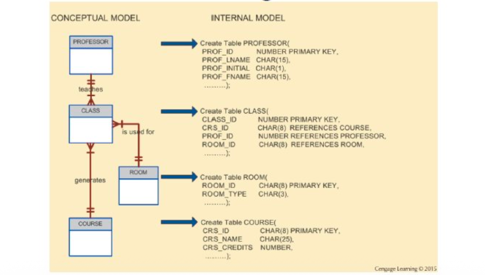

## The Physical Model

- 物理模型是最低抽象层：描述数据如何存在介质上（磁盘/磁带）
- 需要定义物理存储与访问方法
- 强调：关系模型目标在逻辑层，不要求用户提供物理细节
- Physical independence：物理模型变化不影响内部模型

