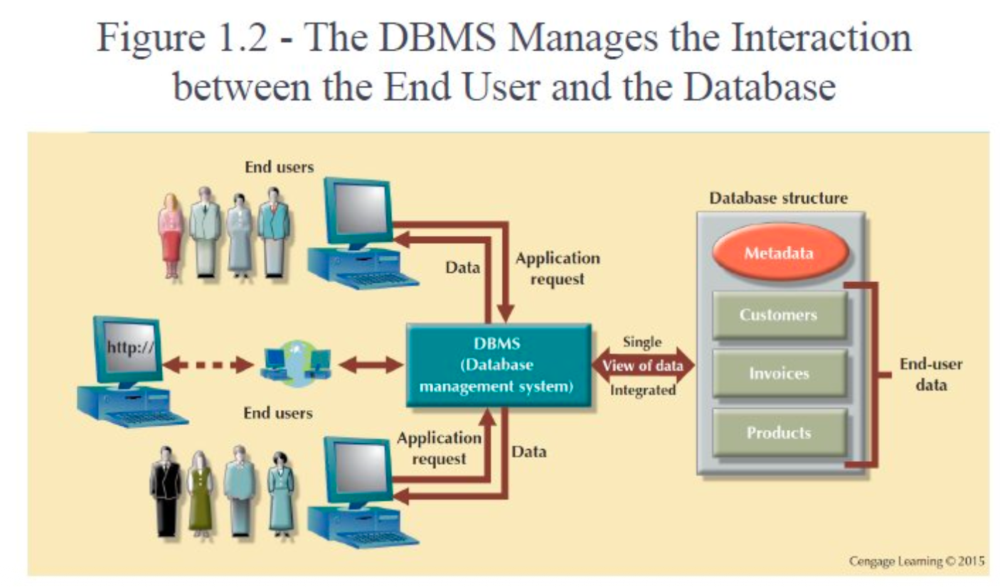
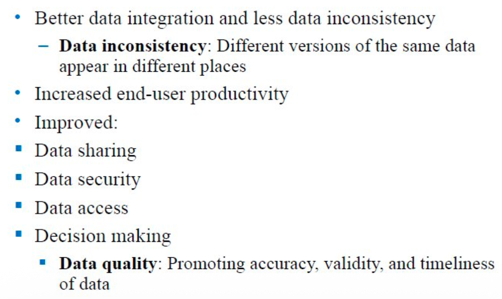
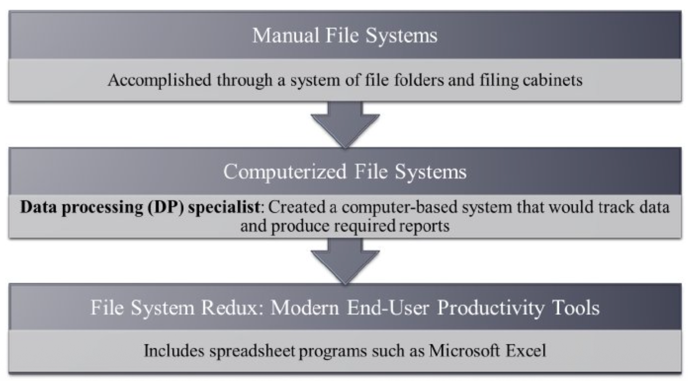
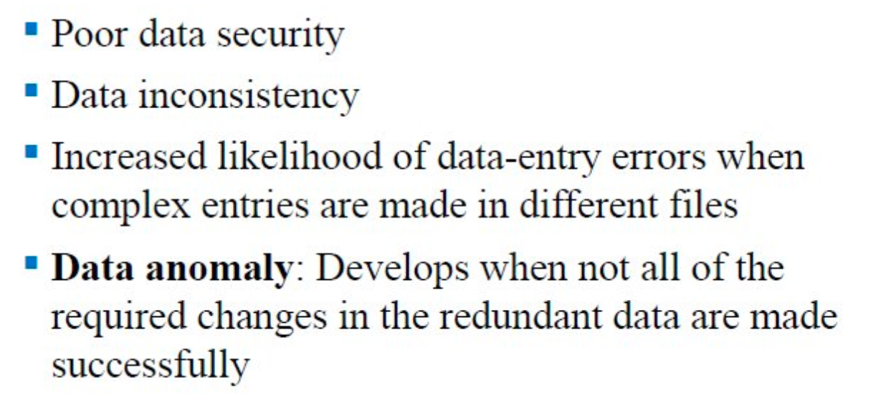

# Week1 Introduction

- [Week1 Introduction](#week1-introduction)
  - [This Chapter Learning Object](#this-chapter-learning-object)
  - [Data v.s. Information](#data-vs-information)
  - [DB and DBMS](#db-and-dbms)
    - [Some Definitions](#some-definitions)
    - [Role of DBMS](#role-of-dbms)
    - [Advantages of the DBMS](#advantages-of-the-dbms)
    - [\*\*\*Types of DBs](#types-of-dbs)
  - [File System](#file-system)
    - [Evolution of File System Data Processing](#evolution-of-file-system-data-processing)
    - [Basic File Terminology](#basic-file-terminology)
    - [Problems with File System Data Processing](#problems-with-file-system-data-processing)
    - [Structural and Data Dependence](#structural-and-data-dependence)
    - [Data dependence vs Data independence](#data-dependence-vs-data-independence)
    - [Data Redundancy](#data-redundancy)
    - [Data Redundancy Implications](#data-redundancy-implications)
    - [Types of Data Anomaly](#types-of-data-anomaly)
  - [DBMS Functions](#dbms-functions)

*** means that carefully review is needed

## This Chapter Learning Object

- 区分 data vs. information
- 什么是 database、有哪些类型、为什么对决策重要
- 数据库设计的重要性
- 现代数据库如何从文件系统演进而来
- 文件系统数据管理的缺陷（flaws）
- 数据库系统的主要组成
- DBMS 的主要功能

> DBMS: Database Management System

**课程后面的大主题基本就是：**
文件系统做不好 → DBMS 来兜底（共享、并发、安全、抽象、恢复、性能）

## Data v.s. Information

这个很好理解了。

- Data（数据）：raw facts（原始事实），没加工前意义不明显；是信息的“积木”。还提到 data management：生成、存储、检索。
- Information（信息）：由 processing data（处理数据） 产生；能揭示意义、形成知识；要 准确/相关/及时 才能支持决策。

关键理解（很重要）
- DB 的价值不是“存数据”，而是把数据组织好，让它能变成可用的信息（支持查询/分析/决策）。
- 你以后会反复看到“数据质量”：**accuracy/validity/timeliness**。

> [!tip]
> - “张三 1/24 买了 $15 的东西”是 data
> - “本月销售额同比 +12%，主要来自某类商品”是 information（处理+聚合+解释）

## DB and DBMS

### Some Definitions

here are some definitions:

**Database:**

shared, integrated computer structure that stores a collections of:
- **end-user data:** raw facts of interest to end user
- **metadata:** data about data, which the end-user data are integrated an managed; describe data characteristics and relationships

**DBMS: 本质就是一组程序，管理数据库的结构，控制对数据库中数据的访问**。

### Role of DBMS

- 用户和数据库之间的 中间层（intermediary）
- 让数据可共享（shared）
- 给用户一个集成视图（integrated view）
- 把应用请求翻译成数据库操作
- 隐藏数据库内部复杂性（对应用和用户）

这个图也很好理解，通过DBMS，用户就可以有统一入口+统一规则+统一视图

重要观点：DBMS 负责把“多用户多应用的请求”映射到“统一管理的数据与结构”，并返回一致的视图。

**‼️ A DBMS is responsible for mapping "requests from multiple users and applications" to "uniformly managed data and structures," and returning a consistent view.**

### Advantages of the DBMS

- 更好的数据集成、更少不一致（data inconsistency：同一份数据在不同地方出现不同版本）
- 提升终端用户生产力
- 改善：
  - 数据共享
  - 数据安全
  - 数据访问
  - 决策制定（数据质量：准确、有效、及时）

### ***Types of DBs

**User type**

- Single-user database: 一次支持一个用户。比如：Desktop database，跑在 PC 上
- Multiuser database: 同时支持多个用户。比如：
  - Workgroup database：小团队/部门
  - Enterprise database：跨部门、大规模

**Deployment type/location classification type**

- Centralized database：数据在单一站点
- Distributed database：数据分布在不同站点
- Cloud database：使用云数据服务创建维护，并有定义好的性能度量

**Purpose type**

- General-purpose databases：跨学科/多种数据用途
- Discipline-specific databases：面向特定领域（例如医疗、地理信息、基因组等）

> 专用数据库往往会有领域特化的数据模型、查询、索引或合规要求。例如地理数据库对空间查询很强（R-tree/空间索引）。

**Operational vs Analytical / Data Warehouse**

- Operational database（操作型/事务型）：支持公司日常运营（day-to-day）
- Analytical database（分析型）：存历史数据和业务指标，用于战术/战略决策
- Data warehouse（数据仓库）：为决策支持优化的数据格式
  - 提到 OLAP（在线分析处理）
  - Business intelligence：捕获/处理业务数据，生成支持决策的信息

关键理解（这页很重要，后面经常考/面试也爱问）
- Operational = OLTP（高并发、小事务、频繁写、强一致）
- Analytical = OLAP（读多、聚合多、历史多、宽表/列存常见）
- 数据仓库是“为分析而组织”的存储，不是简单把 OLTP 数据搬过去。

典型例子
- OLTP：下单、付款、改地址
- OLAP：本季度各地区利润、用户留存漏斗、广告转化分析

**Data structure type**

- Unstructured data：原始状态存在（如纯文本、图片、音频、视频）
- Structured data：经过格式化；结构取决于要做的处理
- Semistructured data：部分结构化（常见例子：JSON、XML、日志）

## File System

### Evolution of File System Data Processing

- 一开始大家用文件夹/柜子（Manual file systems）。
- 后来有 DP specialist（数据处理人员） 写程序：追踪数据、生成报表（Computerized file systems）。
- 再后来很多部门直接用 Excel 之类工具“自建系统”（File system redux）。

### Basic File Terminology

文件系统的一些基本术语

| 术语 (Term) | 定义 (Definition) | 示例 (Example) |
| :--- | :--- | :--- |
| **Data (数据)** | 原始事实；只有被组织起来才有意义。 | 原始数字、杂乱的字符。 |
| **Field (字段)** | 有意义的**最小数据单元**；描述对象的某个属性。 | `phone` (电话), `DOB` (出生日期) |
| **Record (记录)** | 多个字段组成的一条“描述某对象”的信息。 | 一个客户的完整信息行。 |
| **File (文件)** | 相关记录的集合。 | 所有在校学生记录的数据库表或文档。 |

> **文件 (File)** ⊃ **记录 (Record)** ⊃ **字段 (Field)** ⊃ **数据 (Data)**

### Problems with File System Data Processing

列 5 个典型痛点：
1.	开发周期长
2.	很难快速得到答案
3.	系统管理复杂
4.	安全差 & 数据共享受限
5.	需要大量编程

关键理解
- 没有 DBMS 时，很多需求都变成“改程序/写脚本/跑批处理”，不是“写查询”。

- 这页常被用来回答面试/考试：**“Why DBMS instead of files?”**

### Structural and Data Dependence

- Structural dependence：访问一个文件依赖于它的结构；结构一变，程序得跟着改。
- Structural independence：文件结构改变，不影响应用访问数据的能力。

意思是：文件系统几乎天然是“结构依赖”；DBMS 的设计目标之一就是提供“更强的独立性”（至少在更高层抽象上）。

### Data dependence vs Data independence

- Data dependence：数据存储特性变了，数据访问方式也要变。
- Data independence：存储特性改变，不影响程序访问数据。

你写 SQL 是“逻辑层”在描述要什么；DBMS 可以在“物理层”换索引、换存储布局、换文件组织，而尽量不影响你的查询写法。

> [!note]
> 个人理解：这个其实和C++的封装，面向对象的封装是一个道理。通过外部抽象一层封装，访问不同的数据结构，都可以使用同样的方法，比如迭代器。

### Data Redundancy

Data redundancy：同一数据不必要地存多个地方。

Islands of information：数据散落在不同位置，导致同一数据有多个版本的概率升高。

冗余 ≠ 一定坏（有时为了性能会“刻意冗余/缓存/复制”），但这里指的是无治理、无约束的重复存储，会带来一致性灾难。

“信息孤岛”这个词很常考：部门各存各的 = 无法形成单一事实来源（single source of truth）。

### Data Redundancy Implications

冗余的后果

- 安全差（多份数据、多处权限管理更难）
- 不一致（版本不一致）
- 录入错误概率上升（不同文件各自录）
- Data anomaly（数据异常）：更新冗余数据时没能把所有副本都改对/改全

### Types of Data Anomaly

三类异常：
- Update anomalies（更新异常）
- Insertion anomalies（插入异常）
- Deletion anomalies（删除异常）

## DBMS Functions

| 功能类别 | DBMS 功能 | 核心作用 | 关键理解 / 考点提示 |
|---------|----------|----------|------------------|
| 元数据管理 | Data Dictionary Management | 存储并管理数据库的元数据（数据定义、关系、约束等） | Data Dictionary 是 DBMS 的“自我描述机制”；包含表结构、字段类型、约束、索引、关系、权限、统计信息等 |
| 存储管理 | Data Storage Management | 管理数据的物理存储方式并进行性能优化 | 用户只看到逻辑结构，DBMS 负责底层存储布局与访问路径（如索引、文件组织） |
| 数据转换与呈现 | Data Transformation & Presentation | 将输入数据转换为所需的数据结构并输出结果 | 支撑查询结果的格式化与视图呈现，体现逻辑层与物理层分离 |
| 安全管理 | Security Management | 控制用户访问权限，保护数据隐私 | 权限控制是集中式的；比文件系统“到处拷贝文件”安全得多 |
| 并发控制 | Multiuser Access Control | 支持多用户同时访问而不破坏数据一致性 | 后续对应事务、锁、隔离级别；保证并发 ≠ 数据乱 |
| 备份与恢复 | Backup & Recovery Management | 在系统崩溃或错误后恢复数据库 | DBMS 的系统级能力；文件系统/Excel 基本做不到自动一致恢复 |
| 完整性管理 | Data Integrity Management | 保证数据准确、一致，减少冗余 | 通过约束、规则、防止数据异常（update/insert/delete anomalies） |
| 查询语言 | Database Access Languages | 让用户通过声明式语言访问数据库 | SQL 是事实标准；用户描述 “what”，DBMS 决定 “how” |
| 编程接口 | Application Programming Interfaces (APIs) | 允许应用程序访问数据库 | 如 JDBC / ODBC / driver；数据库与应用解耦 |
| 通信接口 | Database Communication Interfaces | 支持通过网络接收用户与应用请求 | 支撑客户端-服务器、分布式、云数据库架构 |