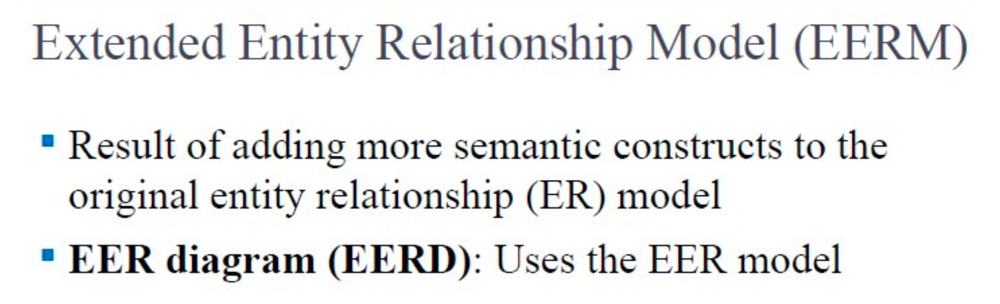
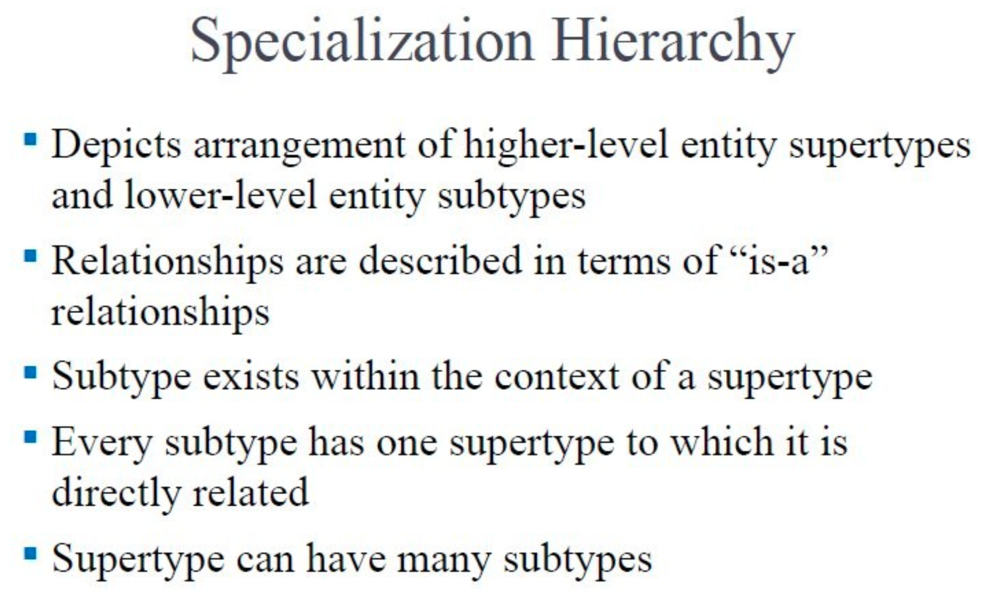
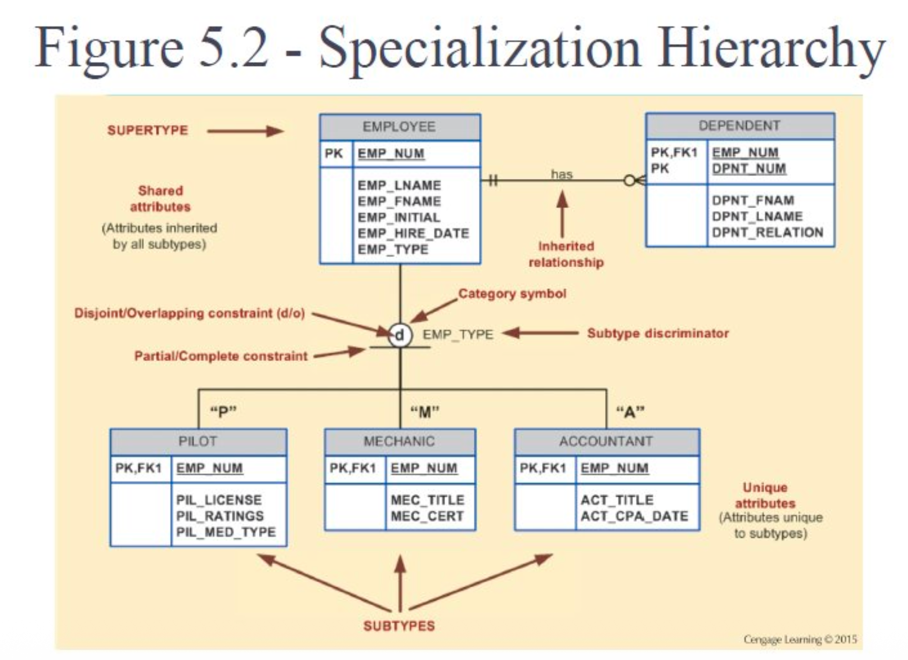
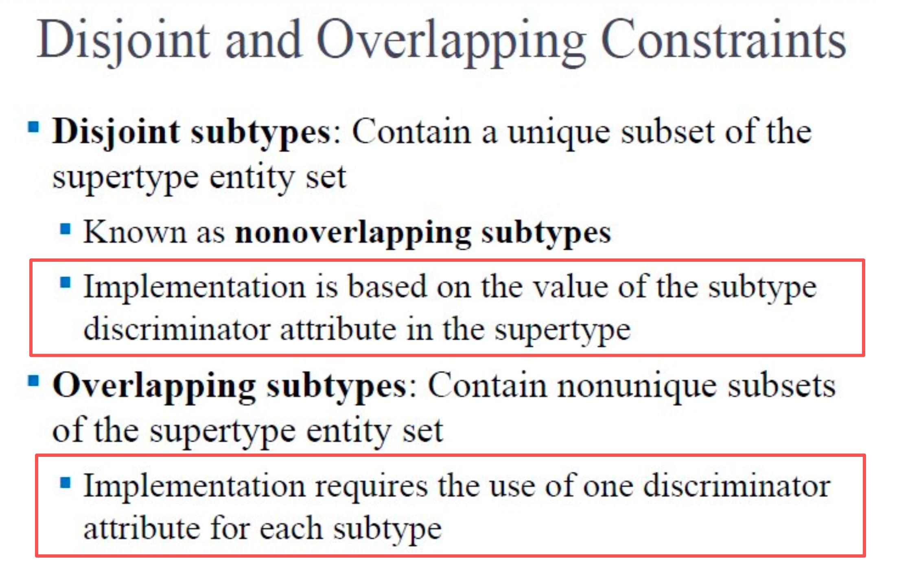
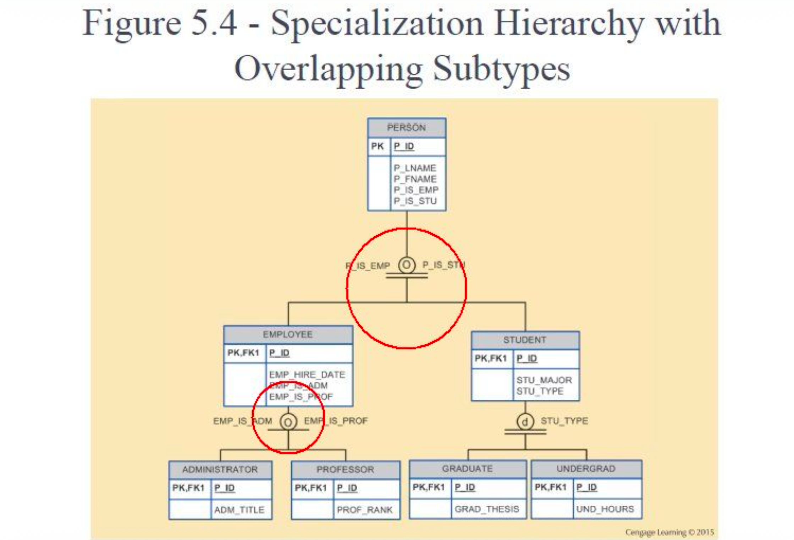
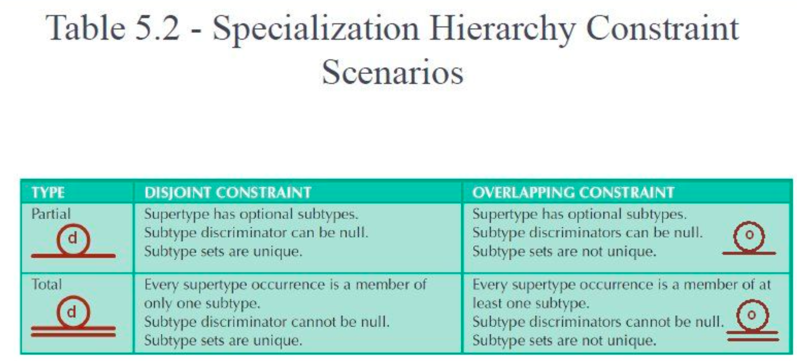
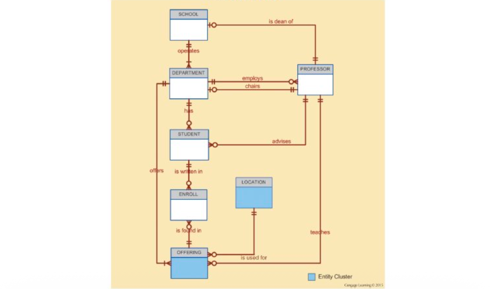

# Week2 EER

[TOC]

## 什么是 EERM？

EERM（扩展实体关系模型）：就是在原来基础的 ER 模型上加了更多的“语义结构”，用来处理更复杂的数据库设计 。

画出来的图就叫 EERD 。

## Entity Supertypes and Subtypes

超类型和子类型

- 超类型：就是一个通用的总称，包含大家都有的“公共属性” 。
- 子类型：总称下面具体的分类，包含自己独有的“独特属性” 。

- 什么时候用：当现实中某个事物有几种明显不同的分类，且每种分类都有自己专属的属性时才用。

> 其实，超类型（Supertype）和子类型（Subtype）的概念，就和 Python 或者 C++ 里的**面向对象编程（OOP）**中的“父类（基类）”和“子类（派生类）”是一模一样的。
>
> - **超类型 (Supertype)**：就是把大家**都有的共同特征**抽出来，放在一起 。相当于写代码时定义的一个基础父类。
>
> - **子类型 (Subtype)**：就是在通用特征之外，某些群体**自己独有的特征** 。相当于继承了父类，但又加了自己独特属性的子类。

> [!tip]
>
> 其实后面的内容，和面向对象是同一种感觉的，很好理解了

## Specialization Hierarchy

专业化层次结构

这是一种从上到下（超类型在上面，子类型在下面）的层级关系 。

它们之间是 "**is-a**"（是一个）的关系 。比如“飞行员**是一个**员工”。

每个子类型只能直接连着一个超类型，但一个超类型可以有多个子类型 。

**这些 specialization hierarchy 结构有什么用吗？**

- 支持“属性继承” 。
- 可以定义“子类型鉴别器” 。
- 可以定义“互斥/重叠”以及“完全/部分”这些约束条件 。

## 层次结构的例子

图里展示了一个 `EMPLOYEE` (员工) 作为超类型，下面分出三个子类型：飞行员 (`PILOT`)、机械师 (`MECHANIC`)、会计 (`ACCOUNTANT`) 。

超类型里存大家都有的信息（比如姓名、雇佣日期），子类型存独有信息（比如飞行员的执照、机械师的证书） 。

## Inheritance 继承

子类型会自动继承超类型的所有属性和关系 。

主键：子类型的主键跟超类型是一模一样的 。在实际底层数据库里，它们是 1对1 的关系 

## 子类型鉴别器 (Subtype Discriminator)

这是超类型里的一个特殊字段，用来告诉系统这条记录到底属于哪个具体的子类型 。比如员工类型填了 'P' 就代表他是飞行员，填 'M' 就是机械师。

## Disjoint and Overlapping Constraints

互斥：一个实例只能属于其中一个子类型 。比如你不可能同时是飞行员又是机械师 。

重叠：一个实例可以同时属于多个子类型 。

这两句的意思是：

1. 互斥子类型 (Disjoint subtypes) 下红框的那句

> "Implementation is based on the value of the subtype discriminator attribute in the supertype" 

- 直白翻译：在底层建表时，子类的区分是基于超类型（父表）里那个特定鉴别器属性的值 。
- 大白话解释：因为是“互斥”的，一个人只能有一种身份。所以在总表（父表）里，==只需要加 1 列就够了。比如加一列叫 `EMP_TYPE` (员工类型) 。如果这列的值填 'P' ，底层程序就知道要去调取飞行员表的数据；填 'M' 就去调取机械师表的数据。==
- 对应课件例子：你可以翻回课件第 6 页的图，父表里就只有一个 `EMP_TYPE` 字段用来做单选题 。

2. 重叠子类型 (Overlapping subtypes) 下红框的那句

> "Implementation requires the use of one discriminator attribute for each subtype" 

- 直白翻译：在底层建表时，需要为每一个子类型都单独设置一个鉴别器属性 。
- 大白话解释：因为是“重叠”的，一个人可以同时有多重身份。这时候只用 1 列就不够填了（你很难在一个格子里既填员工又填学生，这违背了数据库设计的规范）。==所以解决办法是：有几个子类，就在父表里加几列，用来做多选题判断。通常加的都是布尔值（True/False，是/否）。==
- 对应课件例子：你可以翻回第 10 页的图，因为人可以同时是员工和学生，所以父表 `PERSON` 里面特意放了两个独立的列：`P_IS_EMP` (是否为员工) 和 `P_IS_STU` (是否为学生) 。

## 重叠约束的例子

- 图里演示了重叠约束（注意圈里是个 'O'，代表 Overlapping） 。

- 意思是大学里的 `PERSON` (人) 可以同时既是员工 (`EMPLOYEE`) 又是学生 (`STUDENT`) 。

## 完整性约束 (Completeness Constraint)

决定超类型里的记录是不是必须得归类到某个子类型里 。

部分约束 (Partial)：可以不用全归类 。有的记录就是普通的超类型。

完全约束 (Total)：超类型里的每一条记录，都必须属于底下的至少一个子类型 。

这个表格总结了“互斥/重叠”与“部分/完全”这两两组合在一起时的四种情况和规则 。

首先教你认图表里的符号：

- 圈里是 **d**：代表互斥（单选）。
- 圈里是 **o**：代表重叠（多选）。
- **单横线**：代表 Partial（部分），意思是**“可以弃权/不选”**。
- **双横线**：代表 Total（完全），意思是**“必须得选/强制归类”**。

现在我们把它们两两组合，看这四个格子到底在讲什么：

1. 左上角：Partial + Disjoint (单线 + d)

- **规则**：**可以不选；如果要选，最多只能选一个。**
- **特征**：允许有普通的父类存在，不强制细分。鉴别器字段**可以为空 (Null)**。
- **场景举例**：公司里的员工，有的归入“飞行员”子表，有的归入“机械师”子表。但如果是公司前台大妈，她哪个特殊子表都不属于，就只在员工总表里待着（此时鉴别器为空）。

2. 右上角：Partial + Overlapping (单线 + o)

- **规则**：**可以不选；如果要选，可以同时选好几个。**
- **特征**：鉴别器字段**可以为空 (Null)**。
- **场景举例**：学校数据库里存了所有人。你可能既是“教职工”又是“学生”（重叠选多个）；但如果你只是个刚好来参观的校外人员，那你两边都不沾（为空 Null）。

3. 左下角：Total + Disjoint (双线 + d)

- **规则**：**必须得选，而且绝对只能选一个。**
- **特征**：不允许有光秃秃的父类存在。鉴别器字段**绝对不能为 Null**。
- **场景举例**：医院里的病人，一旦录入系统，你必须明确他是“门诊病人”还是“住院病人”。不能两头占，也不能啥都不是。系统强制要求这列必须填值。

4. 右下角：Total + Overlapping (双线 + o)

- **规则**：**必须得选，而且可以同时选好几个。**
- **特征**：鉴别器字段**绝对不能为 Null**（你至少得占一个坑）。
- **场景举例**：买了一辆车，这辆车的“所有者 (Owner)”必须得有人认领（不能是无主黑车，所以不能为 Null）。所有者可以是个“人”，也可以是个“公司”，或者这车是由个人和公司共同出资拥有的（重叠）。

## Entity Clusters

为了防止复杂的 ER 图看起来太乱，把多个相关的实体打包成一个大方块（比如图里的蓝色 `LOCATION` 方块），这就叫实体簇，用来简化整个图纸的视觉效果 。

