# Week2 ER

[TOC]

## Entity Relationship Model (ERM)

这页在讲啥

- ERM 是 ERD（Entity Relationship Diagram）的理论基础

- ERD 描述的是：

  - 终端用户眼里的 概念数据库
  - 数据库的三大核心组件：
    - **Entities**
    - **Attributes**
    - Relationships

- 强调一句：

  Entity 指的是 entity set（实体集合），不是单个实例

**你要真正记住的**

- 你画 ER 图时，画的是「一类东西」（学生、课程），不是「张三、CS585」。
- 这是概念建模层，还没到表/SQL。

## Attributes

### What are attributes

- Attribute = 实体的特征
- 分类：
  - **Required attribute**：必须有值（不能空）
  - **Optional attribute**：可以为空
- **Domain**：该属性允许的取值集合
- **Identifiers**：能唯一标识实体实例的一个或多个属性

> [!tip]
>
> 主键一定 required，但 required 不一定是主键
>
> Domain 是约束的来源（例如年龄 ≥ 0）
>
> 问你：某字段能不能是 NULL，本质就是 optional vs required。

这里就是一个例子，两种图里：the attributes of the student entity

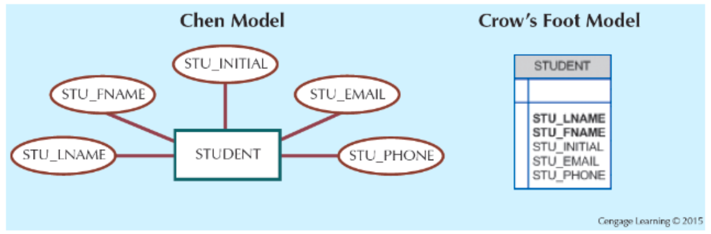

Attributes属性，还有一些分类：

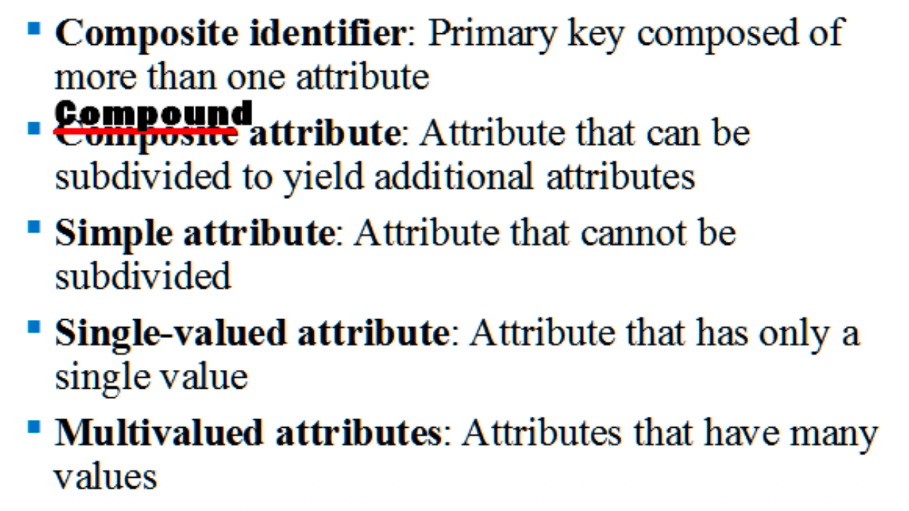

- Composite identifier：复合主键
- Composite attribute：可拆分的属性（如 Address → Street + City）
- Simple attribute：不可再拆
- Single-valued attribute：单值
- Multivalued attribute：多值

**关键理解（非常重要）**

- Composite attribute ≠ Multivalued attribute
  - Address 是 composite（一个地址）
  - Phone numbers 往往是 multivalued（多个）

关于这个 multivalued attribute, 两种图，其中 Crow's Foot Model 不支持 multivalued

在关系数据库里：

- **多值属性不能直接塞进一列**
- 必须拆

### How to deal with Multivalued Attributes

多值属性需要：

1. 拆成多个属性（不推荐，有限场景）
2. **新建一个实体**（最常见、最规范）

- 多值属性 ≈ **潜在的新实体**
- 这一步直接影响后面的规范化

**考试/作业**

- 给你一个多值属性，问你“正确建模方式”——答案基本都是：**新实体 + 关系**

### Derived Attribute

Derived attribute：由其他属性计算得出

示例：

- EMP_AGE ← EMP_DOB

关键理解：

- 派生属性 逻辑上存在，但不一定存
- 图中虚线表示 derived

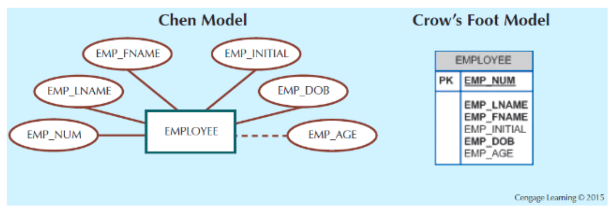

当然关于这个 derived attributes 是否存储，是有优缺点的，可以进行对比。

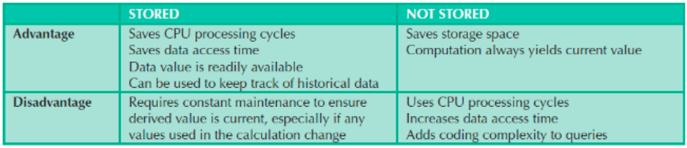

## Relationships

Relationship = 实体之间的关联

重要概念：

- Participants：参与关系的实体
- Connectivity：关系类型（1:1, 1:M, M:N）
- Cardinality：最小/最大参与数

**关键理解**

- ==Connectivity 说“总体关系类型”==
- ==Cardinality 说“具体约束范围”==

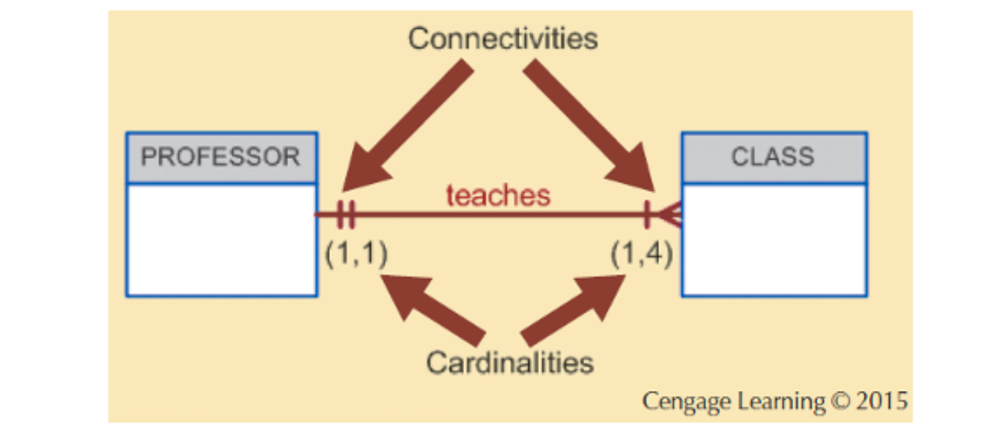

### Existence Dependence

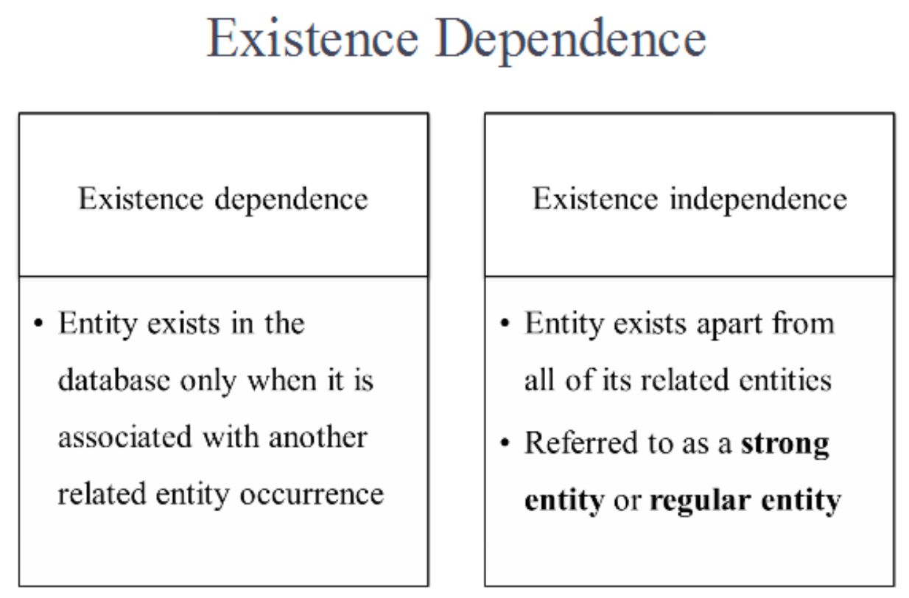

- **Existence-dependent**：实体必须依附于另一个实体存在
- **Existence-independent**：实体可独立存在（强实体）

***

Weak / Non-identifying

- 子实体 PK 不包含 父实体 PK

Strong / Identifying

- 子实体 PK 包含 父实体 PK

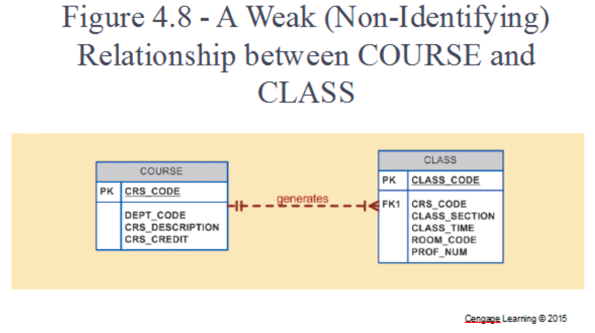

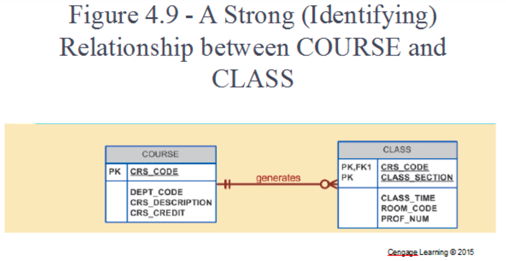

> [!important]
>
> **谁“能独立存在”，谁就是父实体（Parent）, 谁“必须依附别人才能存在”，谁就是子实体（Child）**
>
> 「**CLASS 能不能在没有 COURSE 的情况下存在？**」
>
> 不可能！没有课程，就不存在某门课的某个班

### Weak Entity

Weak entity 的条件：

- Existence-dependent
- 主键部分或全部来自父实体

- 是否是弱实体：由 **business rules 决定**

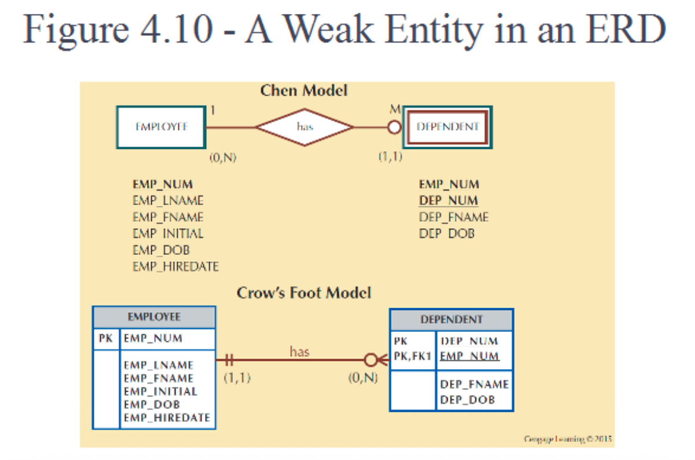

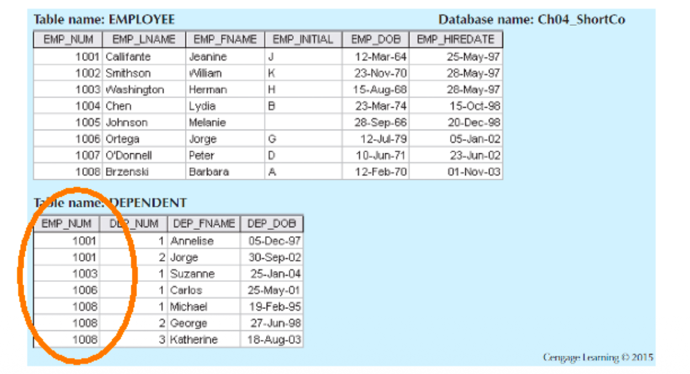

### Relationship Participation

- **Optional participation**：可以不参与关系
- **Mandatory participation**：必须参与关系

**关键理解**

- 这是 最小基数（min cardinality） 的体现
- 和 existence dependence 强相关，但不完全等价

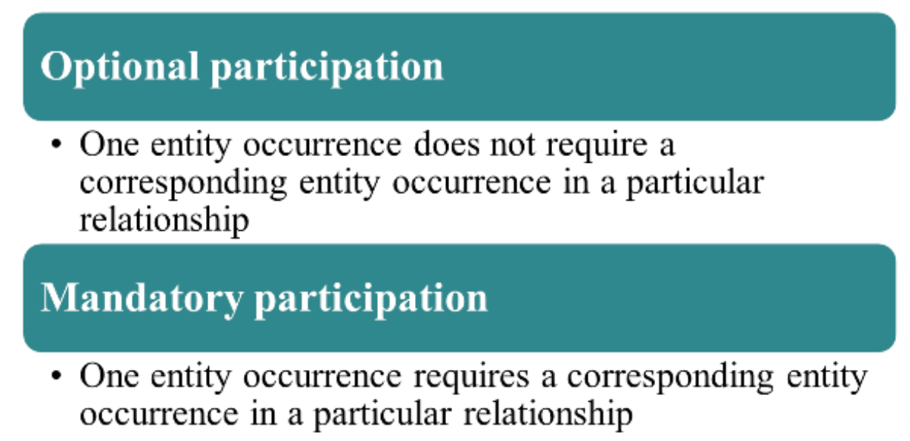

### Participation v.s. Existence dependence

**一、Existence Dependence（存在依赖）到底是什么？**

**定义（语义层，生存问题）**

> ==一个实体 **是否可以在数据库中独立存在**，而不依附于另一个实体。==

**特点**

- **是实体级（entity-level）概念**

- 回答的问题是：

  > **没有 A，这个实体 B 还能不能存在？**

- 通常用来判断：

  - strong entity vs weak entity
  - identifying relationship

**例子（经典）**

- **DEPENDENT** 不能没有 **EMPLOYEE**

  → existence-dependent

- **CLASS**（如果 PK 包含 CRS_CODE）不能没有 **COURSE**

**二、Participation（参与度）到底是什么？**

**定义（关系级，约束问题）**

> ==一个实体的实例 **在某个特定关系中是否必须参与**。==

**特点**

- **是关系级（relationship-level）概念**

- 回答的问题是：

  > **每个实体实例，需不需要在这个关系中出现至少一次？**

- 表现为：

  - **Mandatory participation**（最小基数 = 1）
  - **Optional participation**（最小基数 = 0）

**例子**

- STUDENT – enrolls – COURSE

  - 一个 STUDENT **可以暂时不选课** → optional participation

  - 一门 COURSE **可以没人选** → optional participation

    ==👉 但二者 **都能独立存在**==

> **Existence dependence ≠ Mandatory participation**

> **Mandatory participation ≠ Existence dependence**

**判断 Existence Dependence：**

> **删掉对方，这个实体还能不能合理存在？**

**判断 Participation：**

> **这个实体的每个实例，必须出现在这个关系里吗？**

**六、拿 COURSE – CLASS 再对照一遍（最容易混的）**

**Existence Dependence**

- CLASS 能没有 COURSE 吗？

  ❌ 不能

  → CLASS existence-dependent

**Participation**

- COURSE 一定要生成 CLASS 吗？

  ❌ 不一定（有些课不开）

  → COURSE optional participation

## Crow's Foot Symbols

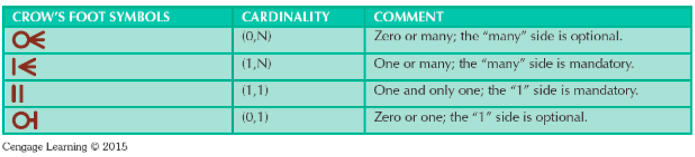

## Relationship Degree

### Unary/Binary/Ternary

这页定义“关系度数”= 一个 relationship 连接了多少个实体（participants）。

- Unary relationship：单实体内部关系（同一实体内部发生关联）
  - Recursive relationship：unary 的一种，发生在同一实体集合的不同实例之间
- Binary relationship：两个实体（最常见）
- Ternary relationship：三个实体一起参与

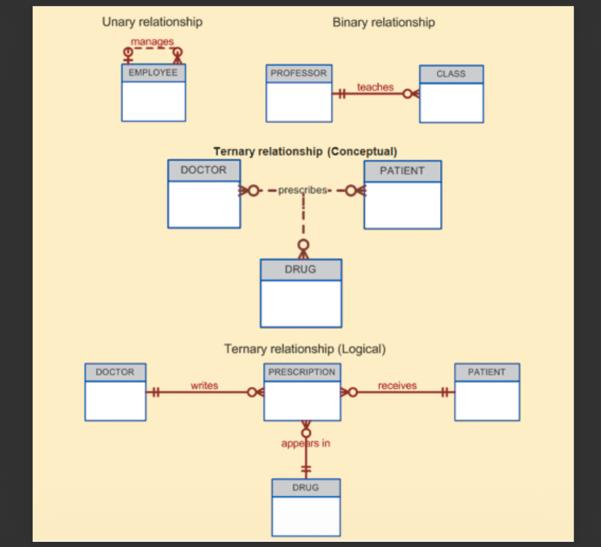

### Recursive Relationships

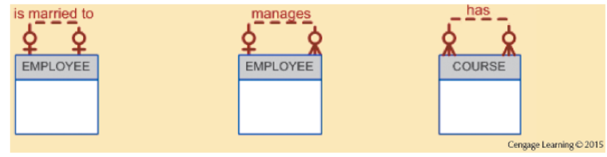

- EMPLOYEE is married to EMPLOYEE（对称/互相关联的感觉，但注意不是 existence 依赖）
- EMPLOYEE manages EMPLOYEE（有方向，上下级）
- COURSE has COURSE（比如先修课/后续课）

## Associative Entities

- Associative entity = composite / bridge entity
- 用来表示 **M:N**（两个或更多实体的多对多）
- 关联实体与每个“父实体”都是 **1:M**
- 关联实体的主键通常由各父实体的主键组成（复合主键）
- 还可以带“额外属性”（这点非常重要：M:N 关系本身往往有属性）

==**只要你看到 M:N，脑子里第一反应就是：加一个 ENROLL/ORDER_ITEM 这种桥接表（关联实体）。**== 

这里先举一个例子：

给了 STUDENT、CLASS、以及中间的 ENROLL 表（桥接表）：

- STUDENT（STU_NUM, STU_LNAME…）
- CLASS（CLASS_CODE, CRS_CODE, SECTION…）
- ENROLL（CLASS_CODE, STU_NUM, ENROLL_GRADE）

看懂这页你就会做题：

- 原来的“学生选课（或选班）”是 M:N
- 用 ENROLL 把它拆成：
  - STUDENT 1:M ENROLL
  - CLASS 1:M ENROLL
- ENROLL_GRADE 这种就是“关系属性”——**只能放在桥接实体里**。 

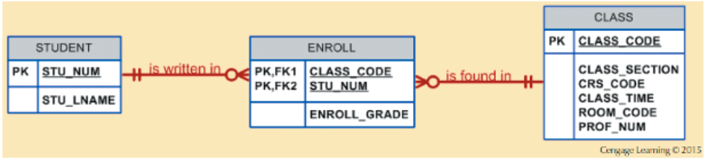

所以本来是多对多的，现在变成了1:多

## Developing an ER Diagram

给了一个标准步骤（你以后做 project/作业就按这个）：

1. 写清楚业务叙述（narrative）
2. 从叙述里提 business rules
3. 从 rules 里找实体和关系
4. 画初版 ERD
5. 补属性和主键（确保能唯一标识实例）
6. 反复 revise/review

重点：**ERD 是迭代出来的，不是一次画对。**

tips: mermaid可以画er图

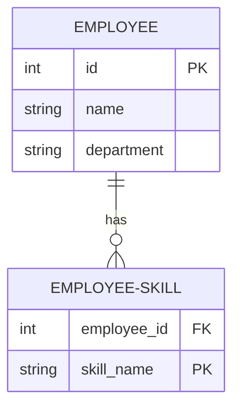

## Examples

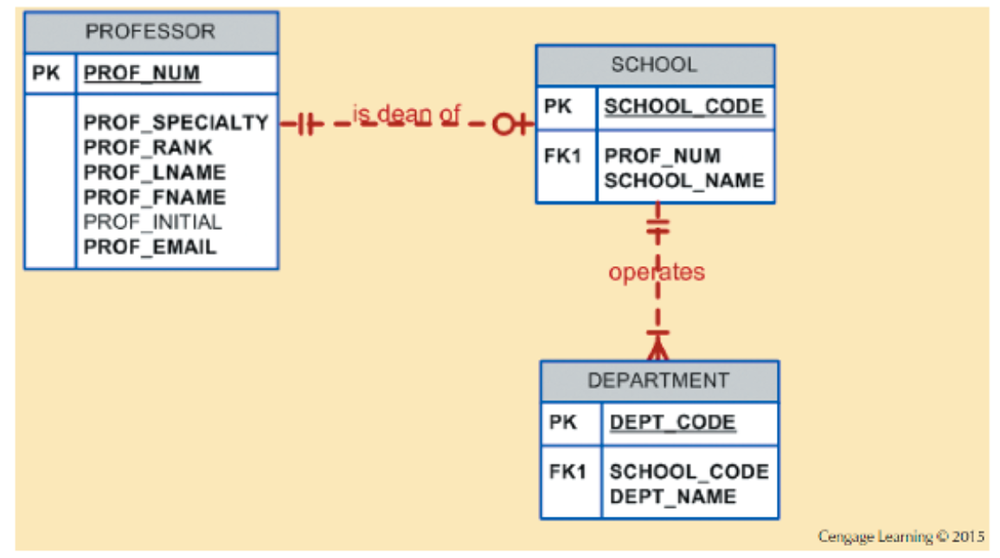

> Page 29（Figure 4.26）：Tiny College ERD Segment 1（PROFESSOR–SCHOOL–DEPARTMENT）。这个图没懂，professor和school一般是1:1，但是为什么school这边的符号是一个圈一竖下来。我知道是因为school端可能是optinal和mandatory，但是是什么意思，没懂。

**翻译成精确语义就是：**

**一个 PROFESSOR：可以是 0 个 SCHOOL 的 dean，也可以是 1 个 SCHOOL 的 dean，但不能超过 1 个。**

**每个 SCHOOL 必须 有且只有一个 PROFESSOR 作为 dean。**

### Something to remember

ER 模型：PK / FK / Existence Dependence（速记版）

- PK（Primary Key）：定义实体的身份（是谁），必须唯一、非空  
- FK（Foreign Key）：引用另一个实体的 PK（或候选键），用于建立关联

核心规则

- 有 FK ≠ existence dependent
- ==只有当 FK 被包含进子实体的 PK 中（FK ⊂ PK），才是 existence dependent（弱实体）==
- 是否 existence dependent 由 **主键设计 + 业务语义** 决定

==口诀：“FK 只是指向，PK 才是身份；FK 进了 PK，才叫存在依赖。”==

***

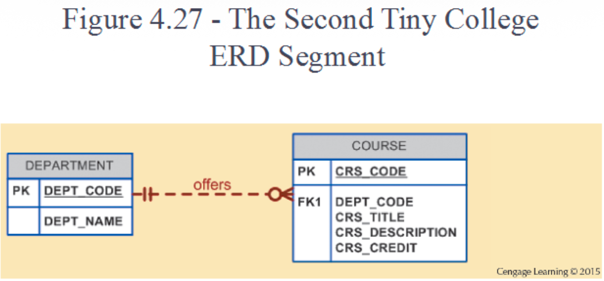

每个 Course 一定会属于一个 Department，不能不属于

每个 Department 可以开设多门课，当然也可以不开班

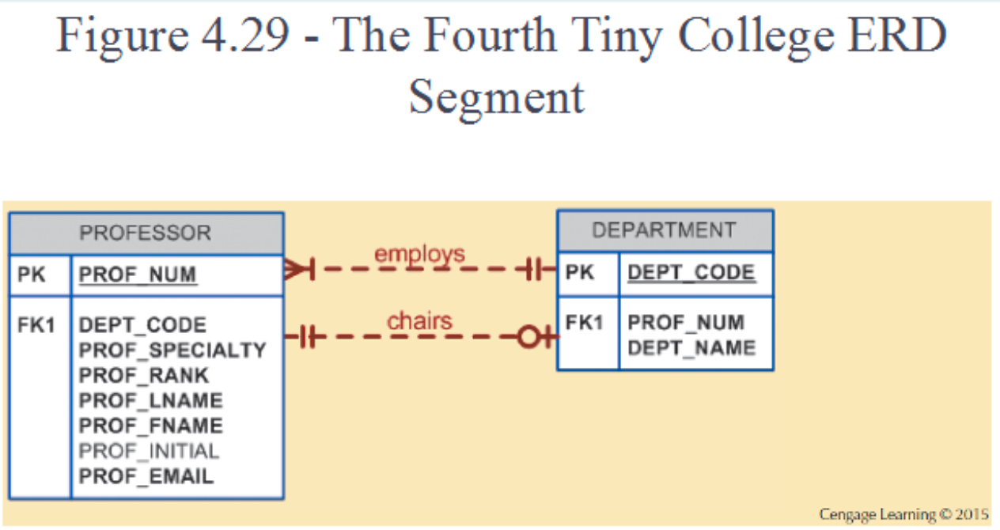

这页有两条关系，很容易考你“同一对实体可以有多条不同语义关系”：

1. DEPARTMENT **employs** PROFESSOR：1:M（一个系雇很多教授）

2. PROFESSOR **chairs** DEPARTMENT：1:1 的味道（一个系有一个 chair；一个教授最多 chair 一个系）

   同时在 DEPARTMENT 表里有 FK1: PROF_NUM，说明 chair 的人是谁（chair 是“部门的一个特殊教授”）。

重点：**“employs”和“chairs”不是一回事**，不能混成一条关系。

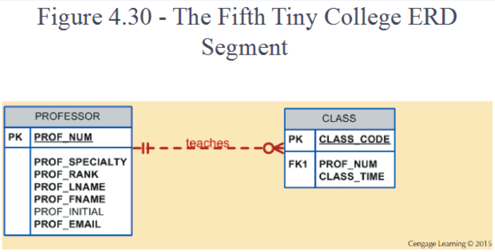

PROFESSOR teaches CLASS：典型 1:M

- 一个教授可教多班；一个班由一个教授教

CLASS 里有 FK1: PROF_NUM，说明落地在 CLASS 这边

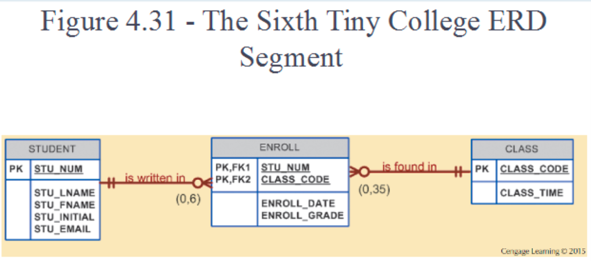

这页把“选课”那条 M:N 加回来，并加了上限约束：

- STUDENT 到 ENROLL：标 (0,6)

  → 每个学生最多选 6 门（或 6 个班）

- CLASS 到 ENROLL：标 (0,35)

  → 每个班最多 35 个学生

- ENROLL 的 PK 由 (STU_NUM, CLASS_CODE) 组成

重点：ERD 里写的 (0,6)/(0,35) 这种 **是业务规则约束**，不是 SQL 天生自带能自动保证的（实现时可能要触发器/应用逻辑/检查约束配合）。 

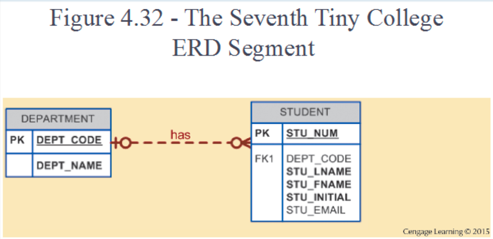

“FK 落地在 X” 是什么意思（速记）

- “FK 落地在 X” = 外键字段存放在 X 这张表里
- ==也就是说：X 这一侧是“多的一侧 / 被引用的一侧”==

规则（直接用）

- 1 : M 关系
  → FK 一定放在 M 的那一侧
- FK 放在哪张表
  → 那张表就“指向”另一张表

一句话口诀：

- “一对多，外键放在多；
- 说落地，就是外键存在哪张表。”
- 多对多的话，就是弄一个中间的放
- 一对一的话，FK放在optional的一边（最常见、最推荐）
  - 哪一边可以没有对方，FK就放哪一边
