# Week3 Relational Model

[TOC]

## A Logical View of Data

关系型数据库最大的好处，就是把极其复杂的底层0和1，变成了我们人脑最容易理解的二维表格 (Table)。这种逻辑非常简单粗暴且有效。

## Characteristics of Relational Table

1. 它是个二维表（有行有列）。
2. 行 (Tuple/Row)：每一行代表一个具体的“对象”（比如张三这个人）。
3. 列 (Attribute/Column)：每一列代表一个“属性”（比如年龄、性别）。
4. 行和列交叉的格子，里面只能放一个具体的值。
5. 同一列的数据格式必须一样（不能上面填数字，下面填汉字）。
6. 顺序不重要：你把两行互换，或者把两列互换，对数据库来说完全没区别。
7. 必须有主键 (PK)：必须有某个列（或几个列的组合）能把每一行区分开，不能有完全一模一样的两行。

## Keys

- 作用：键就像是线索。第一是为了唯一确认某一行（身份证明）；第二是为了把不同的表连起来（牵线搭桥）。
- ==主键 (Primary Key, PK)：==最重要的键！比如你的身份证号，只要拿到它，就能在表里唯一确定你这条记录。

## Determination

决定关系

就是“知道 A，就能顺藤摸瓜查出 B”。比如我知道你的“学号”(A)，我就能决定性地查出你的“姓名”(B)。这就是键的基础原理。

## Dependencies

- 函数依赖 (Functional dependence)：同上，学号决定姓名，姓名依赖于学号。
- 决定因素 (Determinant)：上面例子里的“学号”。
- 依赖因素 (Dependent)：上面例子里的“姓名”。
- 完全函数依赖 (Full functional dependence)：如果主键是由好几列拼起来的复合键（比如“课程号”+“学号”才能决定“期末成绩”），你必须拿到全部的组合键，才能查出成绩，少一个都不行。

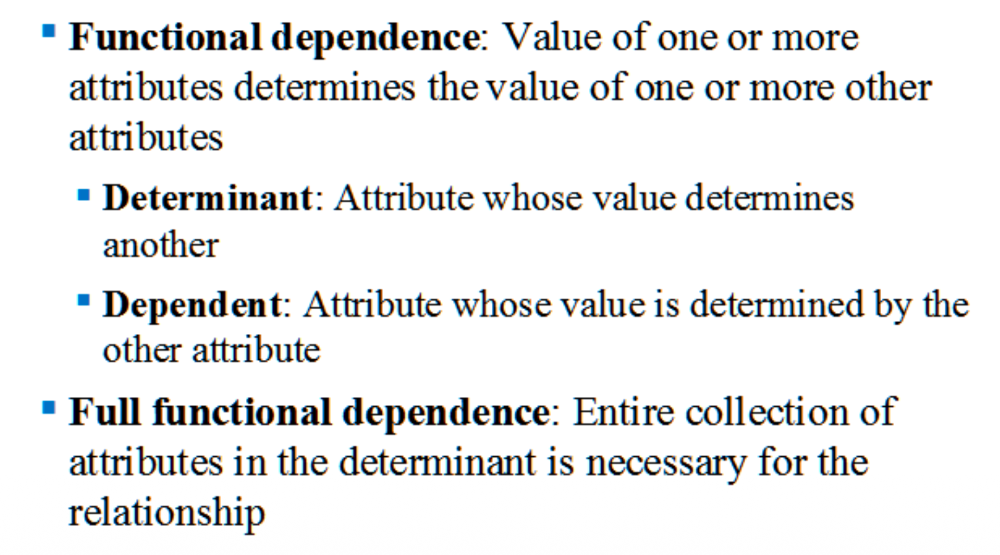

## Types of Keys & Entity Integrity

- 复合键 (Composite key)：如果一列没法唯一标识，就用多列组合。比如同名同姓的人很多，那就用“姓名 + 手机号”组合起来当主键。
- 实体完整性 (==Entity integrity==)：数据库铁律之一！主键的值绝对不能重复，而且绝对不能是空值 (Null)。你要是连身份证号都没有，数据库就不让你进门。

- 空值 (Null)：注意！Null 不是数字 0，也不是一个空格。它代表“不知道”、“缺失”或者“不适用”。

- 参照完整性 (==Referential integrity==)：数据库铁律之二！如果你在表 A 里用外键指向了表 B，那表 B 里必须真有这个东西。（比如员工表里有个字段是“所属部门号”，你不能凭空捏造一个不存在的部门号填进去）。

## 五大键的区别 (Table 3.3 - 必考重点！)

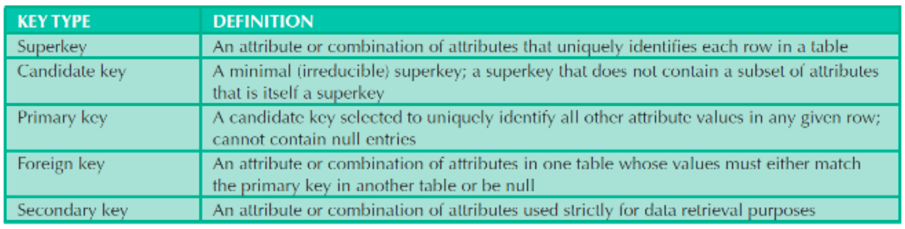

- Superkey (超级键)：只要能把人区分开的组合都算。比如“身份证号”、“身份证号+姓名”、“身份证号+性别”。（太臃肿）

- Candidate key (候选键)：减肥成功的超级键，去掉了多余没用的列，是最精简的。比如“身份证号”。

- Primary key (主键)：你从一堆“候选键”里，钦定了一个用来做表老大的键。（绝对不能包含 Null）。

- Foreign key (外键)：用来和别的表“联姻”的键。它的值必须去隔壁表的主键里找。

- Secondary key (次要键)：平时用来做搜索查询的键（比如为了方便搜索，把“邮箱”设为次要键）。

## 例子

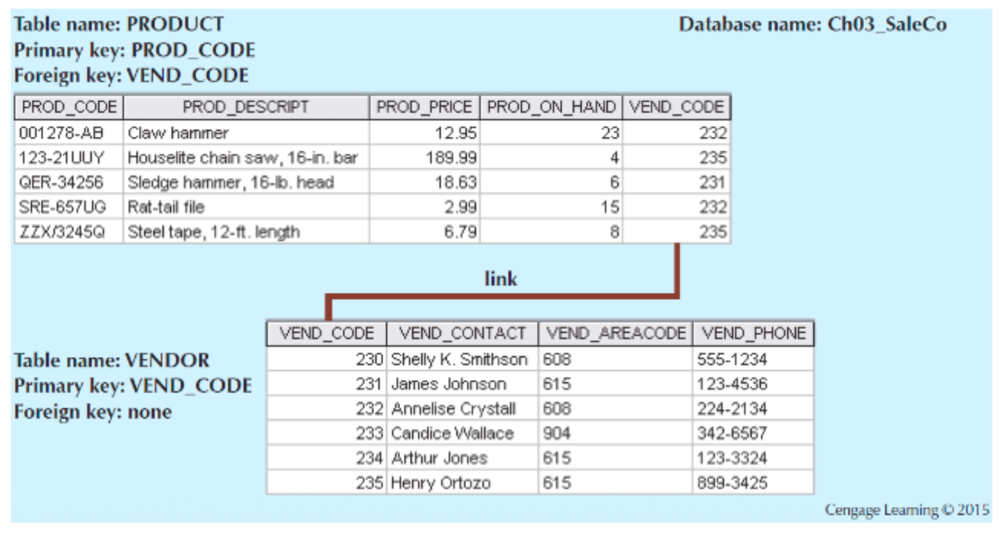

图里有两个表：产品表 (`PRODUCT`) 和 供应商表 (`VENDOR`)。

产品表里有一个 `VEND_CODE`（供应商代码），它是个**外键**，指向上面的供应商表。这样只要看产品，就能顺着代码查到是哪个供应商生产的。

## Way to Handle Nulls

既然 Null 挺麻烦，建表的时候怎么避免？

- Flags：用特定代码代替（比如填 -1 代表没数据）。
- NOT NULL 约束：建表时强制规定这列“必填”，不填不让保存。
- UNIQUE 约束：强制这列的值不能有重复。

## Relational Algebra

别被名字吓到，其实就是讲怎么用数学逻辑对表格做“加减乘除”。

**Relational operators have the property of closure:**

- 闭包 (Closure)：意思是，你拿一个表做筛选、拼接等操作，最后吐出来的结果依然是一个标准的二维表。

## ==关系集合操作 (Relational Set Operators)==

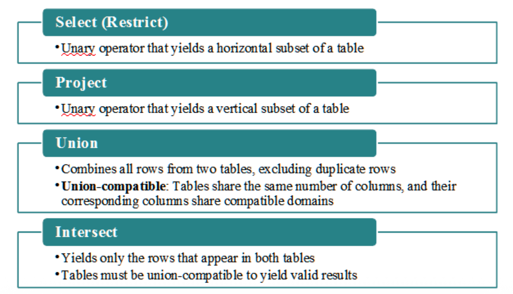

**这四大操作是你写 SQL 的理论基础：**

- Select (选择)：横着切！从几千行里挑出符合条件的几行。
- Project (投影)：竖着切！从几十列里只挑出你要看的几列。
- Union (并集)：把两张表上下拼接在一起，并去掉完全重复的行。前提是这两张表的列数和类型必须一模一样 (Union-compatible)。
- Intersect (交集)：找出两张表里共同拥有的行。

## 几种操作的例子

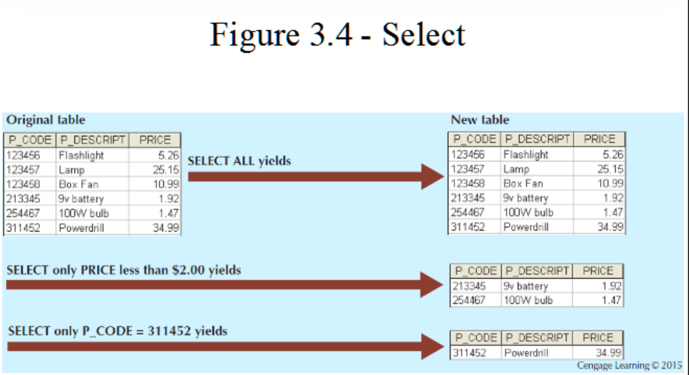

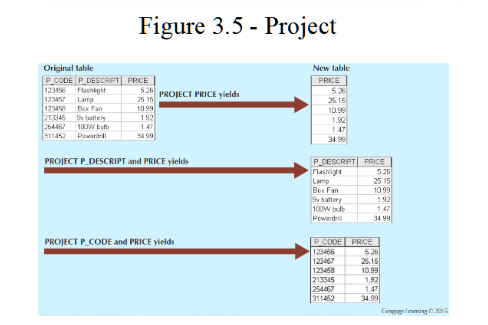

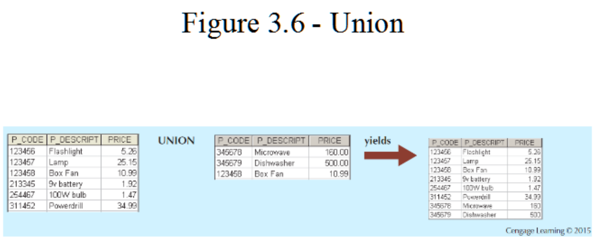

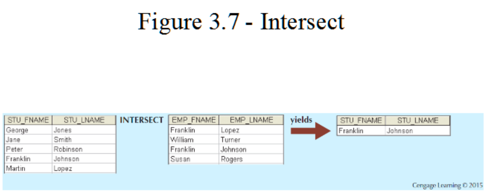

## Relational Set Operators

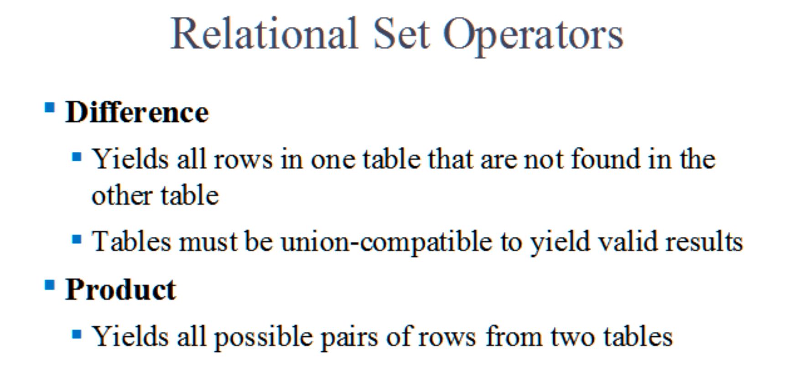

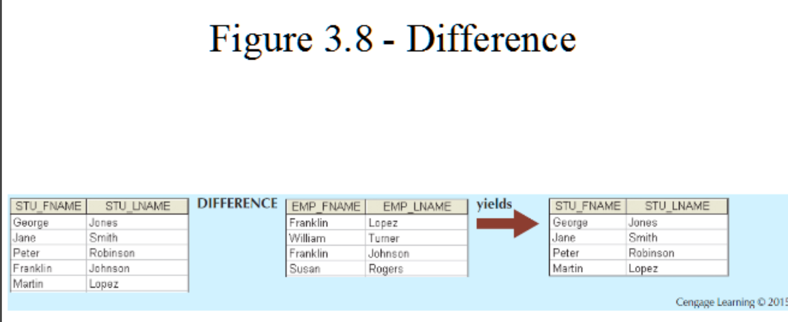

左边是学生表，右边是员工表。把学生表里那些“同时也是员工”的人（比如 Franklin Lopez）给剔除掉，最后剩下的纯纯的学生 

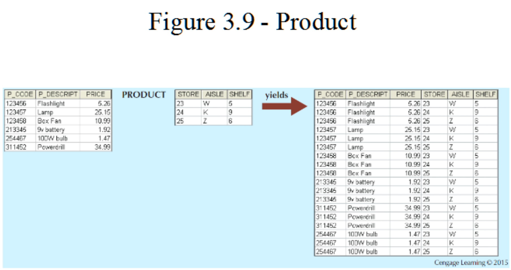

左边 6 个商品，右边 3 个货架位置。乘积操作直接把它们两两配对，变成了一张 6×3=18 行的庞大表格 。没有任何逻辑，就是穷举组合。

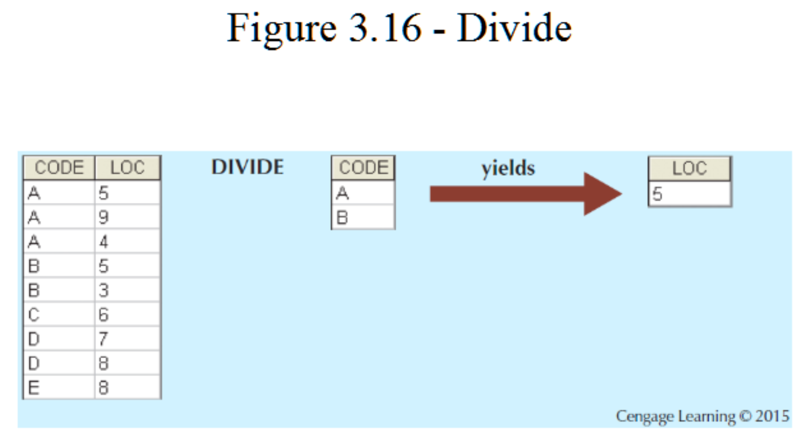

左边是被除数表（有 CODE 和 LOC 两列），右边是除数表（只有 LOC 为 5） 。除法操作就是把左边表里跟“LOC 5”挂钩的 CODE 揪出来，也就是 A 和 B 。

**Divide (除法的文字总结)：**

用一个两列的表当被除数，一个单列的表当除数 。输出的是单列结果，找出那些能和除数表里每一行都关联上的牛人 。

## Joins

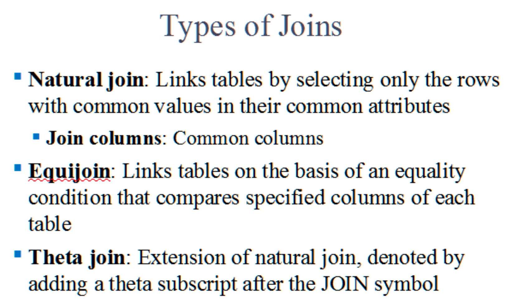

- **Natural join (自然连接)**：系统最智能的连接方式。它会自动找两张表里**列名一样**的地方，把值相等的行连起来 。

- **Equijoin (等值连接)**：咱们自己手写条件，指定只有当表 A 的某列**等于**表 B 的某列时，才把它们拼起来 。

- **Theta join (θ连接)**：自然连接的扩展玩法。除了用“等于”，你还可以用“大于”、“小于”等符号来拼表 。

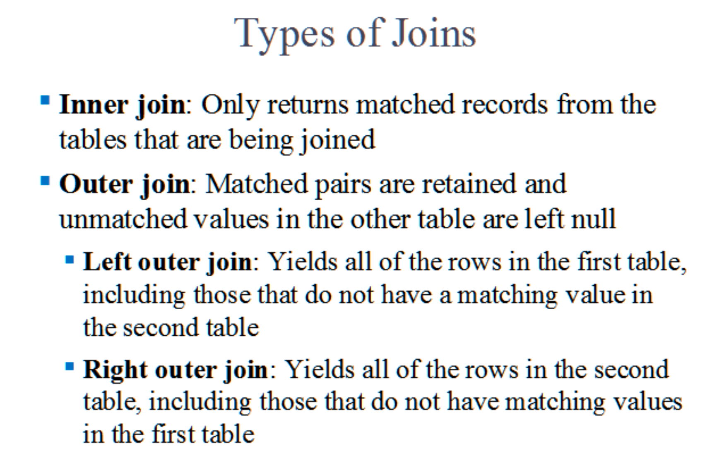

- **Inner join (内连接)**：最严苛也是最常用的。只保留两边能完美匹配上的数据，只要有一边找不到人，这行数据直接抛弃 。

- **Outer join (外连接)**：匹配上的保留，匹配不上的也强行保留，缺心眼的地方就拿 `Null`（空值）垫背 。

- **Left outer join (左外连接)**：**左边**的表当老大，左表的所有行必须全部留下来，哪怕右表里没找到对应数据 。

- **Right outer join (右外连接)**：**右边**的表当老大，右表的所有行必须全部留下来，哪怕左表里没找到对应数据 。

## Example of Joins

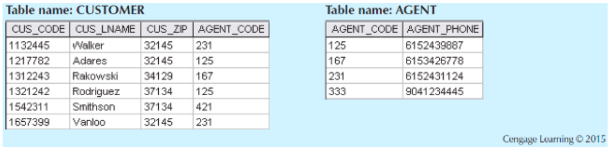

**product效果：**

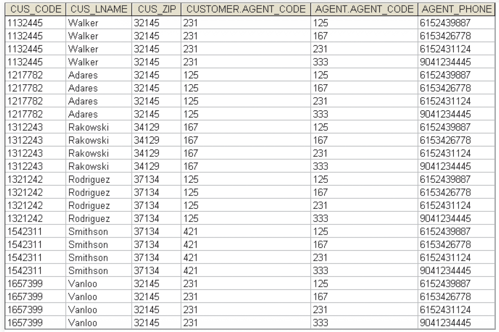

这就是把刚才那两张表直接硬拼（乘积）的结果 。每个人都跟每个代理人配对了一次，产生了一堆没用的垃圾数据。

**Equijoin效果：**

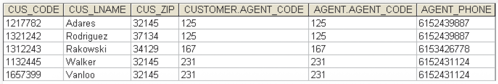

只保留了客户的代理人代码（`CUSTOMER.AGENT_CODE`）等于代理人表代码（`AGENT.AGENT_CODE`）的行。但注意，代理人代码这两列都傻乎乎地保留在表里了 。

**Natural Join效果：**

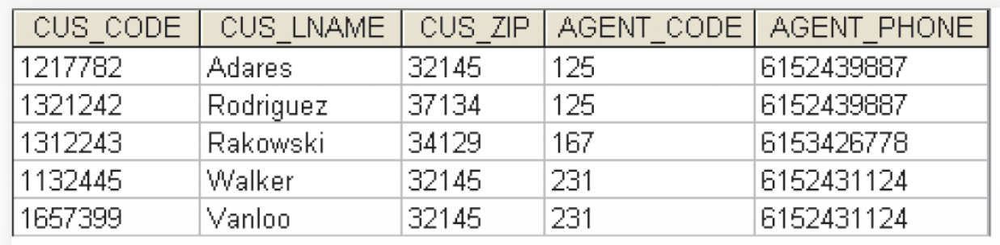

成功把客户和代理人匹配上了，并且系统很聪明地把重复的那列“代理人代码”给去掉了，合并成了一张干净清爽的表 。

**Left Outer Join 效果图 (左外连接)：**

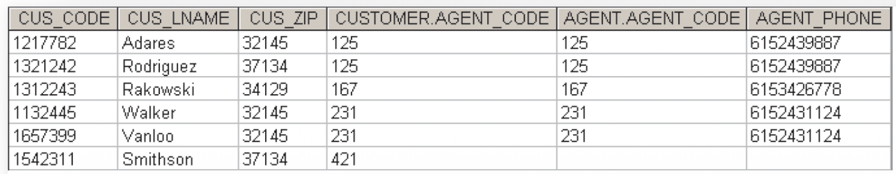

看最后一行，客户 Smithson 的代理人代码是 421，但右表里根本没 421 这个人 。因为是左连接，Smithson 被强行保住了，但他右边的代理人电话只能是空的（底层是 Null）。

**Right Outer Join 效果图 (右外连接)：**

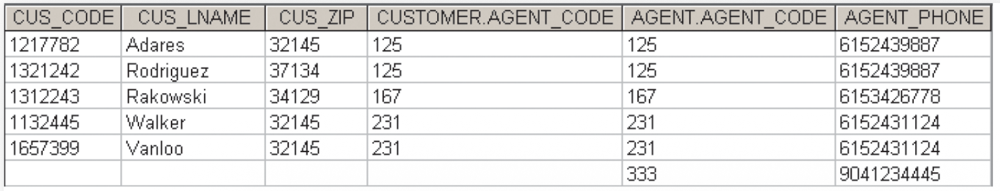

看最后一行，代理人 333 目前一个客户都没拉到 。因为是右连接，代理人 333 被强行保住了，但他左边的客户信息全是空的（Null）。

## Data Dictionary (数据字典与防坑)

**Data dictionary (数据字典)**：记录了用户和设计者创建的所有表的说明书 。

**System catalog (系统目录)**：系统级别的字典，描述数据库里的所有对象 。

**两大命名深坑**：

- **Homonym (同名异义)**：明明是不同的意思，非要用同一个字段名，找死 。
- **Synonym (同义异名)**：明明是同一个东西，在两张表里非要起两个不同的名字，自己折磨自己 。
