# Week4 Normalizaiton

[TOC]

## Learning Objectives

本章要学什么是规范化（Normalization），什么是 1NF、2NF、3NF 等范式，以及什么时候需要“反规范化”（Denormalization）。

## 什么是规范化？(Normalization)

规范化就是给数据库“做大扫除”。通过评估和纠正表的结构，尽量**减少数据冗余**（同样的数据不重复存），从而减少数据异常（增删改的时候不出错）。

==**三大基础范式**：第一范式 (1NF)、第二范式 (2NF)、第三范式 (3NF) 。==

范式级别越高（数字越大），表结构越好 。一般做到 3NF 就能满足绝大多数商业需求了 。

**反规范化 (Denormalization)**：有时候表拆得太碎，查询速度会变慢。为了**提高读取性能**，我们会故意保留一点冗余，把表降级处理，这就叫反规范化 。

## 为什么需要规范化？

不管是设计新数据库，还是接手别人搞的烂摊子，你都需要分析各个属性（列）之间的依赖关系，看看结构还能不能再优化 。

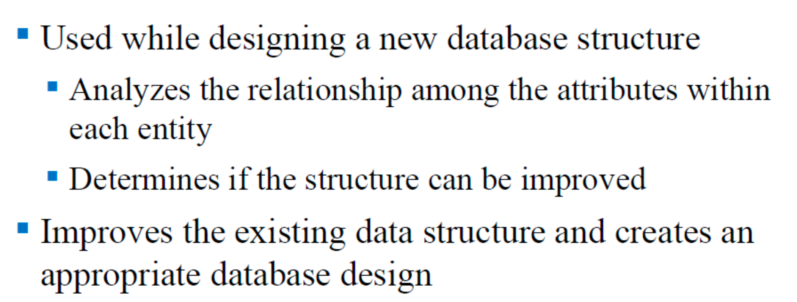

## 例子

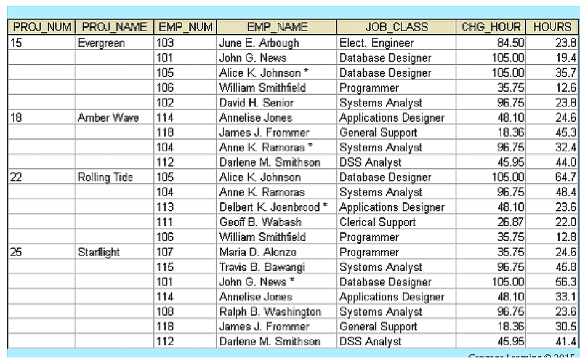

图里展示了一张未经规范化的项目计费表 。

**大白话**：你看这张表，为了记录员工做项目的时间，里面出现了大量大面积的空白和重复（比如项目 15 下面的项目名字空着，说明是重复数据）。这就是我们要动刀改造的对象。

## Normalization Process

规范化流程的目标

**铁律如下：**

1. 每张表只能讲一个主题（不能一张表里既讲项目，又讲员工个人信息）。
2. 数据绝对不准多余地存在不同的表里 。
3. 所有的普通列，都必须老老实实地依赖主键 。

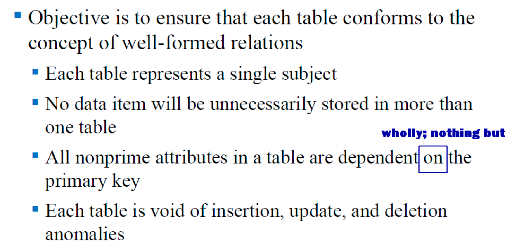

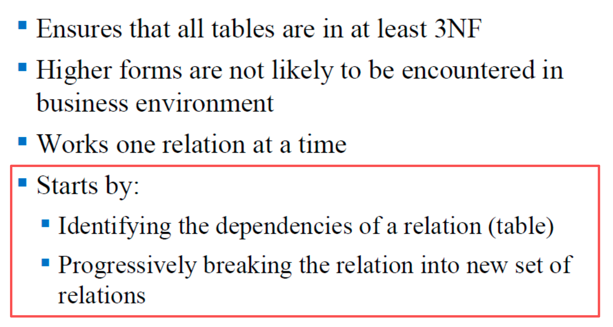

规范化是一次处理一张表 。先找出表里谁依赖谁，然后**把一张大表逐渐切碎成一组新表** 。

## Normal Forms

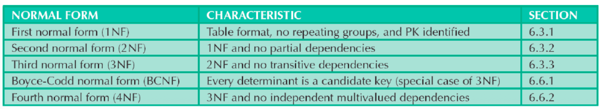

**1. 第一范式 (1NF)**

- 官方特征：Table format, no repeating groups, and PK identified. (表格格式，无重复组，已指定主键)。
- 大白话：就是一张规规矩矩的二维 Excel 表。要求每个格子里只能填一个数据（不能一个格子里写多个电话号码），不能有表外表，并且必须选出一个能唯一代表这一行的老大（主键 PK）。

**2. 第二范式 (2NF)**

- 官方特征：1NF and no partial dependencies. (符合 1NF，且无部分依赖)。
- 大白话：干掉“部分依赖”。如果你的主键是两个人拼起来的（比如“学号+课程号”），那表里的其他信息必须跟这俩都有关。如果有个“学生姓名”只跟“学号”有关，跟“课程号”没半毛钱关系，就把它踢出去单建一张表。

**3. 第三范式 (3NF)**

- 官方特征：2NF and no transitive dependencies. (符合 2NF，且无传递依赖)。
- 大白话：干掉“传递依赖”。表里所有的普通小弟，都只能直接跟着主键老大混。如果表里有个“职位”，职位又决定了“基本工资”（基本工资跟着职位混，没直接跟主键混），那就把“职位和工资”踢出去单建一张表。（通常商业上做到 3NF 就完全足够了）。

**4. BC 范式 (BCNF - Boyce-Codd normal form)**

- 官方特征：Every determinant is a candidate key (special case of 3NF). (每个决定因素都是候选键，是 3NF 的特例)。
- 大白话：这是 3NF 的 VIP 加强版。意思是：在表里，只要你能决定别人的命运（决定因素），你自己就必须有资格当主键（候选键）。只要发现有非主键的列在偷偷决定别人，就必须拆表。

**5. 第四范式 (4NF)**

- 官方特征：3NF and no independent multivalued dependencies. (符合 3NF，且无独立的多值依赖)。
- 大白话：干掉“独立的多选题”。如果一个人有两个完全不相干的多项属性（比如张三既会 3 种编程语言，又生了 2 个孩子），你绝对不能把语言和孩子揉在同一张表里，否则会产生极其恶心的交叉重复。必须拆成“人员-语言表”和“人员-孩子表”。

## Functional Dependence

其实就是我们在 Week 3 学的。如果我知道 A（比如学号），就绝对能推导出唯一的 B（比如姓名），那就说明 B 在函数上依赖于 A 。如果主键是拼起来的复合键，必须靠**全部**主键才能推导出来的，叫“完全函数依赖” 。

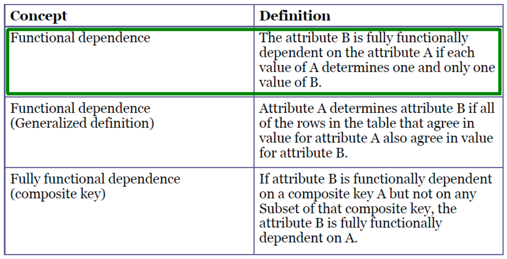

## Type of Function Dependencies

**部分依赖 (Partial dependency)**：只针对复合主键。普通列只依赖了主键的**一部分** 。

- *举例*：主键是（学号+课程号）。“学生姓名”只依赖“学号”，跟“课程号”没关系。这就是部分依赖。

**传递依赖 (Transitive dependency)**：普通列没有直接依赖主键，而是依赖了**另一个普通列** 。

- *举例*：员工表里主键是员工号，里面有两列“职位”和“时薪”。“时薪”其实是由“职位”决定的。这就叫传递依赖。

## 转换为第一范式 1NF

如何做到 1NF：把那些一个格子里塞了好几个值的情况（Repeating groups）拆开，填满所有的空白格子，找出能唯一确定每一行的主键 。

只要它是一个每个格子都有数据的规整 Excel 表，它就已经是 1NF 了 。但 1NF 还存在“部分依赖”，会有数据冗余 。

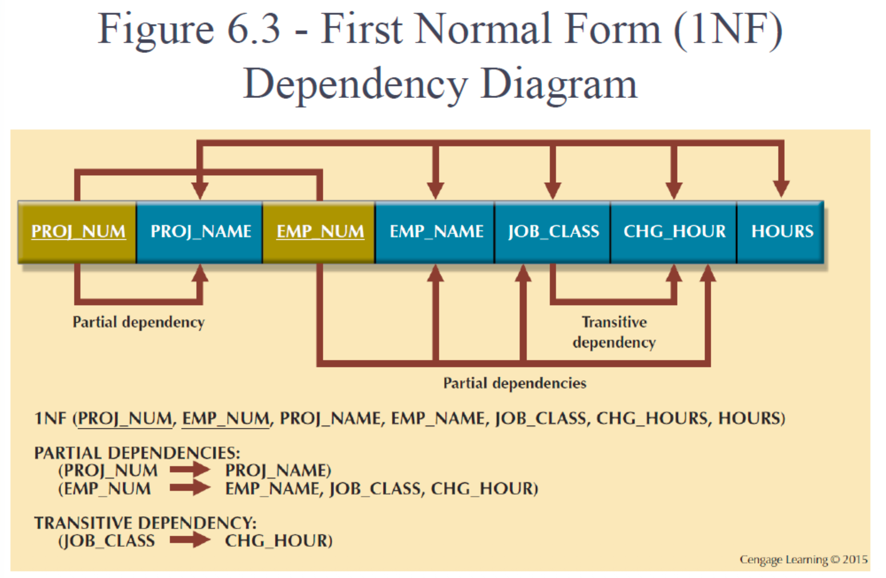

这是考试必画的依赖分析图。

- 上面的箭头是健康的：所有的列都依赖复合主键 `(PROJ_NUM + EMP_NUM)` 。
- 下面的箭头是病毒：找出了“部分依赖”（员工名字只看员工号就行）和“传递依赖”（收费标准只看职位类型就行）

## 在上面这个基础上，转换为第二范式 2NF

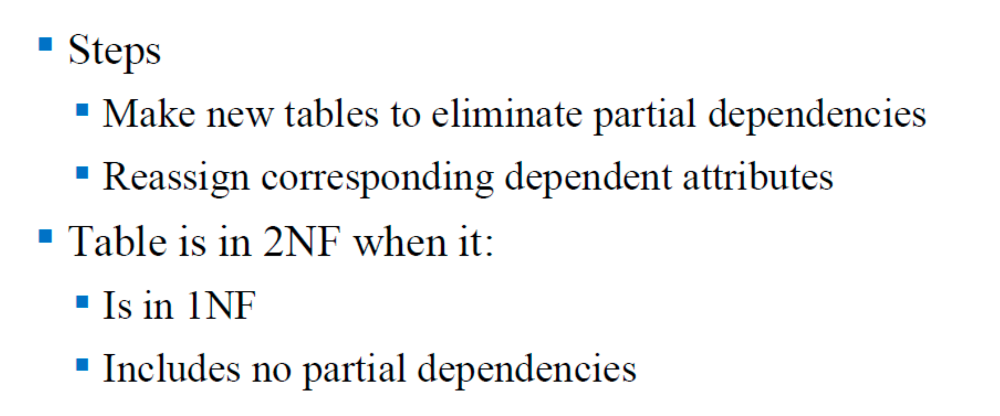

**目标**：**消灭“部分依赖”** 。

把有部分依赖的列“踢出去”，单独建表。

- 比如刚才的图里，项目名字只跟项目号有关，就把它们拿出去建一个【项目表】。
- 员工名字、职位只跟员工号有关，就拿出去建一个【员工表】。
- 剩下的交集，建一个【分配表】记录谁在什么项目干了多久 。

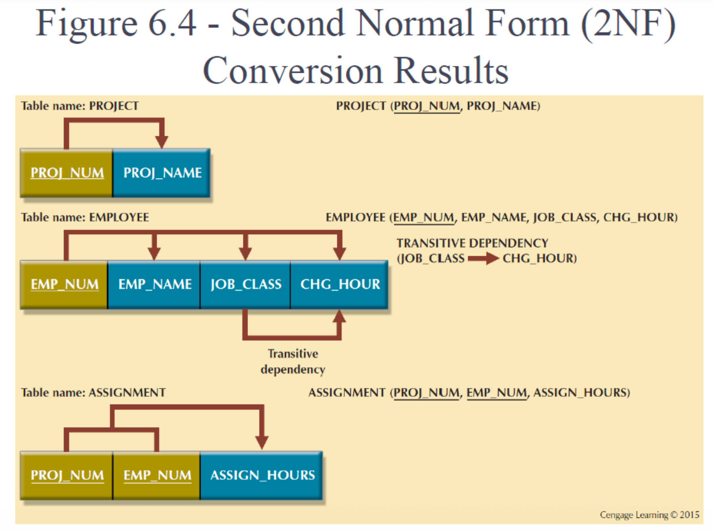

## 在上面这个基础上，转换为第三范式 3NF

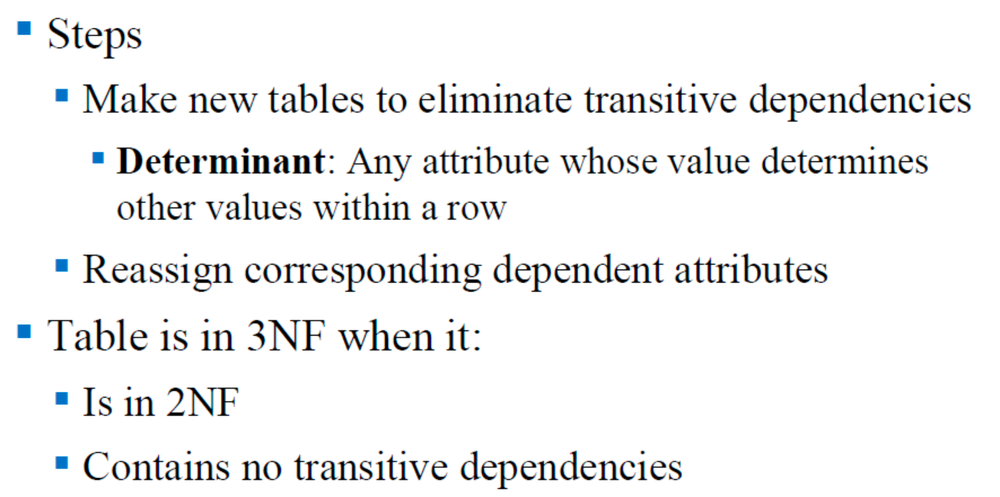

**目标**：**消灭“传递依赖”** 。

在刚才的【员工表】里，时薪是由职位决定的。所以把“职位”和“时薪”再单独踢出去，建一个【职位表】。这样表就彻底干净了 。

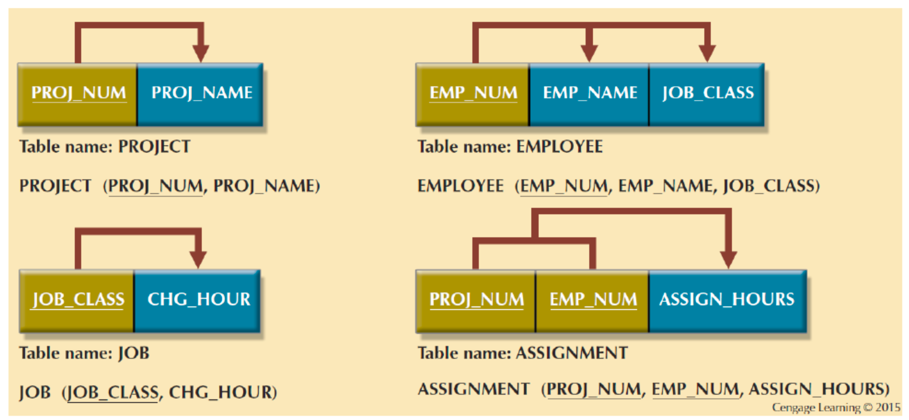

## Requirements for Good Normalized Set of Tables

- **原子性 (Atomicity)**：属性必须是最小单位，不能再往下拆了 。比如“姓名”最好拆成“名”和“姓”。
- **粒度 (Granularity)**：数据记录的精细程度 。比如财务表是按月记账，还是按天记账。

## Denormalization

这是为了应对现实业务的妥协。刚才我们拆成了 4 张表，非常干净 。但是！如果你老板现在立刻马上要看每个员工在每个项目上赚了多少钱，数据库就必须把这 4 张表做 JOIN 拼起来 。

- 表连接操作非常吃 CPU，如果数据量大，系统会直接卡死，影响速度 。
- 在设计的时候，故意把一些表合并，或者保留冗余列（虽然违背了 3NF 原则），从而换取**极快的读取速度**。第 26 页的表就是一张专门为了快速出报表而做的“反规范化大表” 。

### 
