# Week5 SQL

[TOC]

## DDL and DML

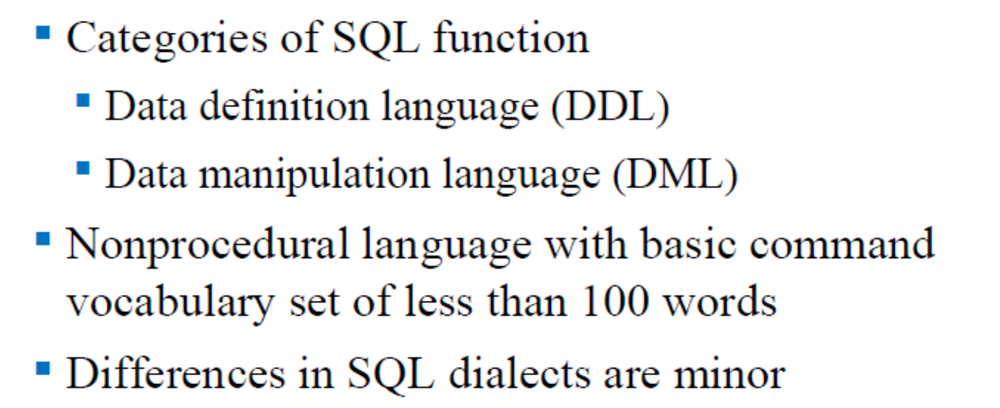

1. DDL (数据定义语言) ：这是用来“搞建筑”的。比如建表、删表、修改表结构（加减列）。
2. DML (数据操纵语言) ：这是用来“搞装修和查户口”的。表建好后，往里面塞数据、修改数据、删除数据、查询数据，全靠它。

## 命令大全

**DDL**

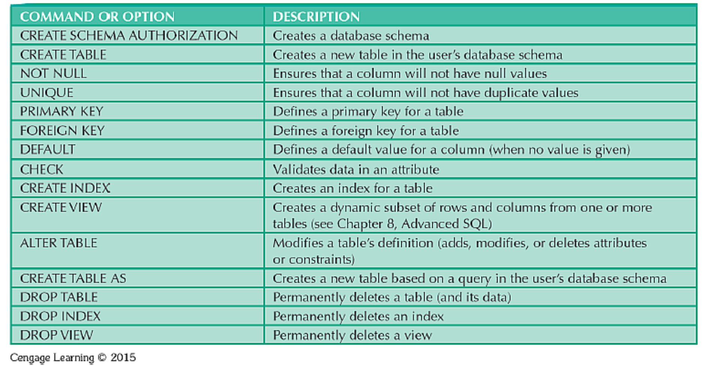

- `CREATE TABLE`：新建一张表 。

- `ALTER TABLE`：表建好后，想再加一列或者改一列，用它来修改表结构 。

- `DROP TABLE`：核武器，连表带数据一起彻底永久删除 。

- `NOT NULL` 和 `UNIQUE` 等：用来定规矩（这列必填、这列不能重复） 。

重点记住上面这几个就行。

**DML**

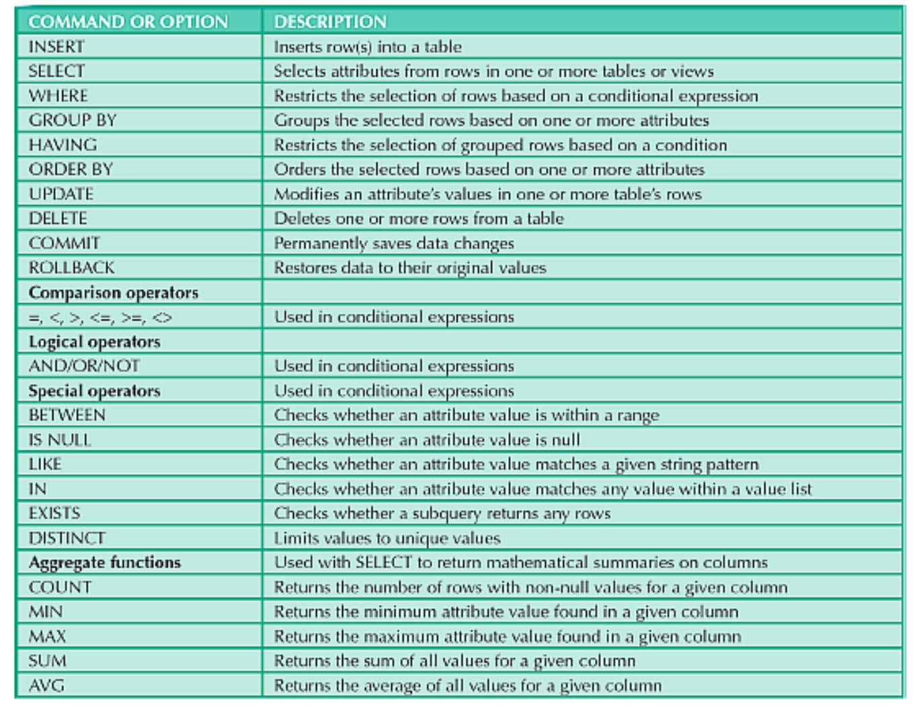

你以后每天写 SQL 都在用它们：

- `INSERT`、`UPDATE`、`DELETE`：增、改、删数据 。
- `SELECT`：查数据 。
- `COMMIT` 和 `ROLLBACK`：这俩很重要！`COMMIT` 就是保存键，保存你的修改；`ROLLBACK` 就是撤销键（Ctrl+Z），退回到上次保存的状态 。
- 聚合函数：`COUNT`（数有几行）、`MAX/MIN`（找最大/最小值）、`SUM`（求和）、`AVG`（求平均） 。

## Common Data Types

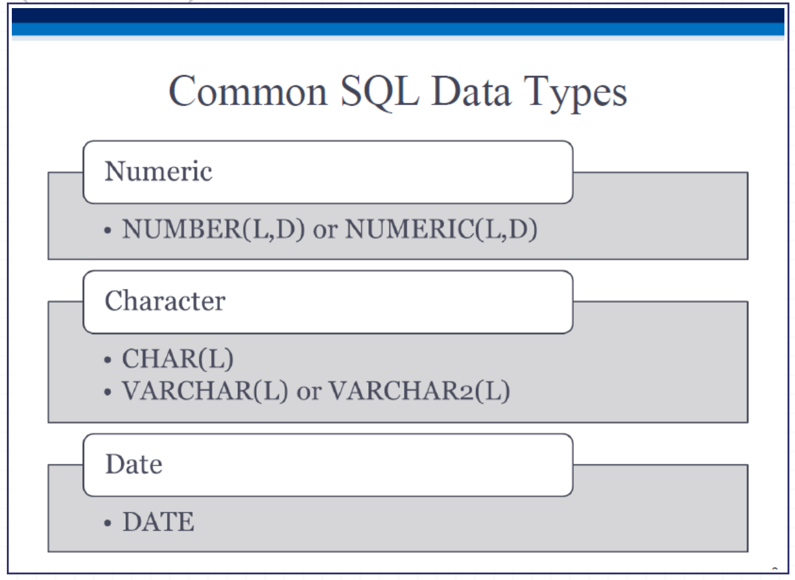

**数字**：`NUMBER(L,D)` 。比如 `NUMBER(8,2)` 意思是总共最多8位数字，其中小数点后留2位。

Eg. NUMERIC(4,2) would range from -99.99 to 99.99, NUMERIC(3,0) would be -999 to 999.

## Create Table

| 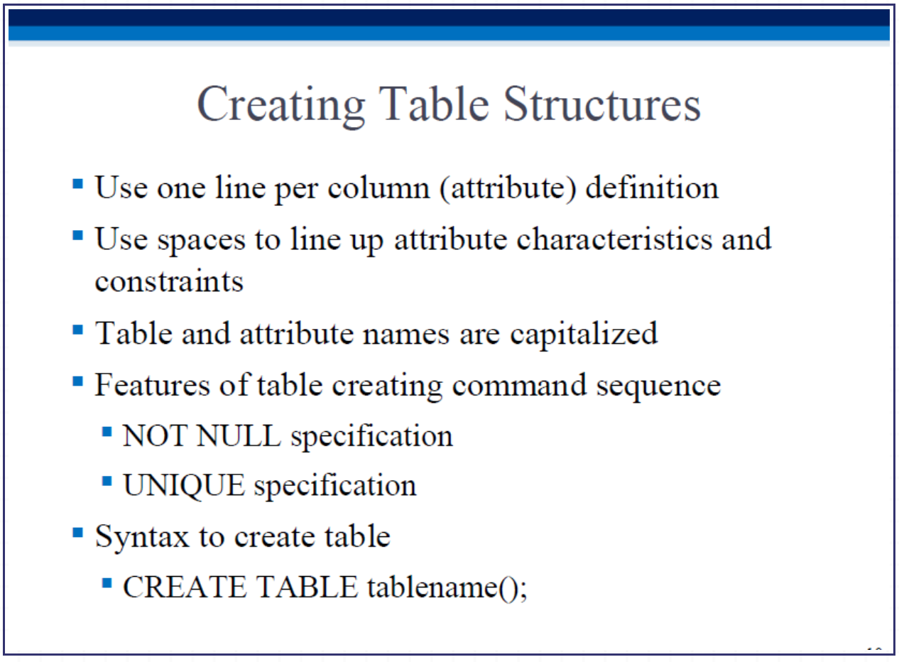 | 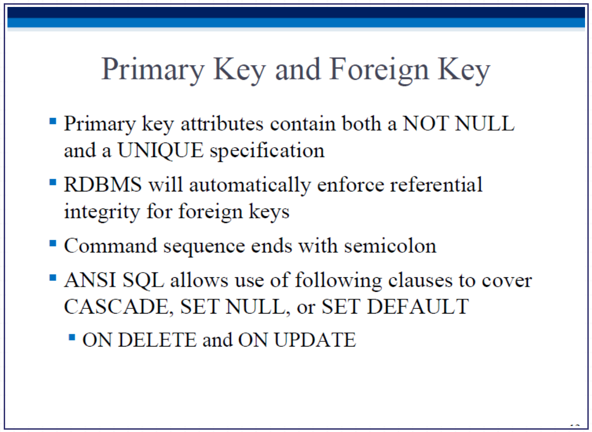 |
| ------------------------------------------------------------ | ------------------------------------------------------------ |

以下面这个产品表 (`PRODUCT`) 为例 ：

- 每写完一列，用逗号隔开 。
- `P_CODE VARCHAR(10) NOT NULL UNIQUE` ：意思是产品代码是最多10个字符的文本，**绝对不能不填 (NOT NULL)**，且**绝对不能重复 (UNIQUE)** 。
- `PRIMARY KEY (P_CODE)`：钦定产品代码为这张表的**主键** 。
- `FOREIGN KEY (V_CODE) REFERENCES VENDOR`：指定 `V_CODE` 是个**外键**，并且它的数据必须去 `VENDOR`（供应商）那张表里找 。
- `ON UPDATE CASCADE`：**级联更新** 。意思是如果供应商表里的代码变了，这边的外键跟着自动变，不用你手动去改 。

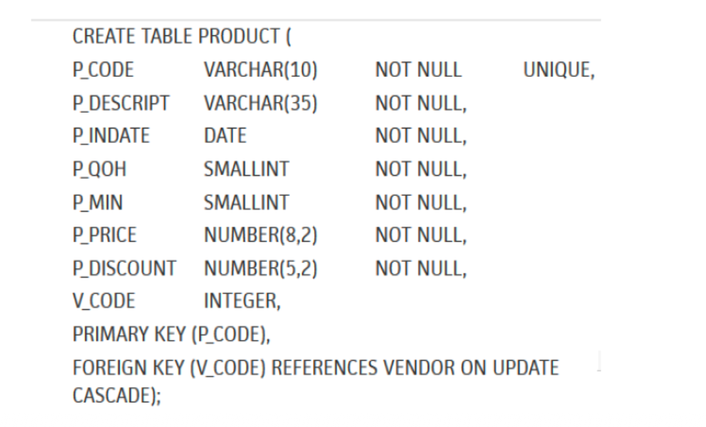

## Inserting Data

用法：`INSERT INTO 表名 VALUES (值1, 值2, 值3...)` 。

- **注意点 1**：如果是文本或日期，外面必须加单引号（比如 `'Smithson'`） 。如果是数字，直接写（比如 `8`） 。

- **注意点 2**：如果你不知道某个格子的数据，或者暂时没有，就填 `NULL`（前提是建表时这列允许为空） 。

- **偷懒写法**：如果你只想给特定几列填数据，可以写成 `INSERT INTO PRODUCT(P_CODE, P_DESCRIPT) VALUES (...)`，没写到的列系统会自动填空值 。

- 最后别忘了执行 `COMMIT;` 把你填的数据永久保存进硬盘 。

## Select, Update

- `SELECT * FROM 表名`：这里的星号 `*` 是通配符，意思是“把这张表所有的列都给我查出来”。

- `UPDATE 表名 SET 列名 = 新值 WHERE 条件`：用来修改已有数据。

**防坑死磕**：==写 `UPDATE` 时**千万、千万要加 `WHERE` 条件**！如果你光写了 `SET P_PRICE = 10` 没写条件，系统会把整张表所有商品的单价全改成 10 块钱，你这辈子都得在跑路中度过。==

## DELETE, ROLLBACK

- `DELETE FROM 表名 WHERE 条件`：删除特定的行。**同理，不写 `WHERE` 就会清空整张表！**
- `ROLLBACK`：数据库里的 **Ctrl + Z (撤销)**。如果你刚才不小心删错了，或者改错了，只要你还没敲 `COMMIT`（保存），赶紧敲一句 `ROLLBACK;`，数据就能瞬间恢复到你上次保存的样子。

## 高级插入 (INSERT INTO ... SELECT)

**大白话**：之前的 `INSERT` 是一行一行手敲数据。这招是**“批量复制粘贴”**。

**用法**：你可以写一个 `SELECT` 语句把旧表里的数据查出来，然后直接当成数据源，一把塞进新表里。这叫使用“子查询 (Subquery)”。

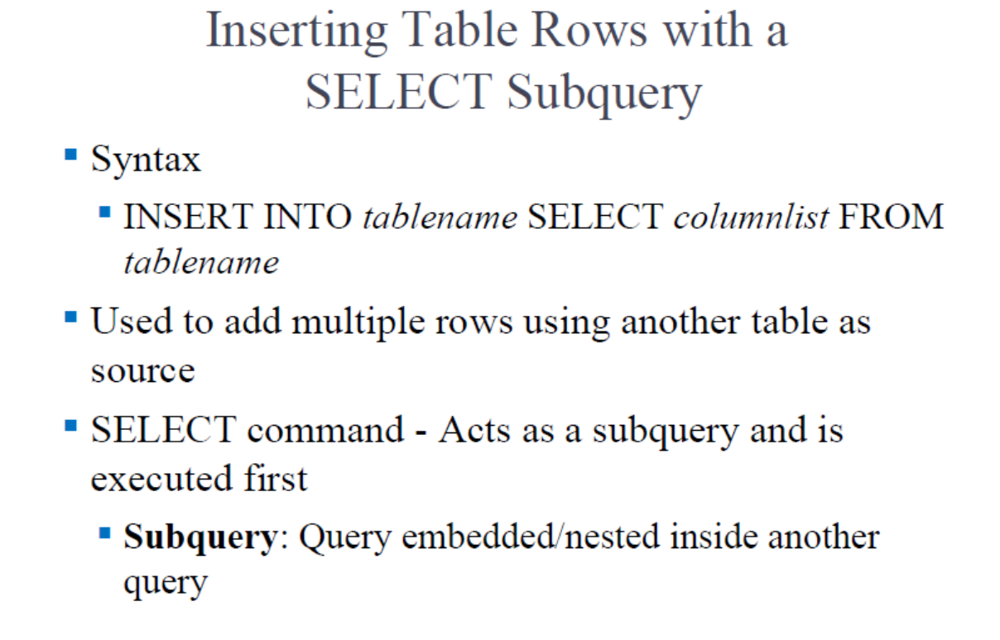

## 条件过滤 (WHERE & 比较运算符)

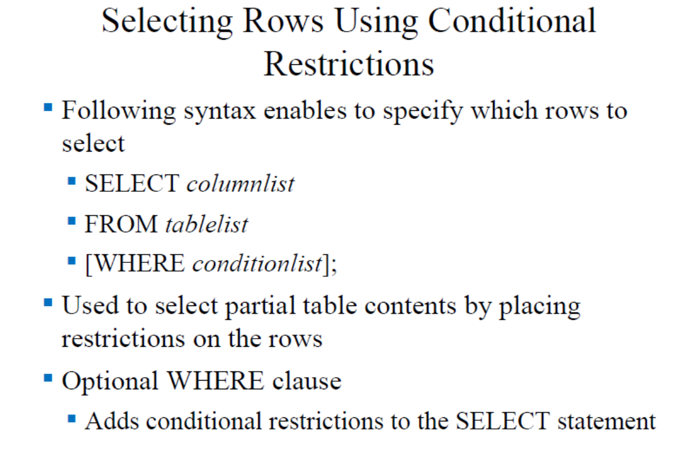

**大白话**：`WHERE` 就是你的**漏勺**。表里有 1 万行数据，你只想要价格小于 50 的。

**第 25 页的符号表 (Table 7.6)**：大于 `>`、小于 `<`、等于 `=` 这都不用说。注意**不等于**，在 SQL 里通常写成 `<>` 或者 `!=`。

## 算术运算符 (Arithmetic Operators)

SQL 的 `SELECT` 后面不仅能写列名，还能直接写数学公式（加 `+` 减 `-` 乘 `*` 除 `/` 乘方 `^`）。

**举例**：比如你想看打八折后的价格，直接写 `SELECT P_PRICE * 0.8 FROM PRODUCT;`。

## 逻辑运算 (AND / OR)

**大白话**：当你的漏勺需要同时满足好几个条件时：

- `AND` (与)：条件必须同时满足。比如 `价格 < 50 AND 库存 > 10`（又便宜又多）。
- `OR` (或)：条件满足其中一个就行。比如 `供应商 = A OR 供应商 = B`（只要是这两家其中一家的货都要）。

## 特殊操作符 (BETWEEN / IS NULL)

- **BETWEEN**：查区间极度好用。比如找价格在 50 到 100 之间的，不用写 `大于 50 AND 小于 100`，直接写 `WHERE P_PRICE BETWEEN 50.00 AND 100.00`。
- **IS NULL**：**极易踩坑点！** 如果你想查哪些商品的供应商是空的，**绝对不能写** `V_CODE = NULL`（系统不认），**必须写** `WHERE V_CODE IS NULL`。

## 存在性检查 (EXISTS)

**大白话**：`EXISTS` 后面跟着一个括号（里面是一个完整的查询语句）。它就像一个探测雷达，**只要括号里的查询能查出哪怕一行数据，`EXISTS` 就返回 True（真）**，外面的大查询才会执行。

**使用场景**：比如你想删除那些“在订单表里从来没接过单”的窝囊废供应商。就可以用 `WHERE NOT EXISTS (查这个供应商有没有订单)`。

## 修改表结构 (ALTER TABLE 的高级玩法)

这几页讲的是表建好之后，老板突然让你改需求怎么办：

- **P39-P40 (MODIFY 改类型)**：比如你原本设定的价格是整数，现在要加小数点。用 `ALTER TABLE PRODUCT MODIFY (P_PRICE DECIMAL(9,2));`。
- **P41 (MODIFY 改特征)**：同上，不改数据类型，只改长度或精度。
- **P42 (ADD 加列 / DROP 删列)**：
  - **加一列**：`ALTER TABLE 表名 ADD (新列名 类型);`（注意：新加的列最好别带 `NOT NULL`，不然以前的老数据会因为没填这个空而报错）。
  - **删一列**：`ALTER TABLE 表名 DROP COLUMN 列名;`。

## 高级数据更新

- **大白话**：`UPDATE` 命令不仅能把值改成固定的数字，还能做数学运算。
- **P44 例子**：比如你想把所有低于 50 块的商品全部涨价 10%。你可以直接写：`SET P_PRICE = P_PRICE * 1.10 WHERE P_PRICE < 50.00;`。

## 复制表

**大白话**：需要建一张跟旧表长得一模一样的新表，难道还要重新 `CREATE` 一遍，再一条条 `INSERT` 吗？不用。

**P46 绝招**：直接用 `CREATE TABLE 新表名 AS SELECT * FROM 旧表;`。系统会瞬间帮你把表结构连同里面的数据一起原封不动地复制过去。

### 数据排序 (ORDER BY)

- **大白话**：查出来的数据乱七八糟，需要排个序。
- **P51-P53 规则**：
  - ==放最后：`ORDER BY` 永远写在整个 SQL 语句的最末尾。==
  - 多重排序：`ORDER BY 姓氏, 名字`。意思是先按姓氏排，如果姓氏一样（都姓李），再按名字排。
  - 默认是**升序 (ASC)**（从小到大，从 A 到 Z）。如果你想从大到小，在后面加个 **`DESC`**。

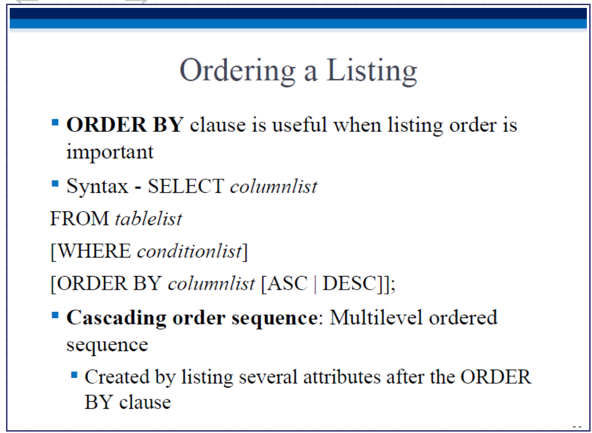

### 去重查询 (DISTINCT)

- **大白话**：超市里有 100 种商品，你想知道它们是由“哪几个”不同的供应商送来的。如果直接查供应商编号，结果会有大量重复。
- **P55 做法**：加上 `DISTINCT`，比如 `SELECT DISTINCT V_CODE FROM PRODUCT;`。结果就会把相同的编号合并，只显示不重复的列表。

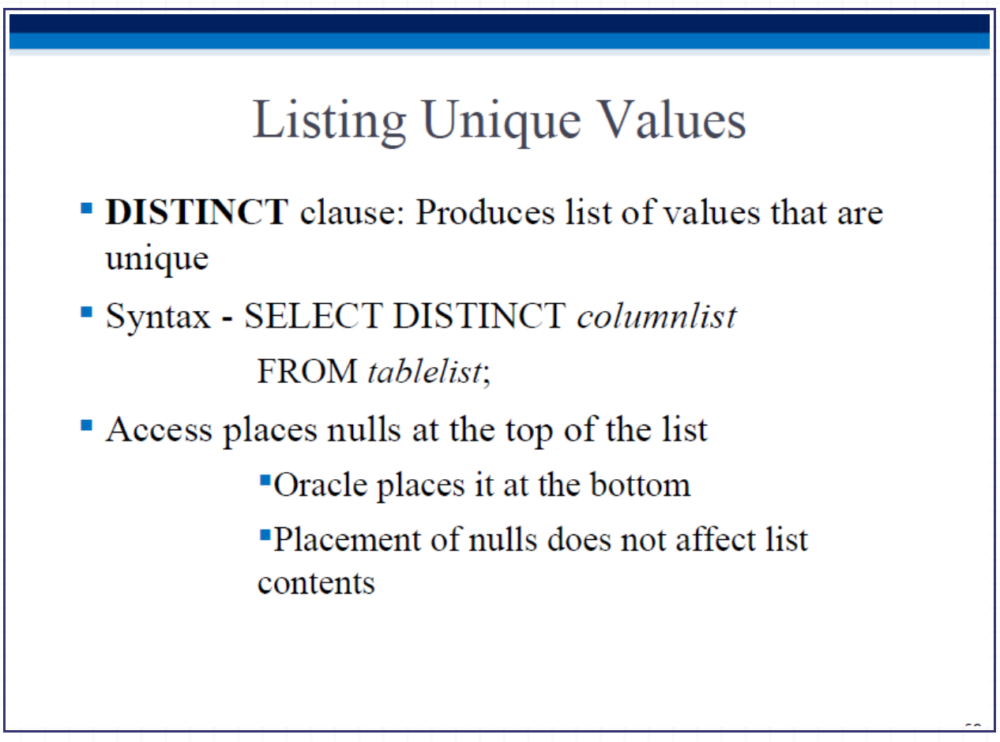

## 聚合函数 (Aggregate Functions) & 子查询

这是期末考试和面试必考的：**五大天王 (`COUNT`, `MIN`, `MAX`, `SUM`, `AVG`)**。

- **P56-P57 (`COUNT`)**：数数。`COUNT(*)` 数一共有几行；`COUNT(DISTINCT V_CODE)` 数有几个“不同的”供应商。
- **P58 (`MAX/MIN`)**：找最大/最小值。**（极端容易踩坑点警告！）**
  - 如果你想找“最贵的商品价格”，写 `SELECT MAX(P_PRICE)` 没问题。
  - 如果你想查**“最贵的商品叫什么名字”**，**绝对不能写** `SELECT P_DESCRIPT, MAX(P_PRICE)`（系统会直接报错）。
  - **正确写法**必须用**子查询**：先查出最高价是多少，再用 WHERE 找谁的价格等于它：`WHERE P_PRICE = (SELECT MAX(P_PRICE) FROM PRODUCT)`。
- **P59-P60 (`SUM/AVG`)**：求和与求平均值。用法同上。

