# Week7 Distributed DBs

[TOC]

## C vs D

'Centralized' DBs - no longer popular/useful...

**为什么集中式数据库被淘汰了？**

因为生意做大了（全球化），大家都上网了，数据类型变复杂了（全面数字化），而且老板们需要做复杂的商业智能分析 (Business intelligence)。一台机器根本扛不住这么多折腾。

**数据库系统的演进**

- DDBMS (分布式数据库管理系统) 是什么？：大白话讲，就是把有逻辑关联的数据和处理任务，分散到通过网络连在一起的多台电脑上。
- 对比以前的“集中式数据库 (Centralized DBMS)”：以前所有公司数据都死死锁在一个中央机房里，员工只能用没有计算能力的“哑终端 (Dumb terminals)”连上去查数据。

**DDBMS 的优缺点（必考重点！）**

- 优点：数据可以就近存放（访问更快）；不怕单点故障 (Less danger of a single-point failure)（这台机子崩了，其他机子还能顶上）；扩容方便。

- 缺点：管理极其复杂！；对技术要求极高；数据在网络传流容易有安全隐患；而且因为要做数据备份，硬件和基建往往要花双倍的钱。

## Distributed Processing vs Distributed Databases

- **分布式处理 (Distributed processing)**：几台电脑通过网络，一起分摊“计算”的任务。

- **分布式数据库 (Distributed databases)**：不仅计算分摊了，连“数据”都被切碎了，存在不同的物理电脑上。这些碎块就叫 **数据库分片 (Database fragments)**。

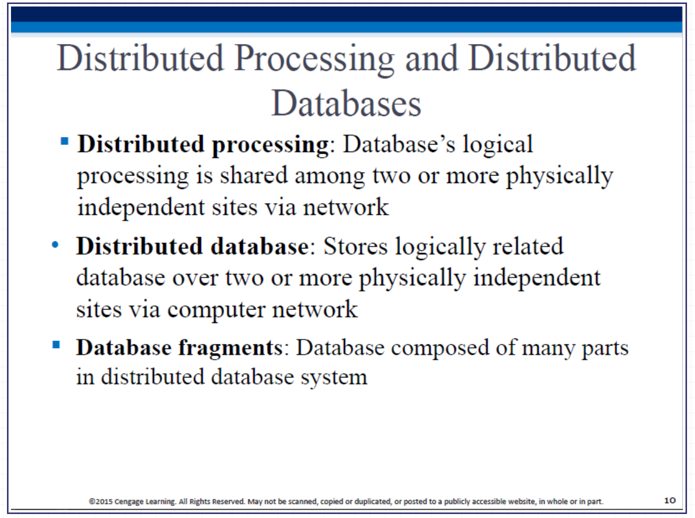

## Functions of Distributed DBMS

它是个大管家。接到用户的请求后，它要拆解任务、分配给各地的电脑去执行；验证数据的安全和完整性；最后还要把各地找回来的数据拼凑整齐，按照统一格式交还给用户。

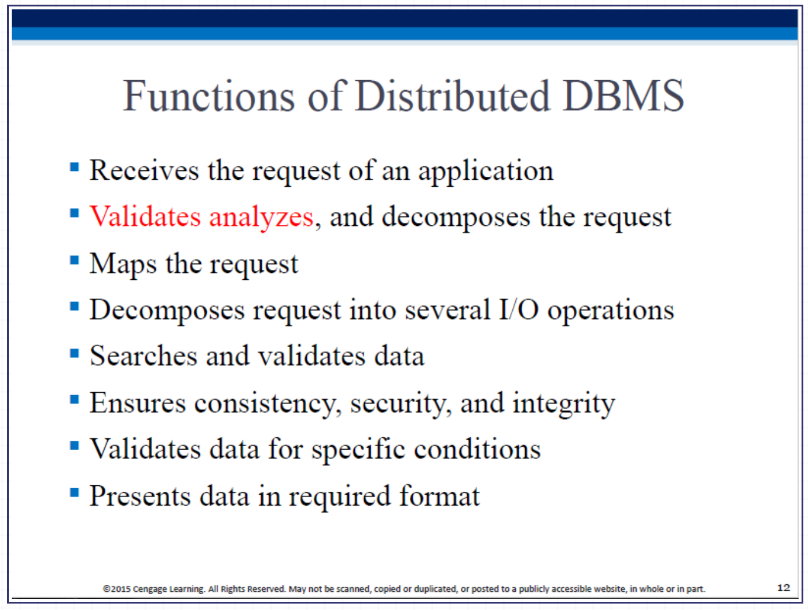

## DDBMS 的核心组件（极其重要！）

DDBMS Components

分布式架构里，把干活的软件分成了两种：

- TP (Transaction Processor 事务处理器)：负责在前面接待用户、提出请求的软件。也叫 TM 或 AP。
- DP (Data Processor 数据处理器)：负责在后方仓库（硬盘）里，真正把数据翻出来的软件。也叫 DM。 *(记牢 TP 和 DP 这两个缩写，后面的架构全靠它们排列组合！)*

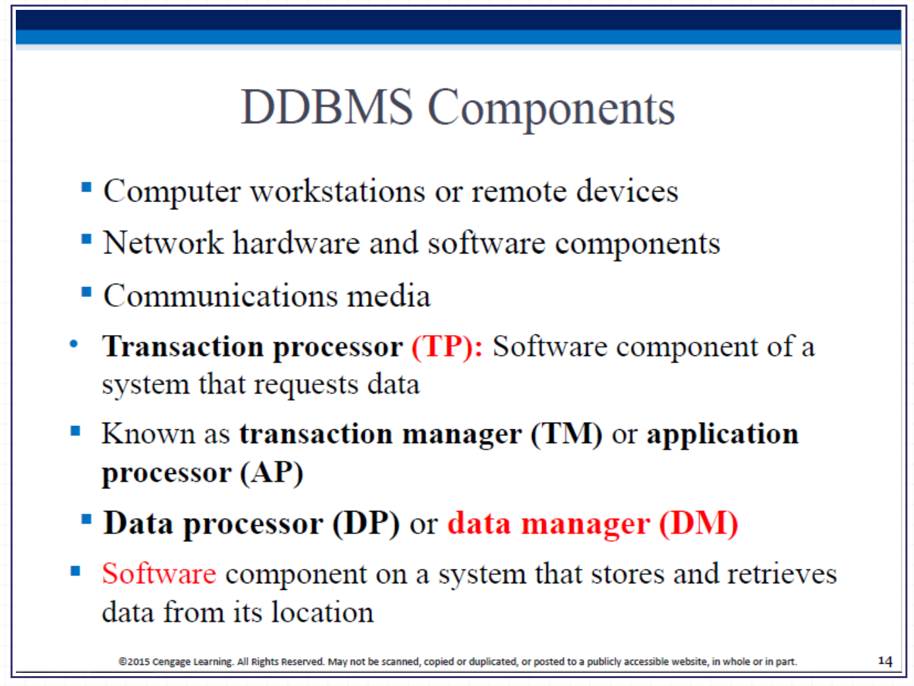

A set of protocols is used by the DDBMS, to enable the TPs and DPs to communicate with each other.

TP: Transaction Processor - receives data requests (from an application), and requests data (from a DP); also known as AP (Application Processor) or TM (Transaction Manager). A TP is what fulfills data requests on behalf of a transaction. 

DP: Data Processor - receives data requests from a TP (in general, multiple TPs can request data from a single DP), retrieves and returns the requested data; also known as DM (Data Manager).

## SPSD (单点处理，单点数据)

最原始的远古架构。计算 (TP) 在一台主机上，数据 (DP) 也在同一台主机的本地硬盘上。你面前的电脑只是个不负责算账的“哑终端”。

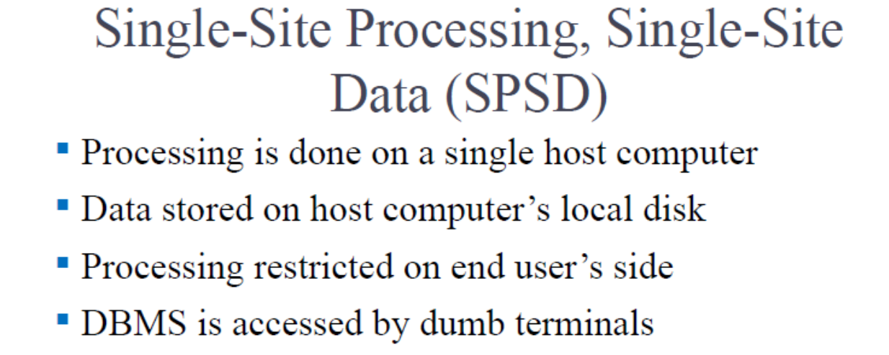图里右边那一排叫 Dumb terminals（哑终端 T1, T2, T3），它们没有任何运算能力，全靠线缆连着左边那一台孤独的 DBMS 主机（同时包揽 TP 和 DP）苦哈哈地干活。

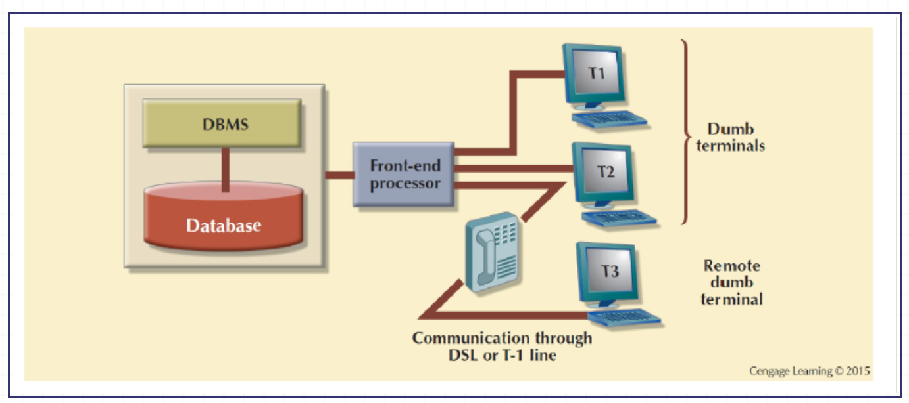

## MPSD (多点处理，单点数据)

稍微进步了一点。现在大家的电脑都有 CPU 了，各自跑自己的计算程序（多个 TP 分布式处理），但是！数据还是统一存放在同一个中央文件服务器里（唯一的 DP）。这就是典型的局域网客户端/服务器架构，能减少一点网络流量。

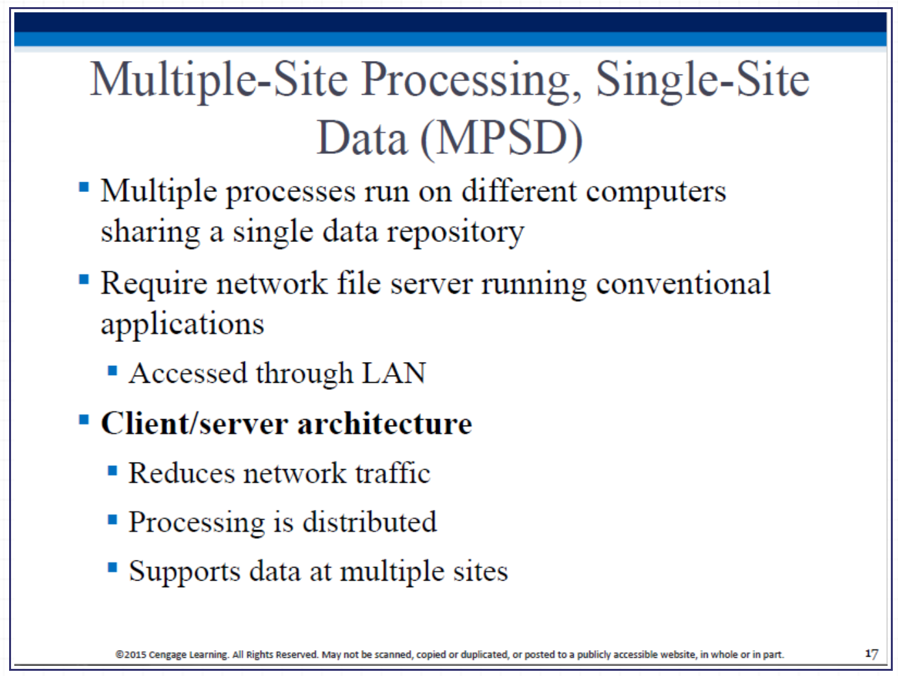

Site A, B, C 的电脑里都装了 TP（它们自己能算账了），但它们底下牵着线，全部指向左边唯一那个装了 DP（数据仓）的文件服务器。

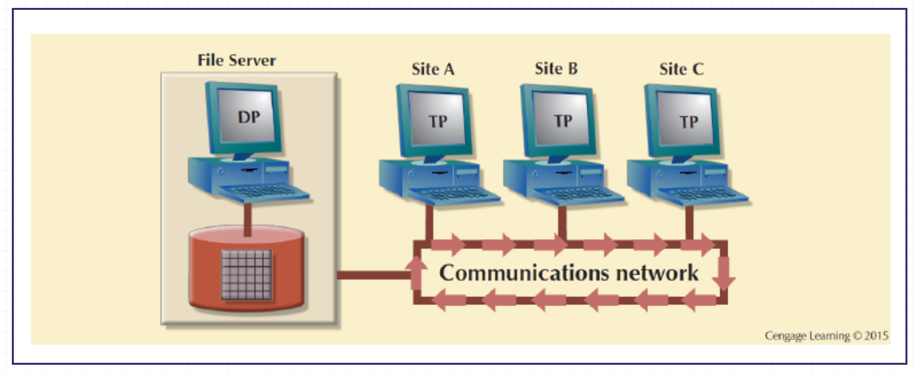

## MPMD Fully Distributed

**大白话**：这就是 MPMD（Multiple-Site Processing, Multiple-Site Data）。每个网点既有负责接待的 TP，又有负责存数据的 DP，大家互联互通。

**同构 (Homogeneous)**：全公司的网点用的都是同一个牌子的数据库（比如全用 Oracle），整合起来比较容易。

**异构 (Heterogeneous)**：大杂烩，有的网点用 MySQL，有的用 SQL Server。系统能把这些底层完全不同的数据库整合在一起，这是分布式里最牛的境界。

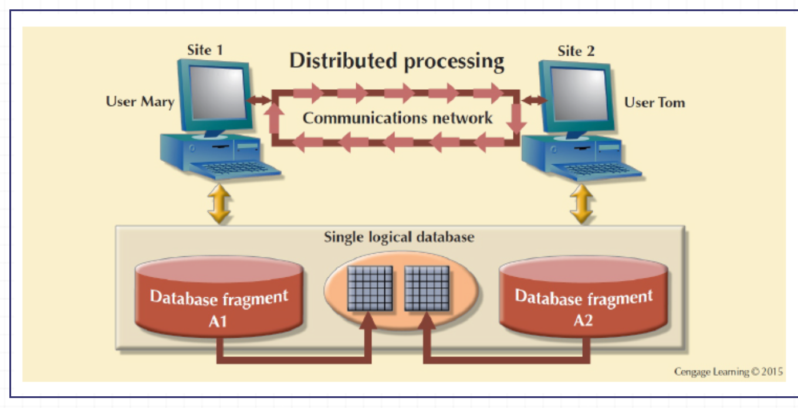

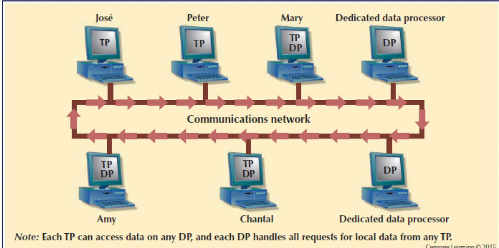

## Restrictions of DDBMS

虽然完全分布式听起来很爽，但在现实业务中还是有些妥协和限制。比如，有时候跨网点访问只允许你“读”，不允许你“写”；或者限制你一个事务最多只能跨越几个数据库，防止把网线撑爆。

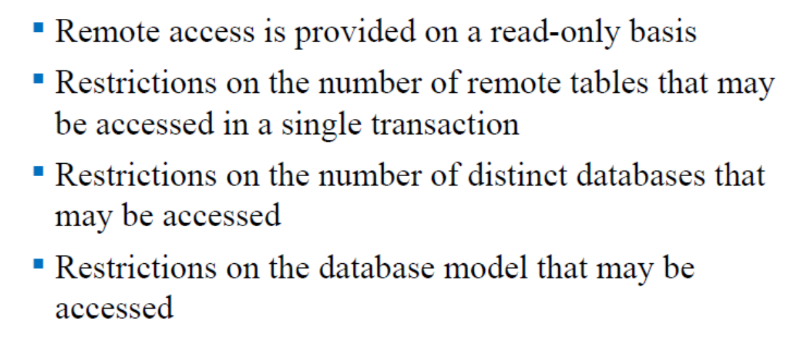

## Distributed Concurrency Control

在上一个课件里我们学了单机的并发控制。在分布式里，这个交警（调度器）的工作难了一万倍，因为多节点、多进程的操作极容易引发数据不一致和跨机房死锁。

**Problem:**

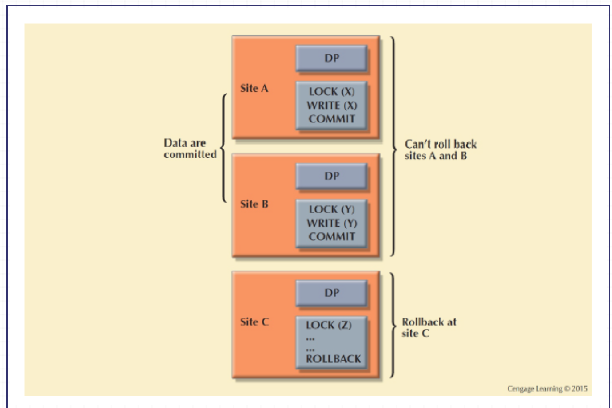

图里展示了悲剧的一幕。Site A 和 Site B 都成功锁住了数据并准备提交 (COMMIT)，结果 Site C 崩了，执行了回滚 (ROLLBACK)。如果不管，A和B的数据就更新了，C却没更新，整个账本直接对不上。

## Two-Phase Commit Protocol, 2PC

必须所有节点一起生，或者一起死。任何一个节点掉链子，所有节点的修改都要被撤销。

## 2PC 的具体实施步骤

**写前日志 (Write-ahead protocol)**：所有节点干活前，必须先把要干嘛记在硬盘的日志里，防止断电死无对证。

**两大阶段**：

1. **准备阶段 (Preparation)**：总指挥（协调者）问所有人：“都准备好了吗？”只要有一个人敢说“没准备好”，直接取消。
2. **最终提交阶段 (The final COMMIT)**：所有人都回复“准备好了”，总指挥才会下达最终的 COMMIT 命令。

## 为什么要 2PC？

就是上面那个图，如果不用2PC就会出问题。

## 分布式透明性特征总览 (Transparency Features)

这里列出了分布式系统的五大“隐身术”（透明性）：分布透明、事务透明、性能透明、故障透明、异构透明。核心目的就是把底层的复杂运作藏起来，别让用户操心。

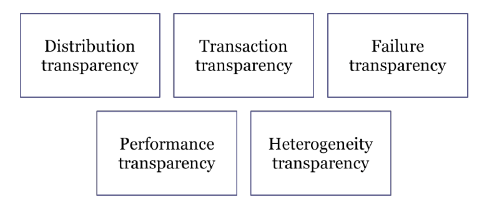

## 分布透明性的 3 个级别 (Distribution Transparency)

1. **分片透明 (Fragmentation transparency)**：最高级！用户根本不需要知道数据被切碎了，就像查单机表一样写 SQL。
2. **位置透明 (Location transparency)**：用户知道数据被切碎了，但不需要自己去指定查哪个城市的机房。
3. **本地映射透明 (Local mapping transparency)**：最低级，也是最累的。用户写代码时必须明确指出“去洛杉矶机房查A分片”。

## 事务透明性 (Transaction Transparency)

当一个事务（比如跨国转账）涉及好几个机房时，系统必须保证要么所有机房都成功扣钱/加钱，要么所有机房都一起撤销。绝对不能出现一半成功一半失败的烂摊子。

## 分布式数据库设计的三大件

要搞分布式，你得决定三件事：怎么把数据切碎（分片）、怎么备份（复制）、放在哪些城市（分配）。

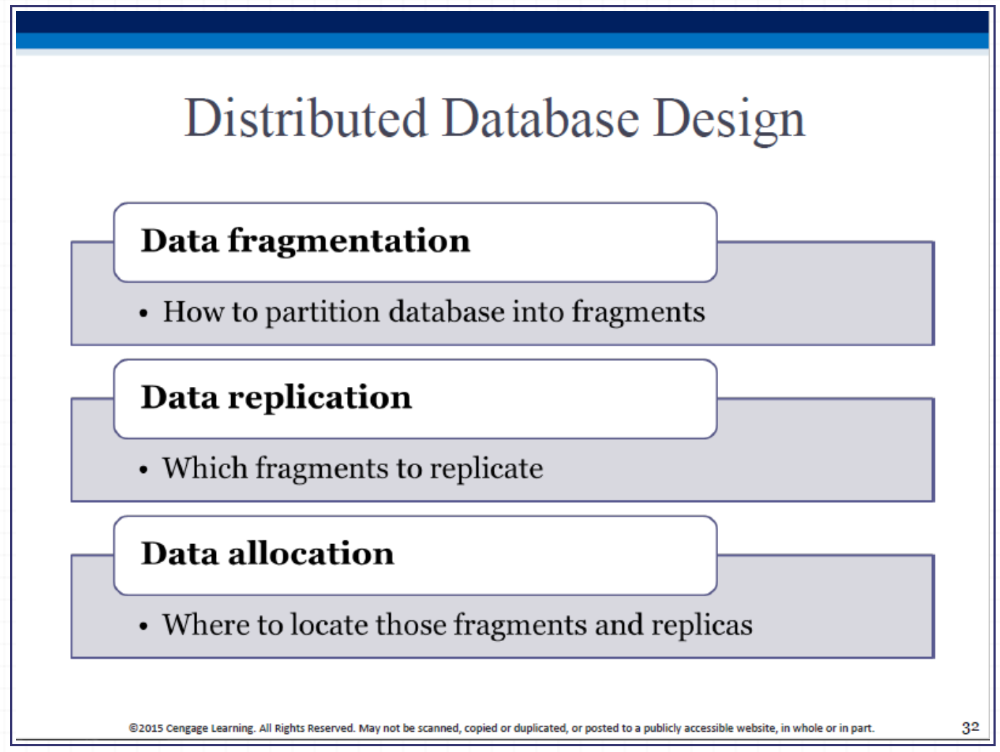

## Data Fragmentation

- **水平切 (Horizontal)**：按“行”切。比如中国区的行数据放中国机房，美国区的行数据放美国机房。

- **垂直切 (Vertical)**：按“列”切。比如把核心密码列单独切出来放高防机房，头像昵称列放普通机房。

- **混合切 (Mixed)**：既切行又切列，切成小豆腐块。

## Replication

**大白话**：就是给数据做多个分身存在不同地方防灾。

**同步机制**：分为 **Push (推)**（主节点一更新，立马强塞给小弟）和 **Pull (拉)**（小弟定个闹钟，每隔十分钟去主节点拉取最新数据）。

**复制的程度 (Replication Scenarios)**

- **全复制 (Fully)**：每个机房都有全套数据的完整备份（最安全，但极其费钱费硬盘，更新起来巨慢）。
- **部分复制 (Partially)**：只有经常被访问的热点数据才多备份几份。
- **不复制 (Unreplicated)**：每个数据都只有独苗一份（省钱，但机房一炸数据就没）。

## 数据分配策略 (Data Allocation Strategies)

- **集中式 (Centralized)**：全部数据放一个点（其实就退化成单机了）。

- **分区式 (Partitioned)**：数据切碎了，每个网点只放自己的那块碎片。

- **复制式 (Replicated)**：把碎片复印好几份分发到各地。

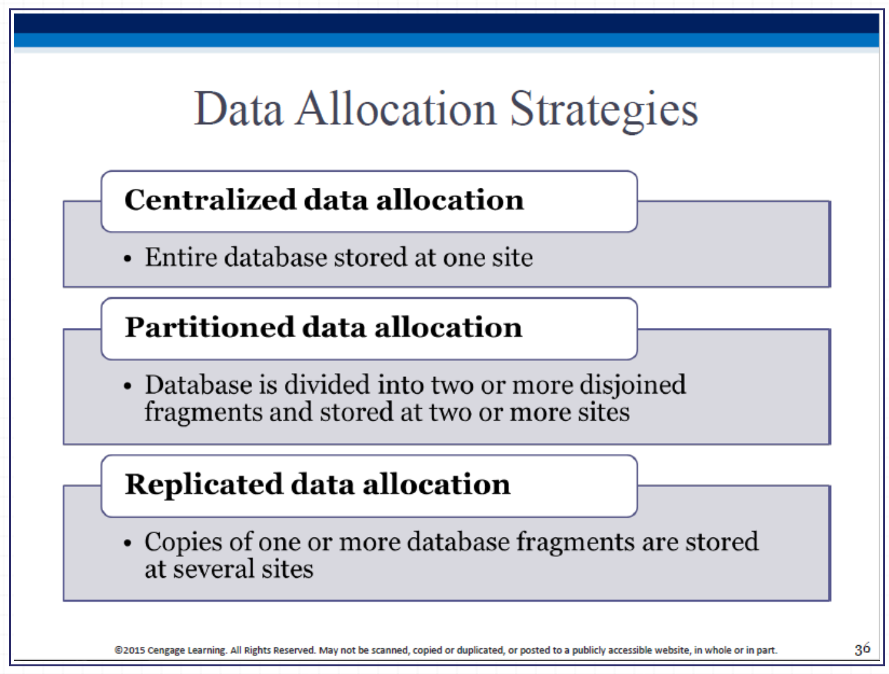

## CAP理论和BASE理论

**CAP定理**：C(一致性)、A(可用性)、P(分区容错性)。**铁律：在一个分布式系统里，这三样东西你最多只能同时满足两样！**

**BASE理论**：既然保不住绝对的一致性（ACID），那就退而求其次。允许数据在短时间内不一致，但保证它“最终是一致的 (Eventually consistent)”。现在的互联网大厂架构基本全是 BASE。
