# Week7

[TOC]

## 什么是 Transaction 事务

定义：一个必须完全执行成功，或者完全被撤销的逻辑工作单元。

大白话：就是“绑定在一起的一组操作”。最经典的例子是“银行转账”：1. 扣你的钱；2. 增加我的钱。这两个动作必须作为一个整体（事务）来对待。不能扣了你的钱结果系统断电了，我的钱没增加。要么全做，要么当做没发生过。

| 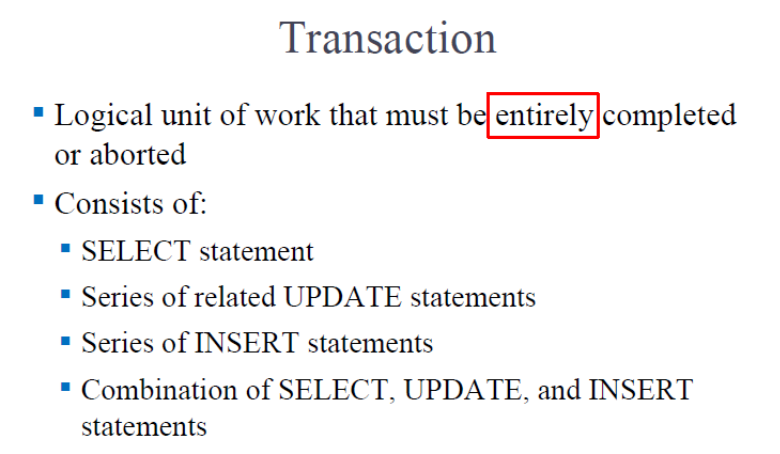 | 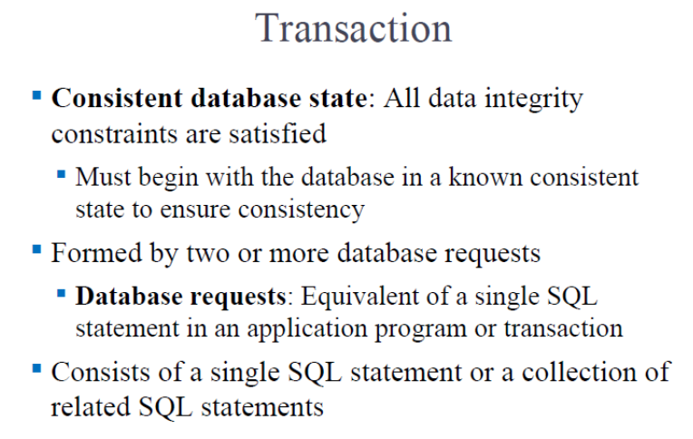 |
| ------------------------------------------------------------ | ------------------------------------------------------------ |

## ==‼️ACID==

只要是合格的数据库事务，必须拥有这四个属性：

- **Atomicity (原子性)**：不可分割。要么这组操作全做完，要么全不做（Aborted）。
- **Consistency (一致性)**：做完之后，必须满足所有的规矩（比如账必须平，不能凭空多出钱）。
- **Isolation (隔离性)**：你转账的时候，别人绝对不能插手看到你的中间状态。必须等你干完了，第二个人才能碰这些数据。
- **Durability (持久性)**：一旦系统提示你“提交成功 (Committed)”，就算下一秒机房爆炸了，这笔修改也永久生效了，绝对不会丢。
- *(附加)* **Serializability (串行化)**：大家并发一起干，但最后的结果，必须跟大家排着队一个一个干出来的结果一模一样。

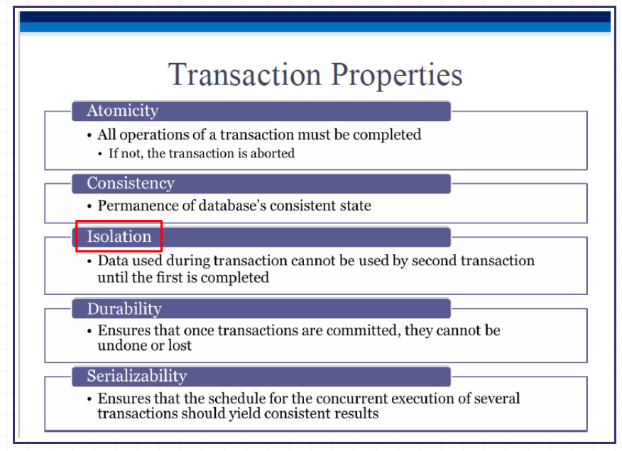

## SQL里如何控制事务？

就两个词；COMMIT（提交）和ROLLBACK（回滚）

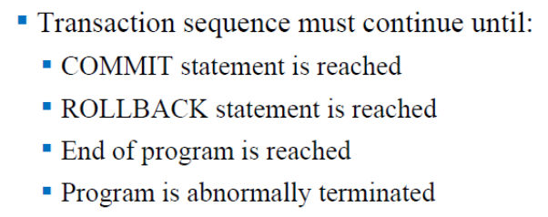

## 事务日志 Transaction Log

大白话：数据库的“行车记录仪”或“后悔药”。

里面详细记录了：哪个事务、在什么时间、把哪个表里的哪个数据、从多少改成了多少（Before 和 After 的值都有记录）。万一系统崩溃或者你要 `ROLLBACK`，数据库就靠倒着翻这个日记本来把数据恢复原样。

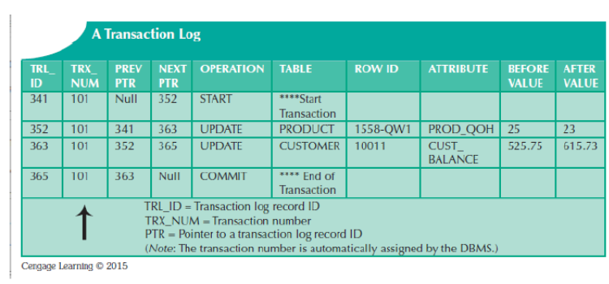

## 并发控制 Concurrency Control

就是一个“交警”。当好几个人（多用户）同时抢着要改同一行数据时，交警负责指挥交通，保证大家不撞车，保证结果跟排队执行（串行化）一样准。

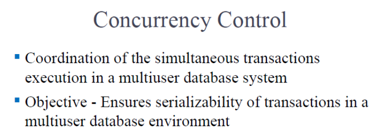

## Problems in Concurrency Control

并发控制不好，会出现下面这几种问题；

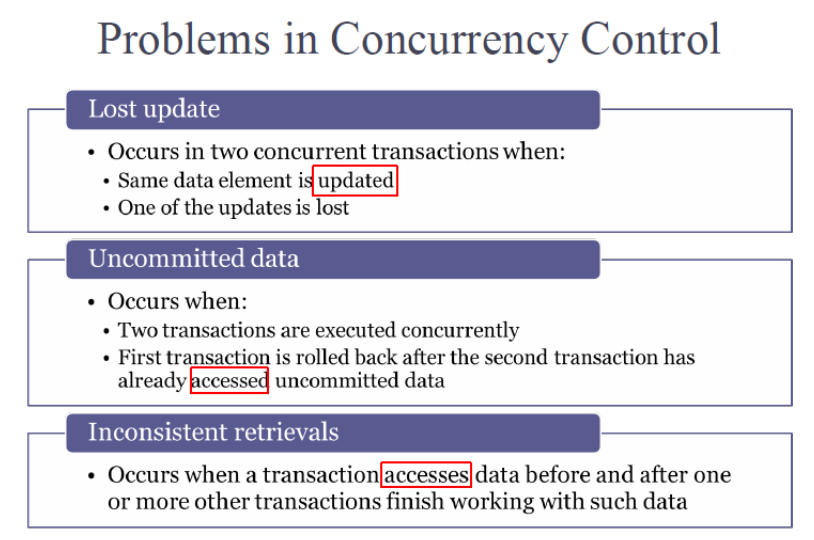

- **Lost update (丢失更新)**：两个人同时改一个数据，后一个人直接把前一个人的修改给无情覆盖了，前一个人白干了。
- **Uncommitted data (读脏数据)**：A 把数据改了还没点保存（未提交），B 跑来读了这个数据拿去用。结果 A 突然反悔撤销了。B 手里拿的就是个根本不存在的假数据。
- **Inconsistent retrievals (不一致检索)**：A 在统计总账，算到一半，B 跑进来偷偷把后面的数据改了，导致 A 前后算出来的数据死活对不上。

## 例子

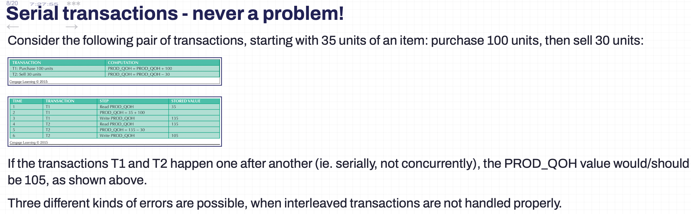

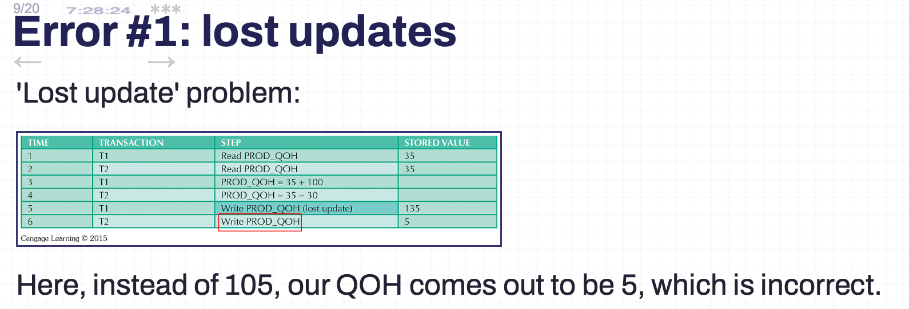

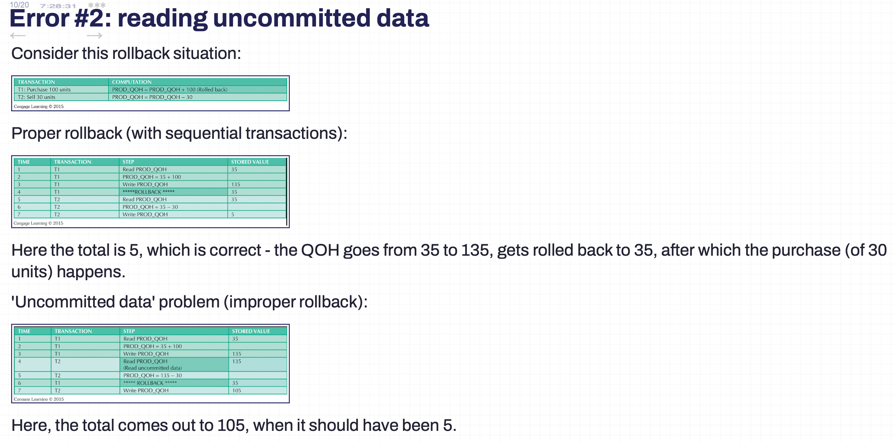

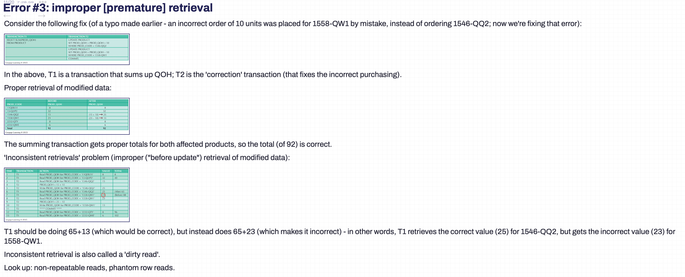

## 调度器

就是前面说的那个“交警本人”。它负责把大家提交的乱七八糟的操作，巧妙地穿插安排，排出一个合理安全、绝不出错的执行顺序（叫做 Serialization schedule）。

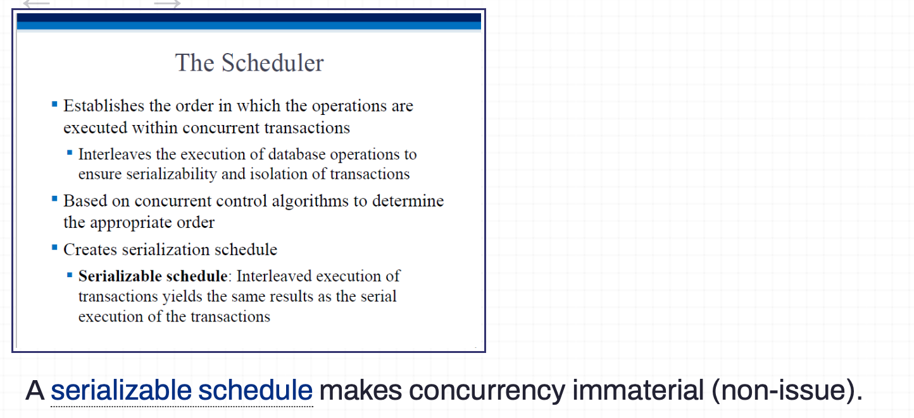

## 锁机制

Concurrency Control with Locking Methods

交警指挥交通的具体工具。谁要改这个数据，谁就先给它“上锁 (Lock)”，向全世界宣布“这个数据现在归我独占”。别人想碰？只能干瞪眼排队等着，直到你改完并解除了锁。

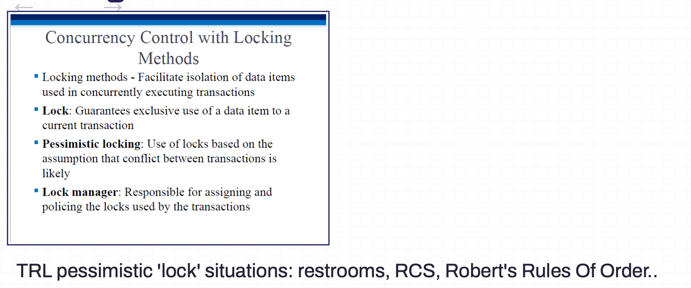

## 锁的颗粒度 (Lock Granularity)

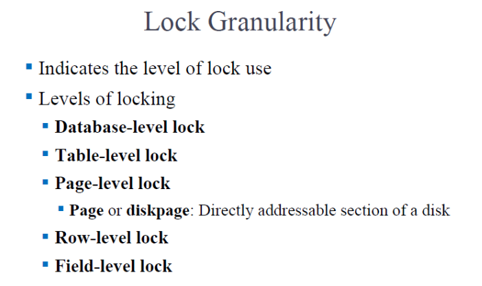

**五个级别（从大到小）**：

1. **数据库级 (Database-level)**：霸道总裁。你改一条数据，把整个库都锁了，别人啥也干不了。极度安全但极其慢。
2. **表级 (Table-level)**：锁一整张表。比如你改某个员工工资，整个员工表都不让别人碰。
3. **页级 (Page-level)**：锁硬盘里的“一页”数据。这是比较折中的方案。
4. **行级 (Row-level)**：最常用！只锁你要改的那一行（比如只锁张三那行，别人还能改李四的）。速度快，并发高。
5. **字段级 (Field-level)**：只锁张三的“工资”这一个格子，连张三的“年龄”别人都能改。

颗粒度越大，别人排队等的时间越长；颗粒度越小，系统跑得越快，但是数据库管理成千上万个小锁的压力就特别大。

## 锁的类型 (Lock Types)

**二进制锁 (Binary lock)**：最傻的锁，只有开 (0) 和关 (1) 两种状态。

**共享锁 (Shared lock / 也就是读锁)**：大家都可以进来看（读），但是谁也不准碰（改）。只要有人在看，就一直处于共享锁定状态。

**排他锁 (Exclusive lock / 也就是写锁)**：最高级别！只要我拿到了这个锁，我要开始写数据了，其他人既不能改，**也不能读**，全都给我闭着眼睛在门外等。

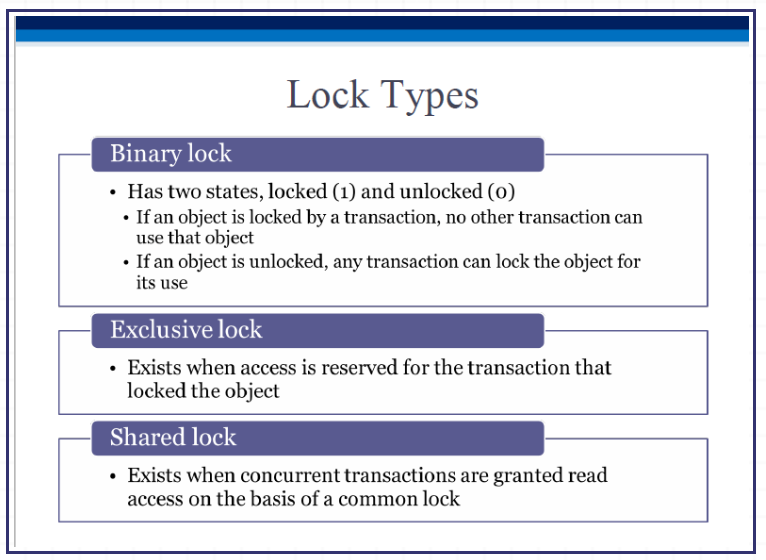

## ==2PL== 两阶段加锁协议 (Two-Phase Locking)

这是防止数据错乱的**黄金法则**，保证最终执行结果能“串行化”。它把事务要锁的过程强制分为两个阶段：

- **阶段一：生长阶段 (Growing phase)** —— **只借不还**。事务疯狂去申请所有需要的锁，但绝对不能释放任何一个锁。直到拿到所有的锁，到达“锁点 (Locked point)”。
- **阶段二：收缩阶段 (Shrinking phase)** —— **只还不借**。事务办完事开始释放锁。注意死规矩：**一旦你开始释放第一个锁，你就绝对不能再去申请任何新锁了**。

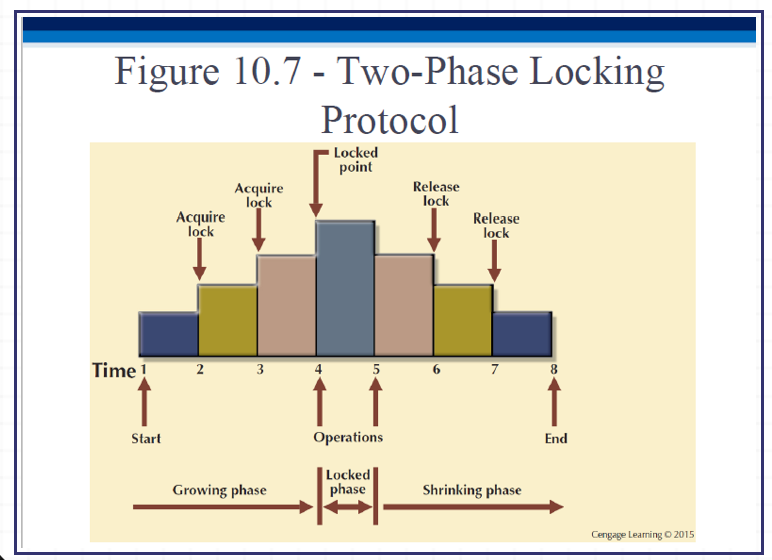

## 死锁 Deadlocks

**发生原因**：我拿了酱油等你手里的醋，你拿了醋等我的酱油。大家都不撒手（互相等锁），直接卡死。

**三大门派解决法**：

1. **死锁预防 (Prevention)**：如果系统觉得你俩有可能死锁，直接把其中一个事务“杀掉”，回滚重来。
2. **死锁检测 (Detection)**：系统定期巡逻，发现真死锁了，挑一个好欺负的（Victim）强制回滚，让另一个先干活。
3. **死锁避免 (Avoidance)**：在事务开始前，你必须向系统证明你已经一次性拿到了所有需要的锁，少一个都不让你开工。

## Deadlock occurrence in 2PL

Earlier we noted that the 2PL scheme cannot prevent deadlock creation. [Here](http://web.archive.org/web/20150921234554/http://research.microsoft.com/en-us/people/philbe/chapter3.pdf) is an example of how a deadlock could occur (at the end of step 5):

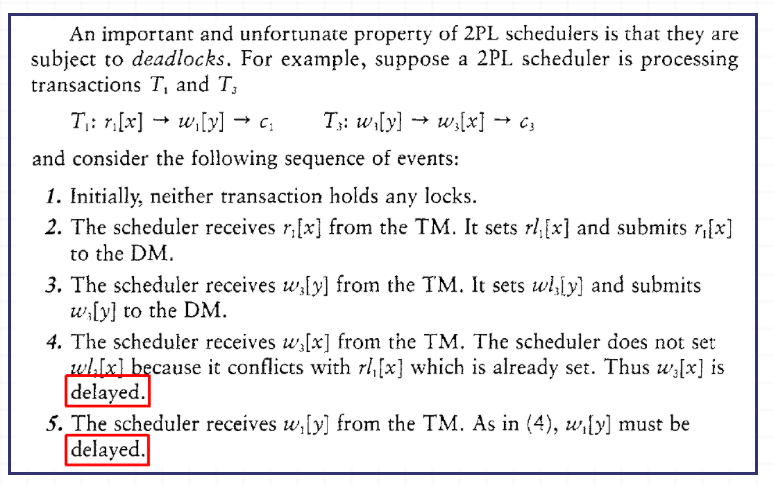

## Deadlock prevention

### Time Stamping

**大白话**：除了加锁，还有别的办法吗？有，给每个操作发个“排队号码牌”（全局唯一且递增的时间戳）。谁号码小（谁先来的），谁就优先办事。

**致命缺点**：太占资源了！表里的每个数据都得多配两个格子来存时间戳记录，极其浪费内存和 CPU。

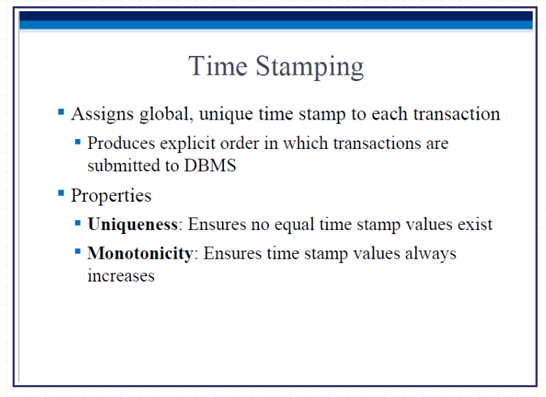

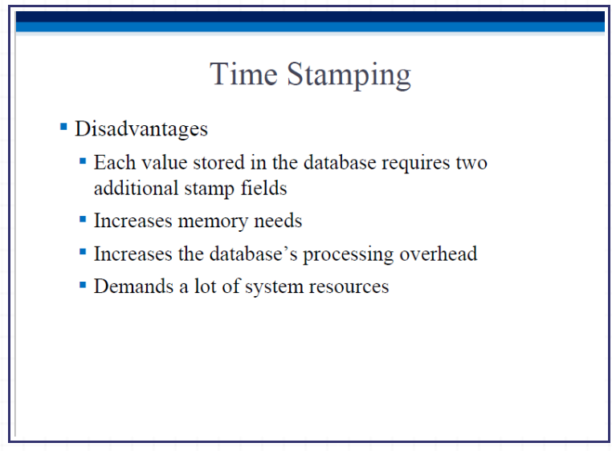

### Optimistic Approach

乐观锁机制。

**大白话**：假设大家都是好人，平时**不加锁**。事务先把数据复制一份到自己的私有空间里随便改（Read 阶段）。等全改完了，要按保存键的一瞬间，系统来检查一下“刚才有没有别人动过原数据？”（Validation 验证阶段）。如果没人动过，直接覆盖写入（Write 阶段）；如果被人动了，直接作废重来。

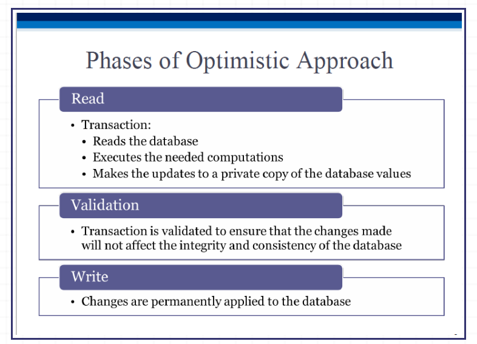
